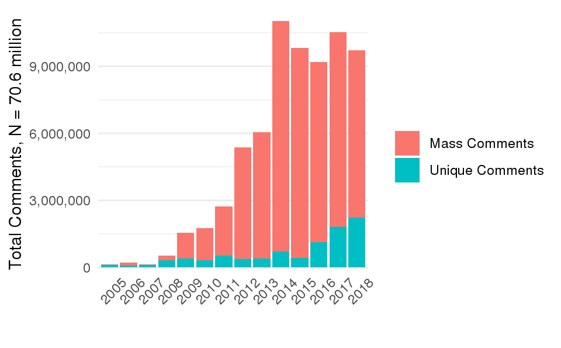
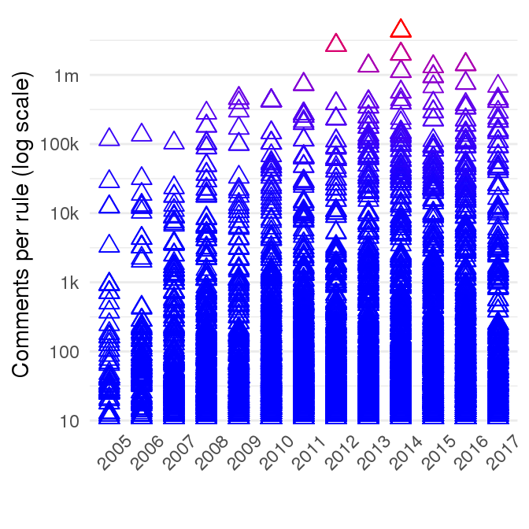

While practitioners and administrative law scholars have long pondered
what to make of mass commenting, political scientists have had
surprisingly little to say about this kind of civic participation. The
contentious politics that inspire the majority of public comments have
no place in leading models of bureaucratic policymaking and have largely
been ignored by political scientists.

Instead, models focus on how agencies either learn about policy
problems, negotiate or avoid accountability to various principals, or
balance interest-group demands.^[
On learning, see @Kerwin2011 and empirical studies by @yackee2012,
    @Cook2017, [@Gordon2018], and @Walters2019. See @Gailmard2017 and
    @Libgober2018 for information-based models where comments reveal
    information to the agency.
    On accountability to elected officials, see @Furlong1997, @Nou2016,
    @Potter2016, @Woods2018, and @Yackee2009RegGov. See [@Gailmard2012]
    for a review of formal models of oversight. Especially relevant to
    my analysis of the effects of mass mobilization on oversight,
    @Potter2014dis develops a signaling model where agencies propose and
    principals veto rules depending, in part, on their beliefs about
    interest group preferences.
    On interest group balancing see @Yackee2006JOP, @Yackee2006JPART,
    and @Kerwin2011. A key assumption of Libgober's (2018) model is that
    bureaucrats have a distribution of preferences over interest group
    positions, about which they are uncertain unless groups reveal their
    preferences through commenting.
]

#### Most scholars are skeptical that ordinary people can affect rulemaking.

Foundational scholarship on rulemaking by @Furlong2005, @Furlong1997
[@Furlong1998], and @Kerwin2011 focuses on interest group lobbying. To
the extent scholars address the input of ordinary people at all, both
existing theory and empirical scholarship suggest skepticism that it
matters. (By "ordinary" people, I simply mean people who are not
professional policy-influencers, not that these politically-engaged
people are demographically representative of the broader public.)
Empirical scholarship finds that economic elites and business groups
dominate American politics in general [@Gilens2014] and rulemaking in
particular. While some are optimistic that requirements for agencies to
solicit and respond to public comments on proposed rules allow "civil
society" to provide public oversight [@Michaels2015; @Metzger2010], most
studies find that participants in rulemaking often represent elites and
business interests
[@Seifter2016UCLA; @Crow2015; @Wagner2011; @West2009; @Yackee2006JOP; @Yackee2006JPART; @Golden1998; @Haeder2015; @Cook2017].

From a strategic perspective, agency officials are not directly
accountable to voters. And even if organized groups do supplement
congressional and judicial checks on executive power, the groups that
participate in rulemaking represent only certain (if any) segments of
the public and may not represent them well [@Seifter2016UCLA]. Scholars
are thus skeptical about rulemaking as a site for collective action the
ability of most people to participate. As a result, mass comment
campaigns are dismissed as epiphenomenal to bargaining with principals
or interest groups. Indeed, almost all empirical studies of rulemaking
discard unsophisticated comments from ordinary people, as evident from a
comprehensive review of scholarship on "The Politics of Rulemaking" by
@Yackee2019, who finds skepticism about citizen comments, but no studies
analyzing mass mobilization as a lobbying tactic:

> "@Kerwin2011 point out that a citizen must know not only that a
> regulation is being formulated but also how and when to participate.
> This is a high bar for most Americans. Second, to be influential
> during rulemaking, commenters may require resources and technical
> expertise. As @Epstein2014 suggest, agency rule-writers--who are often
> chosen because of their technical or policy-specific
> expertise--privilege the type of data-driven arguments and reasoning
> that are not common to citizen comments. " (p. 10)

For any particular lay commenter, this conclusion seems inescapable. But
groups do occasionally mobilize, usually behind a more sophisticated
lobbying effort. Without systematic understanding and study of public
participation, it is difficult to adjudicate such questions about how
processes like public comment periods may enhance or undermine various
democratic ideals.

Contrary to the common assumption that mass engagement emerges
organically, it is almost always mobilized by an organization that also
engages in sophisticated lobbying or coordination with such an
organization. By mass engagement, I mean that thousands of people beyond
professional policy influencers engage. In my empirical context of
agency rulemaking, I define mass engagement as more than 1000 public
comments or 100 identical comments, plausibly indicating a mobilization
effort.^[Following the conventional terms "mass comment campaign" and
    "public engagement," I call the general phenomenon "mass engagement"
    resulting from a "mass mobilization campaign" to distinguish the
    magnitude of civic engagement. This differs from the Environmental
    Protection Agency's definition of mass comment campaign as two or
    more identical comments. In the results below, I use an intermediate
    category---"small batch"---comments to describe identical comments
    numbering less than 100]

This scholarly oversight is surprising given that most people are only
aware of rulemaking when it is the target of a high-profile mass
mobilization campaign.^[Some of the most contentious recent public controversies involve
    bureaucratic policymaking. For example, along with 50 thousand
    protesters in Washington D.C., the State Department Received 1.2
    million comments on the Environmental Impact Statement for the
    Keystone Pipeline. Similarly, along with the thousands of protesters
    supporting the Standing Rock Sioux protest to the Dakota Access
    Pipeline, the Army Corps of Engineers received hundreds of thousands
    of comments. Alongside protest actions that included shutting down
    many websites, the Federal Communications Commission's open internet
    rule received 22 million comments. While some of these comments
    appear to be fake, the scale of public engagement is remarkable
    given how little attention political scientists have paid to it.
    Fake public comments also raise the question of why an organization
    would bother to generate fake public input if it did not matter, as
    its omission from theories of bureaucratic policymaking would seem
    to imply.] While most rules receive little attention,
the ease of online mobilizing and commenting has, like other forms of
participation [@Boulianne2018], created exponential increases in the
number of rules in which thousands and even millions of people engage
(see Figure \@ref(fig:commentsperrule); note that comments per rule are on a
logarithmic scale).^[Proposed rules that have attracted the most public attention have
    been published by the Federal Communications Commission (FCC,
    omitted from this plot), the Environmental Protection Agency (EPA),
    the Department of Interior (DOI), the Bureau of Ocean Energy
    Management (BOEM), the Consumer Financial Protection Bureau (CFPB),
    and Fish and Wildlife Service (FWS).] Occasionally, a large number of people are
paying attention. These bursts of civic participation may affect
rulemaking [@Coglianese2001], but this intuition has yet to be tested.


The general failure to explain or account for mass engagement in
rulemaking is also striking in light of how agencies advertise public
comment periods as an opportunity for a voice in government
decisions.^[I focus on public comments in rulemaking, but the theories and
    methods here may also apply to other kinds of political engagement
    such as through social media or protests as well as to other
    political decisions, including state-level rulemaking. Social media
    engagement may be especially important if agencies implement the
    recommendations of @ACUS2018 that "Agencies should consider using
    social media before or in connection with direct final rulemaking to
    quickly identify whether there are significant or meaningful
    objections" (p. 34).] Big red letters across the top of the Regulations.gov
homepage solicit visitors to "Make a difference. Submit your comments
and let your voice be heard" (Figure \@ref(fig:regsgov). A
blue "Comment Now!" button accompanies a short description of each draft
policy and pending agency action. Another invitation at the bottom of
the page reads "Participate today!" Public commenting on proposed agency
rules is described as "an important part of democracy" (WSJ 2017), the
"often held out as the purest example of participatory democracy in
actual American governance" [@Herz2016]. @Rossi1997 finds that "courts,
Congress, and scholars have elevated participation in rulemaking to
a sacrosanct status\...greater participation is generally viewed as
contributing to the democracy." Despite much debate about the
theoretical import and possible reforms, the bulk of public comments
have yet to be studied.

```{r regsgov, fig.cap = "Regulations.gov Solicits Public Comments on Draft Agency Rules"}

```


{width="6.5in"}


{width="4.5in"}

While "ordinary" members of the public may occasionally provide novel
and useful technical information to expert bureaucrats, such
sophisticated means of influencing policy are out of reach for the vast
majority of people. Thus, to investigate the potential role of ordinary
people in bureaucratic politics I look elsewhere---not because ordinary
people never provide novel and useful technical information, but because
this is not how most people attempt to influence policy, nor, I argue,
how we should expect ordinary people to have influence.

Most public comments are, in fact, of the flavor suggested by the
solicitations on Regulation.gov---ordinary people voicing opinions on a
proposed policy. They do not provide useful technical information or
suggest specific edits to policy texts like the interest group comments
that have thus far captured the attention of political scientists. If
they add information to rulemaking, it is a different, more political
flavor of information. Indeed as Figure
\@ref(fig:commentsperyear) shows, every year since 2008, most people who
comment on draft regulations have done so as a result of an interest
group's campaign.^[At least for agencies participating in regulations.gov. See
    sections
    \@ref(whyMail-methods) and
    \@ref(whyMail-results) for my definition and methods for
    identifying mass comments.] Public engagement in rulemaking is highly
clustered on a few rules made salient by these campaigns. It is
plausible that, at least some of the time, such campaigns aim to
influence policy. It is also plausible that thousands of people engaging
may alter the politics of these policy processes, but this hypothesis
remains untested. Indeed, we have much to understand about the causes
and effects of these campaigns before we are in a position to ask if
they are a mechanism for groups to influence policy. Most critically, we
must understand who mobilizes and why.

The kind of politics created by mass engagement has a few notable
features. It is contentious; most ordinary people are not engaging in
deliberation, they are simply making demands. Importantly, however,
processes like public comment periods channel contentious demands into
institutionalized policy processes rather than undermining them. In
short, the politics of rulemaking created by mass engagement is much
more contentious than most rulemakings, but also much more
institutionalized than most contentious politics. Mass engagement in
rulemaking thus presents a novel context to examine the consequences of
broader engagement in typically insider-dominated policymaking and how
public participation may condition how political decisions are made.

Mass commenting also, in a sense, expands participation in
policymaking.^[If defining "political participation" as "acts aimed at
    influencing governmental decisions [@Verba1987 p. 2], signing a
    petition or mass comment counts. However, some consider true
    participation to be deliberative, which mass commenting is not.
    Other requirements, that participation is "genuine," "informed," or
    "reasoned" are more difficult to assess. Normative theorists may
    debate whether deliberation among a small number of people is
    preferable to a large number of people simply expressing their
    preferences, but empirically, public participation in bureaucratic
    policymaking is much more the latter.] Surely, those who opt in are far from representative
of the broader public [@Verba1987], but in many ways, they must be more
representative than the handful of political insiders who participate in
most policy processes. As @Schattschneider1942 put it, the usual
participants have "an upper-class accent." Does adding thousands of more
voices dilute this bias? This depends on how people are mobilized. If
mass engagement is mobilized by the usual participants to create an
impression of public support, it may merely legitimize the demands of
powerful interest groups.
