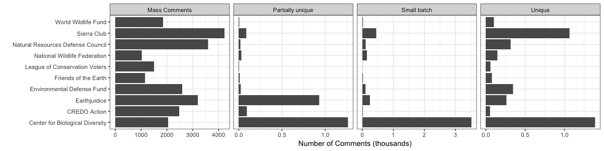
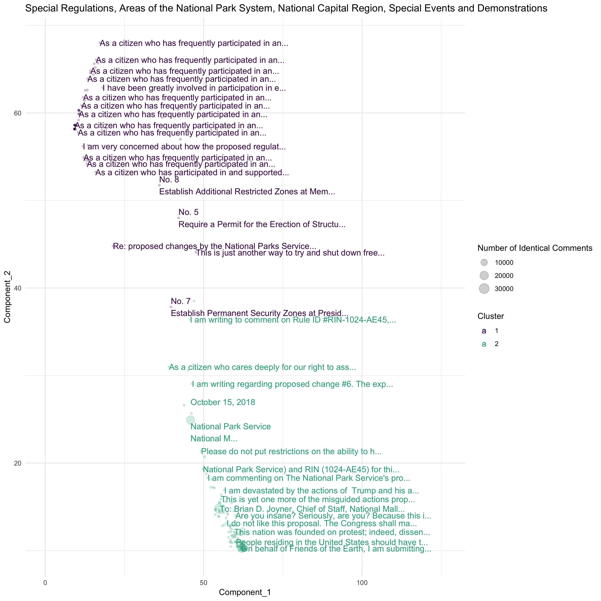

## Measuring Public Pressure and Political Information

In this section, I develop methods to attribute mass comments to the
campaigns that mobilized them and measure the intensity of preferences
expressed. To link individual comments to the more sophisticated
lobbying efforts they support, I use textual similarity to identify
clusters of similar comments, reflecting formal and informal coalitions.
Comments with identical text (if any) indicate which groups and
coalitions ran a mass comment campaign. Within each campaign, I measure
the intensity and potential for the movement to grow. To measure
intensity, I examine the ratio of high-effort and low-effort comments.
To measure the potential to grow, I measure the number of comments mobilized
indirectly by the campaign (i.e., those that support a campaign but do
not include text provided by the campaign). The result is several new
measures of participation in bureaucratic policymaking.

### Who lobbies?

Previous studies of rulemaking stress the importance of coalitions
[@Yackee2006JOP]. Scholars have measured coalitions of organized groups
but have yet to attribute citizen comments to the coalition that
mobilized them.

#### Data.

I collected a corpus of approximately 70 million comments via the
regulations.gov API. About 50 million of these comments are on proposed
rules (over 16,000 proposed rules from 144 agencies from 2005 to 2018).
I then linked these comments to other data on the rules from the Unified
Agenda and Office of Information and Regulatory Affairs Reports on draft
rules sent to them for review. Summary statistics for these data are
available in the Appendix.

Unfortunately, metadata on the authors of comments and their
organizational affiliations are inconsistent and incomplete. As this
information is key to identifying influential actors, improving these
data was a significant data-organization task.

#### Mobilizing organizations.

Through an iterative combination of automated search methods and hand-coding, I identify organizations for over 40 million comments, including all organizations responsible for mobilizing 100 or more
comments with repeated text--either identical text or partially unique
texts that contain shared language. I then searched comment texts for
mentions of these organizations' names to complete missing information
on the mobilizing organization. The top 100 mobilizing organizations
each mobilized between 55 thousand and 4.2 million comments. Figure
\@ref(fig:toporgs) shows the top organizers of comments posted to
regulations.gov.

```{r toporgs, fig.cap = "Top mobilizers of comments posted to regulations.gov", fig.width = 7}


```

Having identified who is participating in rulemaking, the next step is
to determine who is lobbying together. Studies of rulemaking stress the importance of coalitions [@Yackee2006JOP, Dwidar2019]. Scholars have measured coalitions of organized groups but have yet to attribute citizen comments to the coalition that mobilized them.

### Who lobbies together?

The Oceana coalition framed its mass mobilization effort to curb the
Bureau of Ocean Energy Management's 2017 Proposed Offshore Oil and Gas
Leasing Program as a "petition signed by 67,275 self-proclaimed United
States residents," suggesting that organizations consider these efforts
as akin to petitions. In the same statement, Oceana also claimed the
support of "more than 110 East Coast municipalities, 100 Members of
Congress, 750 state and local elected officials, and 1,100 business
interests, all of whom oppose offshore drilling," suggesting that claims
of public and elected official support aim to provide similar kinds of
political information.

#### I identify coalitions using text re-use and clustering methods.
I identify comments that are not identical but share a 10-word (or
"10-gram") string using a moving window function looping over each
possible pair of texts to identify matches.^[For more about this method and comparisons with related partial matching methods such as the Smith-Waterman algorithm, see @Casas2017 and @Judge-Lord2017.]
When actors sign onto the same comment, it is clear that they are
lobbying together. However, various businesses, advocacy groups, and
citizens often comment separately, even when they are aligned. Thus, in addition to mapping text re-use, for rules with a large number of comments,
I use statistical models of text to classify comments into coalitions. I cluster
documents by the frequency with which they use different words. Being
classified together does not mean that the documents all address exactly
the same distribution of substantive issues, just that they use similar
words relative to the full set of documents. I start by modeling all
comments on each rule (collapsing identical comments to one document)
with two and three clusters, which I then inspect to see how well the
comments of named organizations were classified. If the two cluster
model most sensibly describes the conflict, I label these clusters "pro" and "con" If the three-cluster model more sensibly describes the
conflict, I label these clusters as "pro, con, other." If neither fits
well, I increase the number of clusters as needed.

```{r kmeans, fig.cap = "K-means clustering fails to capture coalitions when nearly all comments oppose a regulation"}


```


The asymmetry in expressed support for most rules presents challenges
for unsupervised clustering because much of the variation in comment
texts is within-coalition variation. For example, one of the most common
clustering methods, k-means clustering, often captures within-coalition
variation. Figure \@ref(fig:kmeans) shows k-means clusters based on a normalized
measure of word frequency (term-frequency/inverse-document-frequency)
compared to two principal components of variation. Neither k-means nor
principal components analysis is well suited to identifying the small
number of comments supporting the Park Service's proposed restrictions
on protests in Washington DC.

Two strategies may improve clustering. First, even partial text re-use
generally indicates that comments belong to the same coalition. For
example, as seen at the top of Figure
\@ref(fig:kmeans), models
may be restricted to cluster the large number of comments beginning with
"As a citizen who has frequently participated" in the same coalition
even if they go on to add different personal anecdotes about why protest
rights are important to them. Thus, clustering methods could be
restricted to group partially copied texts, as well as entirely copied
texts. Second, Bayesian mixture model may better recover pro and con
clusters, especially with strong priors comments using positive and
negative sentiment words belong together.

### Measuring the volume, intensity, and potential contagion of public engagement.

I measure variation in engagement in three ways, corresponding to the
three types of comments described above.

**Volume.** First, I measure the total number of comments on the rule.
As commenting results from multiple processes: a coalition deciding to
lobby at all, a coalition deciding to mobilize, and response to the
campaign the distribution contains many cases where groups may have had
success mobilizing but never reached the choice of whether to mobilize
or not. Perhaps they were unaware of the draft rule. Once the decision
to mobilize has been reached and made, the response to mobilizing is a
count process. Thus, I expect the count of comments across rules to
follow a zero-inflated negative binomial distribution.

**Effort.** I measure effort per comment by the number of words people
write, omitting any to text longer than ten words that is not unique,
usually because a mobilizing organization provided it. For example the Sierra Club mobilized more than 47,710
people to submit exactly the same text on the delay of the methane
pollution rule, but 7,452 people also took the time to write a
personalized comment in addition to the text provided (see Figure \@ref(fig:sierra)). However, we may
not observe people who have low levels of passion for the issue because
they either do not cross the effort threshold required to comment or opt
to write nothing more than the form letter. Thus, while effort measured
by the number of words people write may be normally distributed, I
assume that the low end of this distribution is truncated.

**Contagion.** Mass-comment campaigns have wildly different results.
Some submit a clean 10,000 copies of (signatures on) the same comment.
Others "go viral"---inspiring a mess of further engagement where the
original messages are translated through social media posts and news
stories. To identify people who were plausibly mobilized indirectly by a
campaign, I count the number of people who use a similar distribution of
words to that of the form letter but fewer than ten words matching any
other comment. This is a regular count process.
