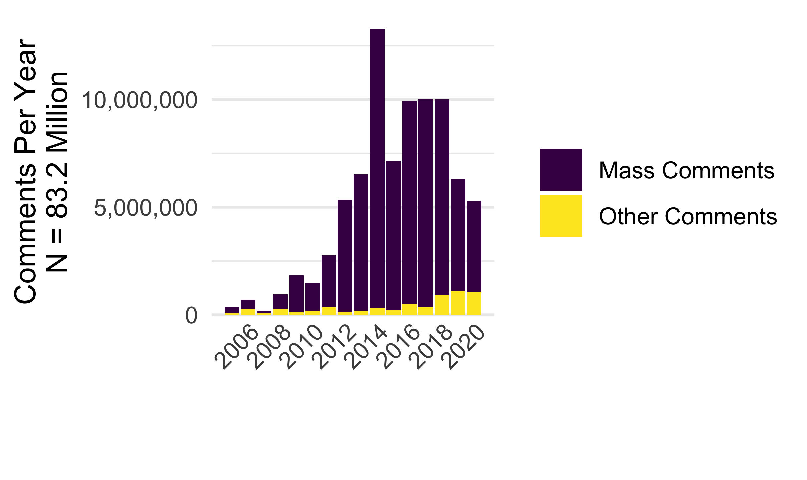
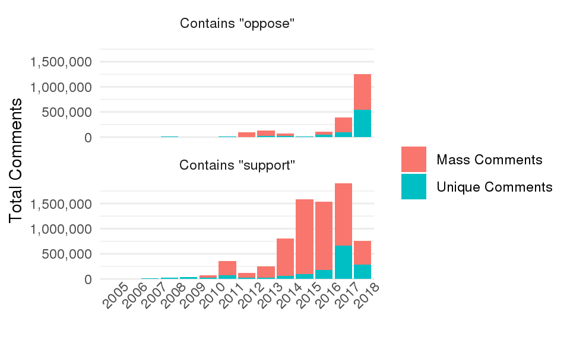
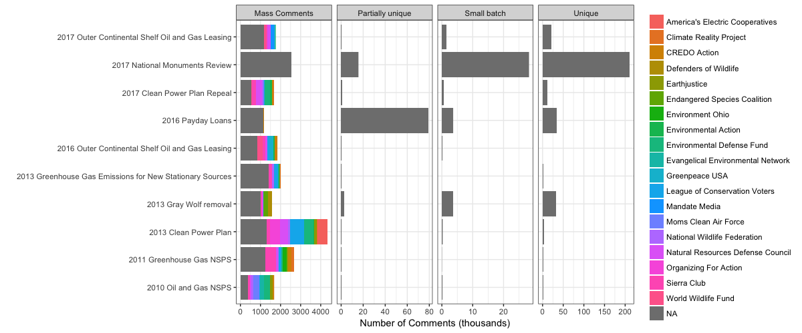

## Patterns of public engagement in rulemaking 

#### Most comments result from mass-comment campaigns.

Figure
\@ref(fig:comments-support) shows all comments posted on
regulations.gov over time by whether they are exact or partial copies of
another comment or not. While some agencies classify all duplicate
comments as mass comments, I call comments that have between 2 and 99
identical copies, "medium batch" because such comments may reflect
coordinated efforts among interest groups that do not include a public
pressure strategy that involves mobilizing ordinary people. Here "mass
comments" are comments that have either 100 or more identical copies or
were uploaded in bulk batches of at least 100. This restrictive
definition of what counts as mass engagement captures comments that were
certainly mobilized by a campaign. As Figure
\@ref(fig:comments-support) shows mass commenting campaigns
mobilize the vast majority of comments. In other words, most comments
are from ordinary people.

```{r comments-support, out.width = "49%", fig.cap = "Comments on Draft Rules Posted to Regulations.gov 2006-2018"}



```


The right pane of Figure
\@ref(fig:comments-support) shows results from a sample of several
million comments for which I have digitized texts. Many of these
comments appear to support proposed agency rules. A rough measure of
support (whether the comment text includes " support " or " oppose ")
shows that many more comments mention support, until 2018, when there is
a fairly dramatic reversal in the share of comments mentioning "support
" compared to those mentioning "oppose " (Figure
\@ref(fig:comments-support). This may be a function of the
changing regulatory agenda due to the change in presidential
administration. However, support and oppose are not used in all comments
and do not always indicate support for a rule (see figures
\@ref(fig:sentiment-2018) and
\@ref(fig:sentiment-2016) in the appendix for a sample of comments
on several rules in 2016 and 2018).

#### Most comments occur on a small number of salient rules.

Approximately one third of public comments posted to regulations.gov
were received on just ten regulations shown in figure
\@ref(fig:topdockets).

```{r topdockets, fig.width = 1, fig.cap = "Top 10 Dockets Receiving the Most Comments on regulations.gov and the top 20 Mobilizers"}


```


#### A coalition of public-interest organizations mobilize most comments.

As Figure \@ref(fig:topdockets) shows, the most prolific mobilizers are
environmental groups. On five out of the top ten dockets (here including
rulemaking and non-rulemaking dockets), a similar coalition of groups
mobilized the majority of public comments. In part, this is because the
Environmental Protection Agency produces a large share of the
substantive rules posted to regulations.gov. However, it is notable
that, on the top ten dockets, 19 of the top 20 mobilizers generally
lobby together. America's Energy Cooperatives, an industry association,
stands out as the lone mobilizer on behalf of material interest for its
members. Notably, it only mobilized significantly on the Clean Power
Plan but not on the subsequent Clean Power Plan repeal. If public
interest group mobilizing on the Clean Power Plan was an example of
"going public" to pressure the Obama administration and then "going
down fighting" in the face of the Trump administration's repeal,
industry counter-mobilization responding to the first, but not the
second fits aligns with (ref:disrupt).
