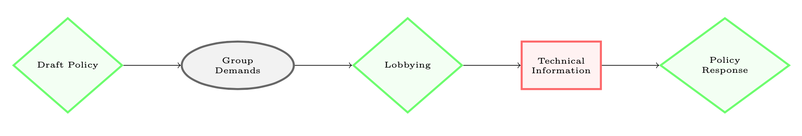
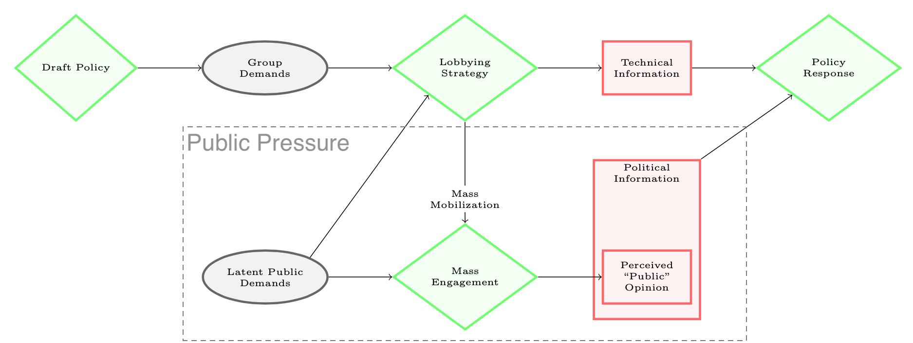

## Why Mobilize? {#why-mobilize}

This section offers a theory and hypotheses to explain variation in mass
engagement. I argue that we should observe different patterns of
engagement depending on whether an organization launches a mobilization
campaign as an outside lobbying tactic, to counter such a campaign, or
for reasons other than influencing policy. In the next section, I
develop methods to measure these patterns. In short, these measures
capture similar statistics to questions posed by @Verba1987 [p. 9]: "How
much participation is there, what kind is it, and from what segments of
society does it come?"


As noted above, scholars of bureaucratic policymaking have focused on
the sophisticated lobbying efforts of powerful interest groups such as
business coalitions. A key insight from this scholarship is that
technical information is the currency of insider lobbying. Figure
\@ref(fig:causal-classic) illustrates the classic causal
model of insider lobbying that describes most rulemakings and nearly all
scholarship on lobbying in bureaucratic policymaking to date.^[Diamonds indicate observable choices, ovals indicate latent preferences, and rectangles indicate information.]
However, mass engagement has no place in this model. I aim to fill this
gap.

```{r causal-classic, fig.cap = "The 'Classic Model' of Interest Group Lobbying in Bureaucratic Policymaking"}


```

First, I offer a framework for assessing the causes of mass engagement.
Next, I argue that organizations may mobilize large numbers of people
for three reasons with observable implications for observed patterns of
mass engagement and theoretical implications for predicted effects on
policy.

### Incorporating political information into models of lobbying in rulemaking


#### Public pressure campaigns claim to represent and evoke the public interest.

The Oceana coalition framed its mass mobilization effort to curb the
Bureau of Ocean Energy Management's 2017 Proposed Offshore Oil and Gas
Leasing Program as a "petition signed by 67,275 self-proclaimed United
States residents," suggesting that organizations consider these efforts
as akin to petitions. In the same statement, Oceana also claimed the
support of "more than 110 East Coast municipalities, 100 Members of
Congress, 750 state and local elected officials, and 1,100 business
interests, all of whom oppose offshore drilling," suggesting that claims
of public and elected official support aim to provide similar kinds of
political information.

Appeals to the government are almost always couched in the language of
public interest, even when true motivations are private
[@Schattschneider1975]. When lobbying during rulemaking, groups often
make dubious claims to represent broad segments of the public
[@Seifter2016UCLA]. If agency staff do not trust an organizations'
representational claims, engaging actual people may be one of the few
credible signals of a broad base of support.  Furthermore, if
organizations claim to represent people beyond their official members,
reforms requiring groups to disclose information about their funding and
membership [@Seifter2016UCLA] only go part way to assess groups' claims
to represent these broader segments of the public. Indeed, if advocacy
group decisions are primarily made by D.C. professionals, these
advocates themselves may be unsure how broadly their claims resonate
until potentially-attentive publics are actually engaged.

Theorists debate whether signing a petition of support without
having a role in crafting the appeal is a meaningful voice and whether
petitions effectively channel public interests, but, at a minimum,
engaging a large number of supporters may help broader interests to
distinguish themselves from truly narrower ones. It suggests that the
organization is not "memberless" [@Skocpol2003] in the sense that they
can demonstrate some verifiable public support.^[Public support can be faked or inflated using "astroturf" tactics, but such campaigns have observably different patterns of engagement.]

#### Public pressure is a political resource.
An organization's ability to expand the scope of conflict by mobilizing
a large number of people can be a valuable political resource [@Schattschneider1975]. In contrast to scholars who focus on the deliberative
potential of public comment processes, I focus on public engagement as a
tactic aimed at gaining power. Scholars who understand mobilization
as a tactic [@Furlong1997; @Kerwin2011] have focused on how
organizations mobilize their membership. I expand on this understanding of mobilization as a lobbying tactic to include a campaign's broader audience, more akin to the concept of
an attentive public [@Key1961] or issue public [@Converse1964].

Here I build on three insights. First, @Furlong1997 and @Kerwin2011
identify mobilization as a tactic. The organizations that they surveyed
reported that forming coalitions and mobilizing large numbers of people
are among the most effective lobbying tactics. Second, @Nelson2012
identify political information as a potentially influential result of
lobbying by different business coalitions. While they focus on
mobilizing experts, @Nelson2012 describe a dynamic that can be extended
to mass commenting:

> "strategic recruitment, we theorize, mobilizes new actors to
> participate in the policymaking process, bringing with them novel
> technical and political information. In other words, when an expanded
> strategy is employed, leaders activate individuals and organizations
> to participate in the policymaking process who, without the
> coordinating efforts of the leaders, would otherwise not lobby. This
> activation is important because it implies that coalition lobbying can
> generate new information and new actors---beyond simply the 'usual
> suspects'---relevant to policy decisionmakers. Thus, we theorize
> consensus, coalition size, and composition matter to policy change."

I argue that, concerning political information, this logic extends to
non-experts. The number and distribution of ordinary supporters may
matter because it suggests a *public* consensus. Instead of bolstering
*scientific* claims, a perceived public consensus bolsters *political*
claims. Finally, @Furlong1998, @Yackee2006JPART, and others distinguish
between direct and indirect forms of interest group influence in
rulemaking. This distinction is especially important for political
information, which may be most influential through indirect channels,
such as through elected officials. In short, to understand how groups
lobby in rulemaking, we must understand mass mobilization as a tactic
aimed at producing political information that may have direct and
indirect impacts on policymaking.

While most scholars have emphasized mass comments' lack of useful
technical information, a few have raised their role in creating
political information. @Cuellar2005 calls on agencies to pay more
attention to ordinary peoples' expressions of preference and @Rauch2016
suggests that agencies reform the public comment process to include
opinion polls. I build from a similar intuition that mass comment
campaigns currently function like a poll or, more accurately, a
petition, capturing the intensity of preferences among the attentive
public---i.e., how many people are willing to take the time to
engage.^[For example, a campaign by the World Wildlife Federation provided
    language explicitly claiming to have public opinion on their side.
    Their model comment stated that "Along with 80% of the American
    people, I strongly support ending commercial trade in elephant ivory
    in the US." This suggests that mass comment campaigns aim to signal
    information about public opinion.] Self-selection may not be ideal for representation, but
opt-in participation---whether voting, attending a hearing, or writing a
comment---may often be one of the few heuristics decisionmakers have
about public preferences.

Mobilizing citizens and generating new political information are key
functions of interest groups in a democracy
[@Mansbridge1992; @Mahoney2007]. Campaigns inform agencies about the
distribution and intensity of opinions that are often too nuanced to
estimate a priori. Many questions that arise in rulemaking lack
analogous public opinion polling questions, making mass commenting a
unique source of political information. As with public opinion on many
specific policy issues, most members of the public and their elected
representatives may only learn about the issue and take a position as a
result of a public pressure campaign [@Hutchings2003]. I thus consider
public demands to be a latent factor in my model of policymaking (Figure
\@ref(fig:causal-whymail). Public demands shape the decisions of
groups who lobby in rulemaking. If they believe the attentive public is
on their side, groups may attempt to reveal this political information
to policymakers by launching a mass mobilization campaign. The public
response to the campaign depends on the extent that the attentive public
is passionate about the issue.

```{r causal-whymail, fig.cap = "Incorporating Political Information into Models of Bureaucratic Policymaking"}



```

Figure \@ref(fig:causal-whymail) amends the "Classic Model" of interest
group lobbying (Figure \@ref(fig:causal-classic)) to incorporate political information about the attentive public. In addition to providing technical information through sophisticated comments, an organization may mobilize supporters.
The more support a group has, the more successful this mobilization effort will be.
Large-scale engagement may produce several types of relevant political
information. The most direct and obvious is the expressed "public
opinion" that policymakers observe.^[I address other types of political information that mass engagement may create elsewhere. For an expanded model, see Figure
    \@ref(fig:causal-full) in the Appendix.
]

The causal process visualized in Figure
\@ref(fig:causal-whymail) may only operate under certain conditions. The success of a mobilizing effort depends on whether a group's perception of latent public demands (the diagonal arrow between "Latent Public Demands" and "Lobbying Strategy") reflects the public response to a mobilizing effort (the horizontal arrow between "Latent Public Demands" and "Mass Engagement"). 

The influence of political information on policy (the arrow between "Political Information" and "Policy Response") depends on the institutional processes by which agencies receive and interpret information. We may only expect to observe mass mobilization influencing a particular policy only if the mobilization effort was aimed at influencing that policy, rather than using the public comment the period to build organizational membership or power more generally.

## Hypotheses About the Drivers of Mass Mobilization

### Types of campaigns

The outcomes of mass mobilization depend, in part, on the aims of a
campaign. I distinguish group campaigns by which of three distinct aims
they pursue: (1) to win concessions by going public, (2) to disrupt a
perceived consensus, or (3) to go down fighting. Going public and
disrupting a perceived consensus are forms of proactive and reactive
outside lobbying, respectively. Here, going down fighting describes any
situation where the organization does not expect to influence policy but
mobilizes for other reasons.

**Going public.** Coalitions "go public" when they believe that
expanding the scope of conflict gives them an advantage.^["Going public," "outside lobbying" or an "outside strategy"
    contrasts with insider lobbying. It is used by Presidents
    [@Kernell2007], Members of Congress [@Malecha2012], interest groups
    [@Walker1991; @Dur2013], Lawyers, and Judges (Davis 2011). For
    example, organizations may use phone banks, targeting strategies,
    and direct-mail techniques to drum-up and channel public support
    (Cooper 1985).] As these
are the coalitions that believe they have more intense public
support, mass engagement is likely to skew heavily toward this side.^[This strategy is likely to be used by those disadvantaged (those
    @Schattschneider1975 calls the 'losers') in a policy process with
    less public attention.]
Indeed, @Potter2017 finds that advocacy group-driven campaigns mobilize
far more people on average than industry-driven campaigns. Additionally,
many people may be inspired indirectly (e.g., through news stories) or
to engage with more effort (e.g., writing longer comments) than people
mobilized by the side with less public support. This is important
because political information may be especially influential if
decisionmakers perceive a consensus.^[For example, the level of consensus among interest groups
    [@Golden1998; @Yackee2006JPART], especially business unity
    [@Yackee2006JOP; @Haeder2015], predicts policy change, though it is
    not clear if this is a result of strategic calculation, a perceived
    obligation due to the normative power of consensus (e.g., following
    a majoritarian logic [@Mendelson2011]), or simply that unified
    demands are easier to process than opposing demands.]

```{theorem,  support} 

```

(ref:support) Hypothesis 1a

> **(ref:support):** Lobbying coalitions
mobilize mass engagement when they perceive the attentive public is on
their side, have sufficient resources, and perceive an opportunity to
influence policy.

The key part of this hypothesis is that mobilizing is correlated with
existing public support, what might be called "grass-roots" support. The
converse, that organizations mobilize when they have less public
support, could also be true. For example, business groups who are
already advantaged in low salience rulemaking may decide to leverage
their superior resources further to mobilize support to alter a bad
reputation or bolster claims that they represent more than their private
interest. If mobilization most often takes this "astroturf" form, this
would be evidence against 
(ref:support) and Schattschneider's argument that it is the
disadvantaged who seek to expand the scope of the conflict.

The latter parts of (ref:support) regarding sufficient resources and political
opportunity are scope conditions. Most organizations that are
disadvantaged in low-salience rulemaking also lack resources to launch
mass mobilization campaigns. If an organization does not perceive a
lobbying opportunity, it would be incorrect to call mobilization a
lobbying strategy. Many factors may contribute to perceived political
opportunities. For example, @Moore2017 finds that agencies that use high
levels of expertise (as defined by @Selin2015) receive fewer comments,
possibly because mobilizing organizations perceive these rules to be
less open to influence.

**Disrupting a perceived consensus.** I theorize that when coalitions
with less public support mobilize, it is a reaction to their opponents.
Because the impression of consensus is powerful, when a coalition goes
public, an opposing coalition may countermobilize. Because I theorize
that these are coalitions with less intense public support and its aim
is prevent a perceived consensus, I expect such campaigns to engage
fewer people, less effort per person, and yield a smaller portion of
indirect engagement.

```{theorem, disrupt}
```

(ref:disrupt) Hypothesis 1b

> **(ref:disrupt):** When a lobbying
coalition with more intense public support mobilizes successfully in
response to an opportunity to influence policy, opposing coalitions with
less public support are more likely to countermobilize, but with
proportionally smaller results.

The first part of (ref:disrupt) would be undermined if lobbying organizations
with less public support are no more likely to engage in outside
lobbying when their opponents do so. While @Potter2017 found industry
groups were no more likely to advocate for rules to be strengthened,
weakened or withdrawn, this does not mean that they are no more likely
to mobilize when their opponents do so.

The second part of this hypothesis, that countermobilization is
proportionally smaller, rests on the intuition that the scale and
intensity of public engagement are moderated by preexisting support for
the proposition that people are being asked to support. It is possible
that the "potentially mobilized" segments of the public are unrelated to
public support before being contacted by the campaign, for example, if
mobilization is driven more by partisan identities than issue
preferences.

**Going down fighting.** Finally, campaigns may target supporters rather
than policymakers. Sometimes organizations "go down fighting" to fulfill
supporters' expectations. I use "going down fighting" as shorthand for
campaigns aimed only at fulfilling member, donor, or supporter
expectations and related logics that are internal to the organization,
including member retention or recruitment, fundraising, or satisfying a
board of directors. For example, as Figure
\@ref(fig:sierra) shows, the Sierra Club uses campaigns to collect
contact information of supporters and potential members. In this case,
given the executive-branch transition between 2010 when the rule was
initiated and 2017 when it was delayed, the Sierra Club may have had
little hope of protecting methane pollution standards, but for members
of the public who wanted to voice their opinion, the Sierra Club created
an easy way to do so, as long as users consented to "receive periodic
communication from the Sierra Club."


```{r sierra, out.width="40%",fig.cap = "The Sierra Club Collects Contact Information Through Mass Mobilization Campaign"}

knitr::include_graphics(here::here("Figs/sierra2.jpeg"))

```


While such campaigns may engage many people, they are unlikely to affect
policy or to inspire countermobilization. I expect such campaigns to
occur on rules that have high partisan salience (e.g., rules following
major legislation passed on a narrow vote), rules that propose large
shifts on policy issues dear to member-funded public interest groups, or
rulemaking started shortly after presidential transitions when
executive-branch agendas shift more quickly than public opinion.

When a lobbying coalition with more intense public support successfully
mobilizes for reasons other than influencing policy, opposing coalitions
with less public support are not more likely to countermobilize.

Going public and going down fighting may be difficult to distinguish in
the observed public response. Indeed, members of the public may poorly
understand the different chances of success in each case. However,
lobbying organization do likely know their chances of success and should
thus invest less in sophisticated insider lobbying under the going down
fighting strategy. By identify cases where coalitions engage in large
public campaigns without corresponding investment in sophisticated
lobbying, I can assess whether countermobilization and is indeed less
likely in these cases. Table
\@ref(tab:campaigns-patterns) specifies the general pattern of
engagement suggested by each of the three reasons behind mass-comment
campaigns.

<!--Table: (\#tab:campaigns-patterns) Observable differences in engagement across types of
  mass-mobilization campaigns
  --------------------- ----------------------- -------------------- --------- -----------
                         Technical information   Number of comments   Effort    Contagion
  Going public                   High                   High           High       High
  Disrupting                     High                   Low             Low        Low
  Going down fighting             Low                   High           High       High
  --------------------- ----------------------- -------------------- --------- -----------
-->

Table: (\#tab:campaigns-patterns) Observable Differences in Lobbying Strategies
  
| | Inside lobbying (eg., technical information provided) | Outside lobbying (e.g., the number of comments from a public pressure campaign) |
|:---|:---:|:---:|:---:|
| "Normal" lobbying | High | None | 
| "Going public" | High | High |
| "Disrupting consensus" | High | Low | 
| "Going down fighting" | Low | High |


As Table
\@ref(tab:campaigns-patterns) suggests, the relevant statistic
distinguishing patterns is the *relative* number of each type of comment
on each side on a given rulemaking docket. Even among rules targeted by
campaigns, salience varies significantly and thus "high" and "low"
numbers of comments will differ across rules. Importantly, even
campaigns that achieve very low public response rates appear in these
data. Because campaigns aim to collect thousands of comments, it is
implausible that even the most unpopular position would achieve no
supportive responses. For example, @Potter2017 found Poultry Producers
averaging only 319 comments per campaign. While this is far from the
Sierra Club's average of 17,325 comments per campaign, it is also far
from zero.

#### Public and private goods.

While coalitions may form around various material and ideological
conflicts, those most likely to be advantaged by going public or going
down fighting are public interest groups---organizations primarily
serving an idea of the public good rather than the material interests of
their members.^[@Potter2017 similarly distinguishes "advocacy groups" from
    "industry groups." @Berry1999 calls these groups "citizen groups"
    and emphasizes conflict over cultural issues. While some public
    interest groups focus on conservative or progressive cultural
    issues, like religious education, immigration, or endangered
    species, many are more focused on the public provision or protection
    of public goods such as national parks, consumer product safety
    standards, air quality, drinking water, and public safety.
    One exception may be types of membership organizations that are both
    broad and often focused on material outcomes for their members such
    as labor unions. @Potter2017 puts unions in the "Industry" category.
    I take a different approach based on the coalition with whom such
    groups lobby. If a union lobbies alongside businesses (see @Mildenberger2020), I classify
    this as a private interest-driven coalition. If a union lobbies with
    public interest groups on public health or safety issues, I classify
    this as a public interest.] Thus, I theorize that mass mobilization is most
likely to occur in conflicts of public versus private interests or
public versus public interests (i.e., between coalitions led by groups
with distinct cultural ideals or desired public goods), provided they
have sufficient resources to run a campaign. If true, one implication is
that mass mobilization will systematically run counter to concentrated
business interests where they conflict with the values of public
interest groups with sufficient resources to mobilize.

```{proposition, publicinterest}

```

(ref:publicinterest) Hypothesis 1c

> **(ref:publicinterest):** Public interest group coalitions mobilize more often than
business-driven coalitions.

(ref:publicinterest) posits a conditional logic in the
decision to mobilize. If resources purely determined outside lobbying,
business-driven coalitions would often dominate, as they do elsewhere.
However, I argue, because outside lobbying can alter the decision
environment, those who have the advantage in the usual rulemaking
process (where a more limited set of actors participate) have little
incentive to expand the scope of the conflict.

## Types of public engagement

I classify supporters into three types that help describe key pieces of
political information. I illustrate these types in the context of public
comments. Comments that are exact copies of a form letter are akin to
petition signatures from supporters who were engaged by a campaign to
comment with minimal effort. Commenters that also take time to add text
indicate more intense preferences. Finally, commenters who express
solidarity in similar but distinct phrases indicate they were engaged
indirectly, perhaps by a news story or a social media post about the
campaign, as campaign messages spread beyond those initially
targeted.^[It is possible that some people in this latter category engage
    purely on their own initiative, but any impact they have likely
    comes from their alignment with a coalition. Furthermore, as I show
    below, wholly original comments are rare.] Because the success of a mobilization effort is moderated
by public support, broader public interest group coalitions ought to
mobilize more people, more effort per person, and more people indirectly
for the same amount of mobilization effort (e.g., spending or
solicitations).

Public interest group coalitions mobilize more successfully than
business-driven coalitions. Indicators of success include (1) the number
of comments supporting a coalition (2) the effort per comment (3) the
number of comments mobilized indirectly.

The size of each group thus offers political information to
policymakers, including coalition resources, the intensity of sentiment,
and the potential for conflict to spread. The first two types signal two
kinds of intensity or resolve. First, they show the mobilizers'
willingness to commit resources to the issue. Second, costly actions
show the intensity of opinions among the mobilized segment of the public
[@Dunleavy1991]. The number of people engaged by a campaign is not
strictly proportional to an organization's investment. The less people
care, the more it costs to mobilize them. The third type indicates
potential contagion. Indications that messages spread beyond those
initially targeted may be especially powerful [@Kollman1998].

Information about organizational resolve, the intensity of public
demands, and contagiousness are thus produced, but such political
information will only influence decisions if these signals are processed
in a way that captures this information and relays it to decisionmakers.
These organizational processes may vary significantly across agencies.
