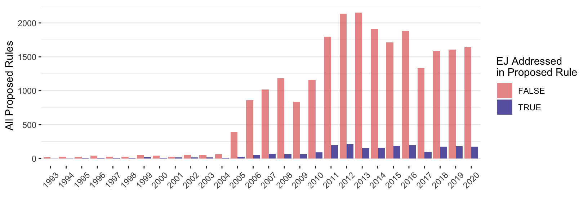
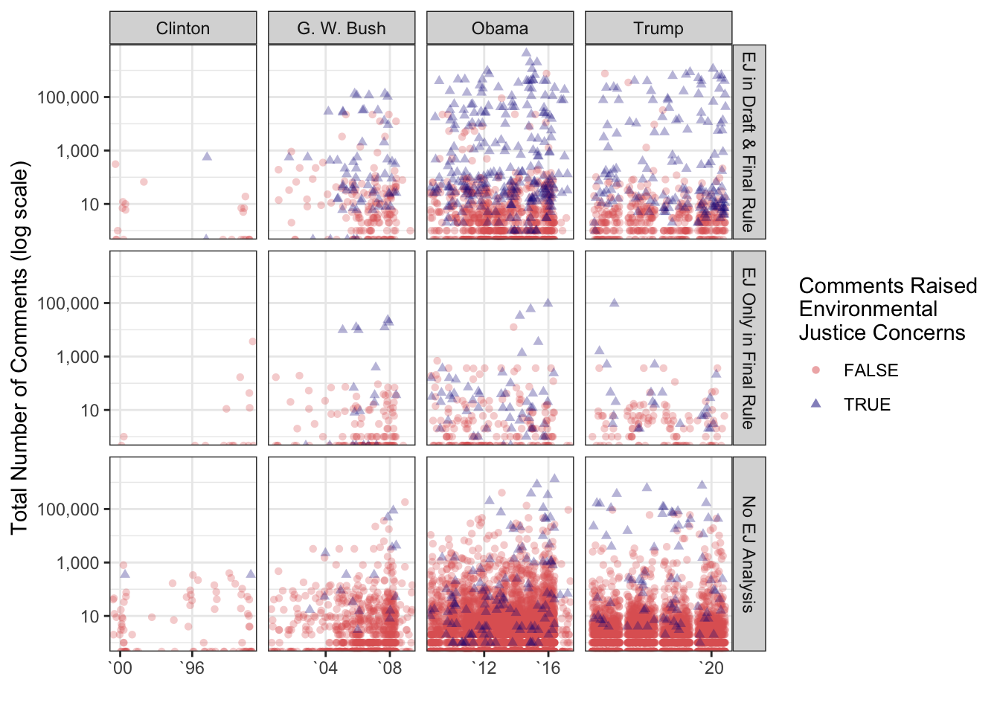
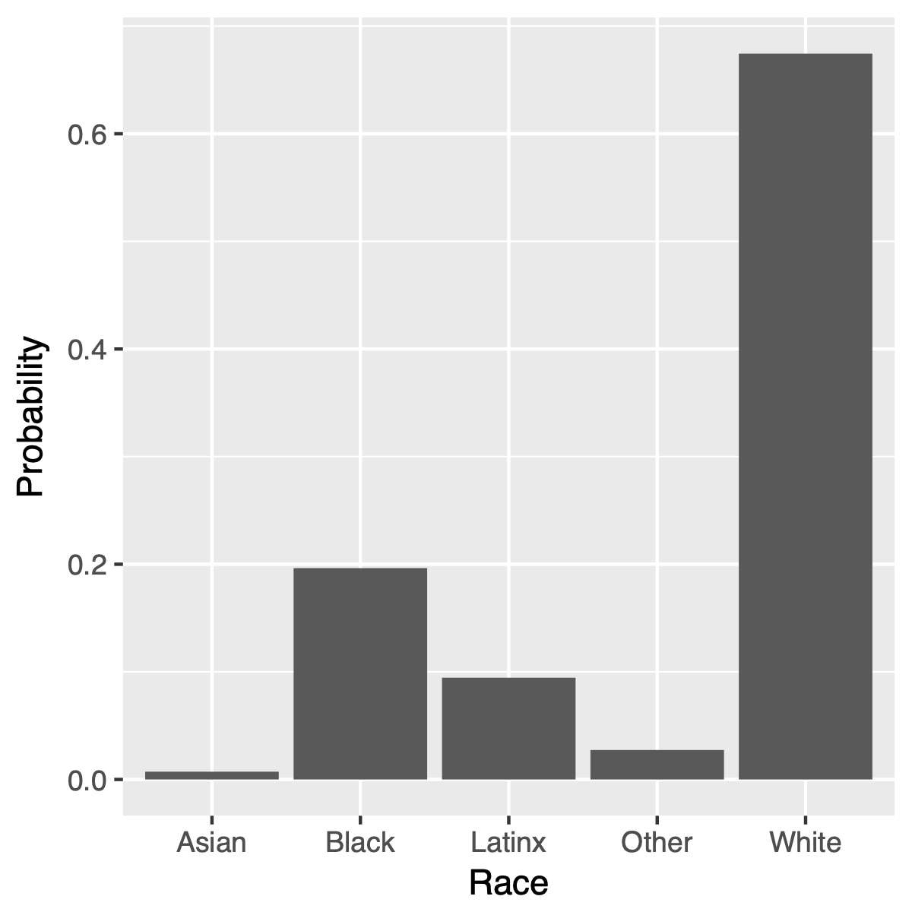
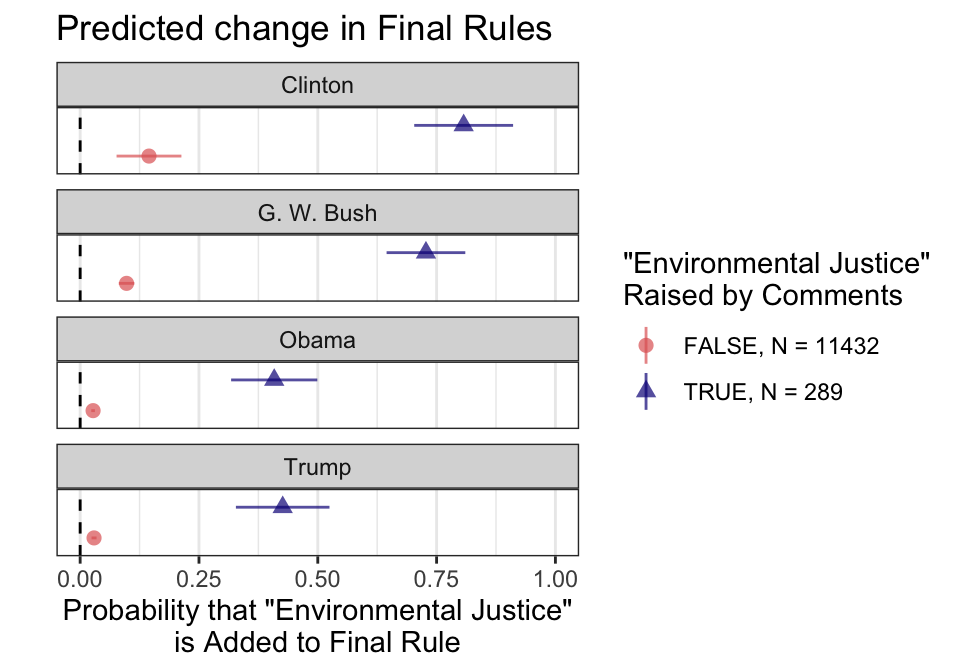
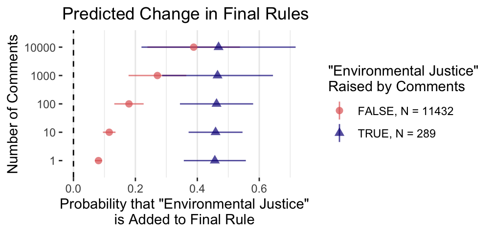
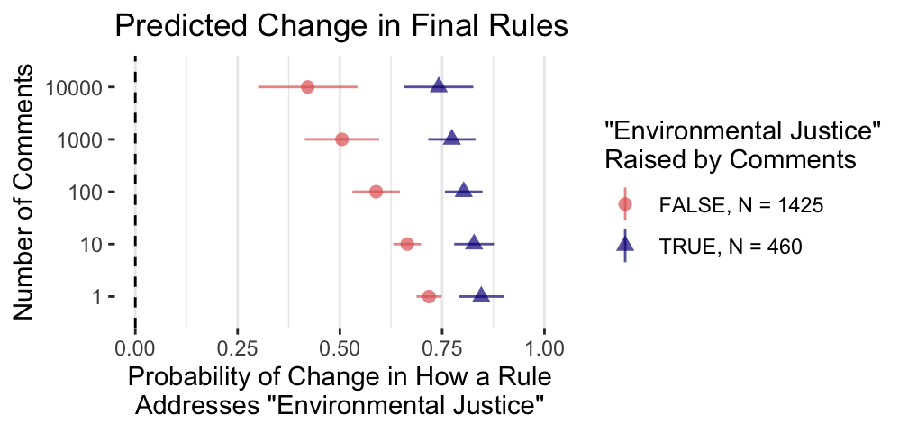

```{r setup, include = FALSE}
# chunks options:
# hide code and messages by default (warning, message)
# cache everything 
knitr::opts_chunk$set(warning = FALSE, 
                      message = FALSE,
                      echo = FALSE, 
                      cache = FALSE, 
                      fig.align = 'center',
                      fig.retina = 2,
                      dpi = 100)
# Xaringan: https://slides.yihui.name/xaringan/
library("xaringan")
library("xaringanthemer")
library("here")


mono_light(base_color = "#3b444b",
          link_color = "#B7E4CF",
          #background_color = "#FAF0E6", # linen
          header_font_google = google_font("PT Sans"), 
          text_font_google = google_font("Old Standard"), 
          text_font_size = "28px",
          padding = "10px",
          code_font_google = google_font("Inconsolata"), 
          code_inline_background_color    = "#F5F5F5", 
          table_row_even_background_color = "#ddede5",
          extra_css = 
            list(".remark-slide-number" = list("display" = "none")))

```

```{r, eval = FALSE, include= FALSE}
# setup
devtools::install_github("yihui/xaringan")
devtools::install_github("gadenbuie/xaringanthemer")
install.packages("webshot")
# webshot::install_phantomjs()

library(webshot)

# export to pdf
file <- here("present/ej-pres.html")
webshot(file, "ej-pres.pdf")
```


<!-- 
Hi, my name is Devin Judge-Lord; I'm a Ph.D. candidate at Wisconsin
This paper is the first bit of writing I've done for my dissertation on public pressure campaigns in bureaucratic policymaking, for example, mass comment campaigns.

It sets out concepts and measures for these occasional bursts of civic participation,
which I will then use to assess whether it matters. 

I am still workshopping these concepts and measures, so your comments will be decisive when I take this in the next few years. 

SLIDE

My dissertation is at the intersection of two kinds of literature that have not had much contact. 

On the one hand, civic engagement has long been a core interest of political scientists. We are highly uncertain about the size of effects from actions like letter writing, signing petitions, and protests, but there is little doubt that these things matter at a large enough scale.  
--> 

## Do Social Movements Cause Policy Change?

--

**Yes.** (Dahl 1956; Piven & Cloward 1977; Lipsky 1968; Tarrow 1994; Andrews 1997; McAdam 1982, 2001; McAdam & Su 2002, McCammon et al. 2011; Cress & Snow 2000; Weldon 2002)

--

- **Activists shape parties** (Cohen et al., 2008, Schlozman 2015, Skocpol & Williamson 2016)

--

- **Petitioning government builds movements** (Carpenter 2021)

--

- **"From the very beginning, redistributive policies have been associated with social classes and social movements"** (Lowi & Nicholson 2015)

--

- **Protests affect policy** (Gillion 2013) 

--

- **No movement, no policy** (Skocpol 2013)

???

The big question is whether social movements impact policy.

- There is a lot of research on social movements, much of it from sociology, but political scientists tell us that social movements do 
- shape party agendas
- that the act of petitioning the government builds power
- In Lowi's words redistributive policies have been associated with social classes and movements from the beginning--some kinds of policy only come about when groups form and mobilize to affect policy
- We don't know a lot about policy outcomes, but there is some great reach showing specific policy affects of civil rights protest, for example'
- And as Skocpol found in her study of why climate legislation failed, a movement is often a necessary condition for policy change


---


## Research tends to explain social movement emergence rather than specific impacts (see McAdam 2017) 

- **"limited research on [social movement] influence"** (Andrews & Edwards 2004)

- **The DV is rarely specific policy outcomes or systematic impact**

--

## My DV: Systematic impact on specific policy documents (**agency rules**)

???

Social movement scholars tend to focus on explaining movement. 

With a few notable exceptions (like Dan Gillion's work on civil rights protests) most scholars are not looking at policy, and when they do, they usually focused on a few peices of landmark legislation.

- I help fill that gap by looking systematically at change in very specific policy documents, agency rules. Agency rules now make up 90% of US law; rulemaking is where the theeth of the law are forged and reforged.

---

## Whom does notice and comment rulemaking empower? 

--

### If groups build the power to pass a Green New Deal, what happens when 30+ agencies write the actual policies? 

--

### Will organized public pressure carry over to agency policymaking? 
--
If so, by what mechanisms?

- General level of public attention?

- Specific pressure on issues like EJ?


???

So, whom does notice and comment rulemaking empower? 

For example, if a GND is passed, what happens when dozens of agencies write the implimenting rules?

Or, consider the opposite. Legislative gridlock continues but the Biden Harris administration still wants to take majore policy action

- Will organized public pressure carry over to agency policymaking? 

- If so, what kinds of politics are influential. Is it general attention, is it specific pressure groups like environmental justice activists?

---

## Theory: Information is the currency of lobbying.

### Scholars focus on *technical* information (see Yackee 2019)

- Bureaucratic policymaking, especially, is about expertise (Wagner 2010)

--

### Does *political* information matter?

- Coalition size? (Nelson and Yackee 2012 find it does)

- Who is affected? (Lowi would say it should)

- Public pressure/attention? (Balla et al. 2020 find that "legal imperatives trump political considerations")

???

Everything we know about lobbying, especially lobbying in agency rulemaking, tells us that information is the currency of lobbying. 

Information is how you get policymakers to change their minds, especially experts and lawyers.

Indeed, research shows that business groups dominate lobbying in rulemaking because they have the capacity to generate and provide relevent information. 

Thus far, by information, scholars generally mean technical and legal information (see Susan has recent Annual Review of this scholarship)

- I ask about the role of a different kind of information--what we might calll political information, building on Nelson and Yackee's finding that coalition size matters, we might also wonder if groups raising distributional claims would matter (Lowi would say so) and whether public pressure or public attention. Here scholarship is skeptical. Balla et al concluded that mass comment campaings don't matter "legal imparatives trump political considerations"

---

### *Distributive Information Hypothesis*

> Policymakers are more likely to address distributional justice when commenters raise distributional justice concerns.

--

### *Repeated Information (Coalition Size) Hypothesis*

> Policymakers are more likely to address concerns when more commenters raise them.

--

### *Policy Receptivity Hypothesis*

> Policymakers that more frequently address certain concerns will be more responsive to commenters raising those concerns.

---

### *General Pressure Hypothesis*

> Policies are more likely to change when they receive more public attention (e.g., more public comments).

--

### *Specific (Conditional) Pressure Hypothesis*

>Policies are more likely to address an issue when they receive more public attention (e.g., more public comments) *and* comments raise that issue.

---

## Why EJ?

1. Variation in issue framing: "environmental" policy is inconsistently racialized +  inconsistently focused on *distributions* of costs and benefits

--

1. Distinct phrase (few false positives) without many synonyms (few false negatives)

--

1. E.O. 12898 "Federal Actions to Address Environmental Justice"
--
--> Administrative Procedures Act lawsuits: 
> "environmental justice analysis can be reviewed under NEPA and the APA" (*Protect Our Communities Foundation v. Salazar*, 2013; *Communities Against Runway Expansion, Inc. v. FAA*, 2004)


???

Environmental Justice For All Act (2020) introduced by Senator Harris

The day after Biden's executive order was launched, Rep. Cori Bush (D-MO) and Sens. Tammy Duckworth (D-IL) and Ed Markey (D-MA) introduced the Environmental Justice Mapping and Data Collection Act of 2021, which builds on many of the concepts in the executive order and would create a whole-of-government initiative, including data infrastructure and funding to “identify communities most at risk from environmental injustices.”

---

background-image: url(clinton-ej.jpg)
background-size: cover


`“Addressing disproportionately high and adverse human health or environmental effects of programs, policies, and activities on minority populations and low-income populations.”`

---

## Example of Policy Change: Safe Levels of Mercury 
--
(For Whom?)


- 2000 Notice: "the U.S. population."

--

- 2002 Draft: Regulated entities + "Other types of entities not listed could also be
affected."

--

- 2011 Draft: Five pages of analysis of the disparate impacts
on "vulnerable populations" including "African Americans," "Hispanic,"
"Native American," and "Other and Multi-racial" groups.

--

- 2012 Final Rule: + "minority, low income, and indigenous populations."
--

- 2020 Rollback: "While these communities may experience forgone benefits as a result of this action, the potential forgone [health benefits] are small." 


???


In addition to who gets what, there is debate over who the whos *are*. What communities exist as groups diserving consideration. 

---

## Data: ~25,000 Policy Documents

12,257 Draft and Final Rule Pairs* across 40 agencies that published rules addressing EJ from 1993-2020

```{r ej-data, fig.show = "hold", out.width = "100%"}

  
```

*A few rulemaking dockets have more than one draft or final rule.

---

## Data: ~42,000,000 Public Comments

~4,800,000 (~28,000 unique) comments raise EJ concerns

```{r ej-comments, out.width = "75%"}


```

---

background-image: url(climatemarchDCej.jpg)
background-size: cover


`"The amount of methyl-mercury and other bioaccumulative chemicals consumed by Alaskans (especially Alaskan Natives) could potentially be much higher than is assumed" - Heather McCausland of the Alaska Community Action on Toxics (ACAT)`

---

background-image: url(earthjustice.png)
background-size: contain
background-position: bottom


`"Such an approach ignores the cumulative pollution burdens experienced by environmental justice communities." - Amanda Goodin, Staff Attorney, Earthjustice on behalf of Communities for a Better Environment et al.`

---

background-image: url(climatemarchDC.jpg)
background-size: cover

`"Attached are files containing the names of 11,478 individuals who have submitted public comments urging the Bureau of Land Management (BLM) to strengthen the proposed regulations on methane waste and pollution on federal and tribal lands"` <!--...I am committed to taking a stand against oil and gas exploration on public lands, as this is an Environmental Justice issue here in our vulnerable communities..."`-->

---


```{r ejcommentsbyrace, fig.cap = 'Estimated Racial Distribution from Census Surnames of Commenters Raising "Environmental Justice" Concerns in Rulemaking', out.height = NULL, out.width = "60%", fig.show = "hold"}


```

---

## Results: Adding EJ to Policy

```{r ej-m-PR-president-median-1,  out.width = "75%"}


```

- Distributive Information ✅  

---

## Results: Adding EJ to Policy

```{r ej-m-PR-comments-agencyFE, out.width = "90%", fig.show = "hold"}



```

- Distributive Information ✅  
- General Public Pressure/Attention ✅  
- Specific (Conditional) Pressure ⏪  


---

## Results: Changing Existing EJ Language

```{r ej-mejPR-comments, out.width = "90%"}


```


- Distributive Information ✅  
- General Public Pressure/Attention ⏪  
- Specific (Conditional) Pressure ❓ 

---

## Results: To sum up, yes, movements matter.


|                                            | Add EJ Language | Change EJ Language |
| ------------------------------------------ | :--: | :--: |
| ✊🏿 Distributive Information (Comments with EJ Concerns)     | 📈 | 📈 |
| ✊🏿🔁 Coalition Size           | 📈 | 📈 |
| 🏛️ Policy Receptivity                             | 📈 | ❓ |
| 📢 General Public Pressure/Attention               | 📈 | 📉 |

<!--| 📢x✊🏿 Specific (Conditional) Pressure            | 📉 | ❓ | -->

With more public attention, agencies are more likely  📈 to *add* EJ language where there was none (indeed, displacing effect of EJ comments), BUT agencies also anticipate public attention, making existing EJ analyses less likely 📉 to *change* on higher-salience rules.


---

### Next

Framing 
- More on how social movements may impact policy. Petitioning and protest? Lobbying?
- Better names for hypotheses? *Distributive Information*?

Methods
- Test policy receptivity using rates of addressing EJ out of sample (direct rules & notices)
- Better measures of policy change
- Better estimation

Substance
- Other terms/movements ("climate change"/"racial"/"minority populations"/"low-income"...others?)
