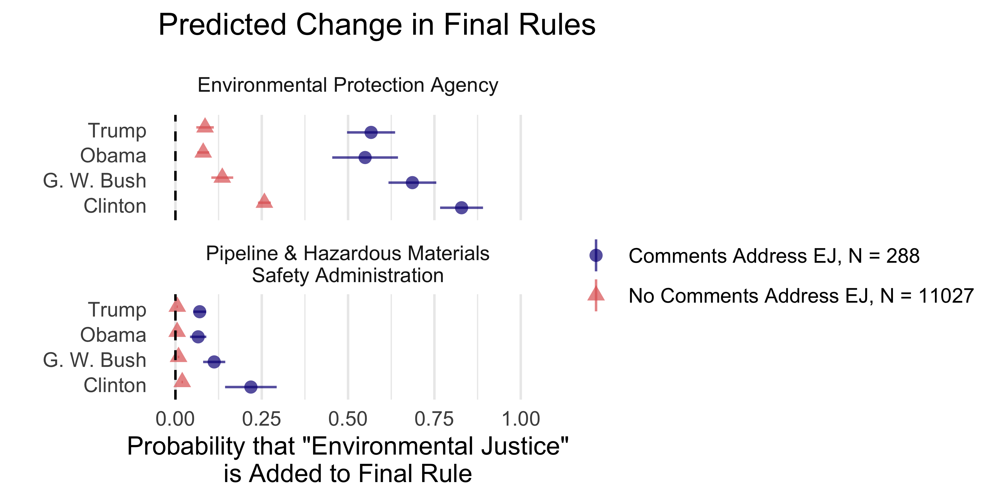

```{r setup, include = FALSE}
# chunks options:
# hide code and messages by default (warning, message)
# cache everything 
knitr::opts_chunk$set(warning = FALSE, 
                      message = FALSE,
                      echo = FALSE, 
                      #fig.path = "Figs/",
                      cache = FALSE, 
                      fig.align = 'center',
                      fig.retina = 2,
                      dpi = 100)
# Xaringan: https://slides.yihui.name/xaringan/
library("xaringan")
library("xaringanthemer")
library("here")
library("tidyverse")
library("magrittr")


style_mono_light(base_color = "#3b444b",
          inverse_link_color	
 = "#B7E4CF",
          #background_image = "Figs/ej-superfund-light.jpeg",
          background_color = "white", #FAF0E6", # linen
          header_font_google = google_font("PT Sans"), 
          text_font_google = google_font("Old Standard"), 
          text_font_size = "29px",
          padding = "10px",
          code_font_google = google_font("Inconsolata"), 
          code_inline_background_color    = "#F5F5F5", 
          table_row_even_background_color = "#ddede5"#, extra_css = list(".remark-slide-number" = list("display" = "none"))
 )

```

```{r, eval = FALSE, include= FALSE}
# setup
devtools::install_github("yihui/xaringan")
devtools::install_github("gadenbuie/xaringanthemer")
install.packages("webshot")
# webshot::install_phantomjs()

library(webshot)

# export to pdf
file <- here("present/ej-pres.html")
webshot(file, "ej-pres.pdf")
```

class: inverse center

class: inverse center

# The Broader Project: Public Pressure


Mobilization


(grassroots, astroturf, elected officials)

↓

Getting policymakers' attention and framing policy debates

↓

Substantive policy influence

↓

Surviving judicial review

???

Hi, my name is Devin Judge-Lord; I'm a postdoc at Harvard Univ.
Today I am zooming in from Lenape land just uphill from neighborhoods that New York City's initial climate adaptation plan proposed to flood to protect the financial district. 

My work is at the intersection of two literatures that have not had much contact...On the one hand, social movements and civic engagement have long been a core interest of political scientists. We are highly uncertain about the size of effects from actions like letter writing, signing petitions, and protests, but there is little doubt that these things matter at a large enough scale.

On the other hand, bureaucratic policy processes like agency rulemaking are often discussed as if they operate with technocratic rationality. In a sense, mass politics is missing from a lot of the administrative law literature and even from political science theories and formal models of bureaucratic policymaking. 

The paper I am presenting today is a small part of a larger book project: 

Sub-stan-tive

Clinton

Chicano 

---

class: inverse center

# The Broader Project: Public Pressure


Mobilization


(grassroots, astroturf, elected officials)

↓

<mark>Getting policymakers' attention and framing policy debates</mark>

↓

Substantive policy influence

↓

Surviving judicial review


???

It is a middle step in the causal chain from mobilization to substantive policy influence. 
As I turn this chapter into an article,
I am struggling to include just enough and not too much of what comes before and after.

I need enough about mobilization to be clear about who is empowered.

I need enough on substantive policy influence to be honest about the limited power of framing and discourse effects in any one policy fight. 
But, this paper is really about the aggregate effects of many linked campaigns on the discourse and issue frames in the policy process---that is, how a movement affects policymaking 
across institutions and over time.

---

## Preview

Public pressure affects policy debates

--

- Policymakers rarely addresses EJ concerns (across administrations)
--
, but

- they are much more likely to address EJ when pressured.

--

Especially **receptive policymakers** who have **not already taken a position**

- With larger EJ coalitions and more public attention, agencies are more likely  📈 to **add** EJ language **where there was none**
- BUT agencies also anticipate public attention, making **existing** EJ analyses less likely 📉 to **change** on higher-salience rules.

--

HOWEVER, groups raising EJ are usually "big green" (White) advocacy organizations.  
--
Big greens are much more likely to have their substantive policy demands met than tribes or frontline EJ groups.

???

Today, I'm goint to show that public pressure can affect the policy process, but with lot of caveats. And the caveates are often the most intereting part. 

The first caveat is that baseline rates of addressing EJ is very low from the Clinton through the Trump administrations. 
There is a lot of potential for change, which is a tough road for the movement, but helpful for the scientist trying to measuring change.

The second caveat is that pressure matters to receptive policymakers--policymakers who are used to thinking about ej at institutions with organizational processes for addressing EJ. 

Third is that, the scale of public attention makes policymakers more likely to address EJ when they did not, but higher-salience policies that already addressed EJ are less likely to change. I suspect this is because agency officials have already dotted their i's and cossed their t's in these cases and there little room left to move. 

Finally, assessing the normative implications requires us to understand who is advocationg for whom. In the the case of comments on federal agency rules, it is "big green" national advocacy groups that have historically led a very White environmental movement. 
These "big greens" are more likley to get substanitve policy demands met than Tribes and frontline community groups. So, a lot hinges the extent to which these national organizations represent EJ communities.

---

background-image: url(https://assets.nrdc.org/sites/default/files/styles/full_content/public/media-uploads/midwesttoxicdoughnut_25_002chicago_steel_mills-july_1965_vl_2400.jpg?itok=yXMNtQ-Y)
background-size: cover

--


# The EJ Frame

- Emerged in local campaigns against toxic waste sites and pesticides
- Began appearing in federal policy documents in the 1980s
- A fusion of the American Indian Movement, Chicano movement, farmworker movement, civil rights movement, and union organizing

> People of color [raised] social justice concerns such as self-determination, sovereignty, human rights, social inequality, loss of land base, limited access to natural resources, and disproportionate impacts of environmental hazards and linked them with traditional working-class environmental concerns such as worker rights and worker health and safety to develop an environmental justice agenda. (Taylor 2012, p. 1)

???

The EJ movment began in local resistance to toxic waste in places like the  Alt-geld Gardens housing complex on Chicago's South Side where Hazel Johnson had been organizing tennats years before a young barak obama showed up in 1984. This housing complex is surrounded by manufacturing and dumping. 

Dorcetta Taylor describes how black-led campaigns like Johnson's fused with the American Indian Movement, Chicano and farmworker movements, and drew on the civil rights and union organizing to push the EJ frame onto the national policy agenda, and EJ begain appearing in federal documents in the 1980s. 

My aim is to build on Taylor with some more detailed and systematic data on the broad trends she has maped. 


---

## Do Social Movements Cause Policy Change?

--

**Yes.** (Dahl 1956; Lipsky 1968; Piven & Cloward 1977; Tarrow 1994; Andrews 1997; McAdam 1982, 2001; McAdam & Su 2002, McCammon et al. 2011; Cress & Snow 2000; Weldon 2002)

--

- **Activists shape parties** (Cohen et al. 2008, Schlozman 2015, Skocpol & Williamson 2016)

--

- **Petitioning government builds movements** (Carpenter 2021)

--

- **"From the very beginning, redistributive policies have been associated with social classes and social movements"** (Lowi & Nicholson 2015)

--

- **Protests affect policy by informing** (Gillion 2013, Gause 2022) **and seed policy agendas** (Wasow 2020)

--

- **No movement, no policy** (Skocpol 2013)

???

The big question is whether social movements impact policy.

- There is a lot of research on social movements, much of it from sociology, but political scientists tell us that social movements do 
- shape party agendas
- that the act of petitioning the government builds power
- In Lowi's words, "redistributive policies have been associated with social classes and movements from the beginning"--some kinds of policy only come about when groups form and mobilize to affect policy
- We don't know a lot about policy outcomes, but there is some great work showing specific policy effects of civil rights protest, for example.
- And as Theda Skocpol found in her study of why climate legislation failed, a movement is often a necessary condition for policy change

Notwithstanding all of this work, there is still demand for better understanding of the role of social movements in policymaking. 

---


## Research tends to explain social movement emergence rather than specific impacts (McAdam 2017) 

- **"limited research on [social movement] influence"** (Andrews & Edwards 2004)

- **The DV is rarely specific policy outcomes or systematic impact**

--

## My DV: Systematic impact on specific policy documents (**agency rules**)
--

## Aggregate impact of EJ campaigns across institutions and over time $\rightsquigarrow$ EJ movement impact

???

Doug McAdam and others has noted a need for more work on measuring impact.

While we have a lot of great case studies, much of the systematic work focuses on explaining mobilization. Movement activity and structure are the DVs. 

Again notable exceptions (like Dan Gillion and Omar Wa-So's work on civil rights protests, Jamila Michener). 

I help fill that gap by looking systematically at change in very specific policy documents---agency rules, which now make up 90% of US law; 

rulemaking is where the teeth of the law are forged and reforged.

So, I'm interested in the extent to which social movments can affect agency rulemaking. 

Put differently, 
Whom does notice and comment rulemaking empower? 

---

## Whom does notice and comment rulemaking empower? 

--

### If groups build the power to pass a Green New Deal, what happens when 30+ agencies write the actual policies? 

--

### Will organized public pressure carry over to agency policymaking? 
--
If so, by what mechanisms?

- General level of public attention?

- Specific pressure on issues like EJ?

- Targeting more receptive institutions?


???

So, whom does notice and comment rulemaking empower? 

For example, if a GND is passed, what happens when dozens of agencies write the implementing rules?

Or consider that Biden has pleged to spend 40% of infrastucture money and BBB in disadvantaged and EJ communities. There is a lot of discussion this week because they ommitted race from the definintion of an EJ community because they are worried the courts will block it. 

Even without BBB or a GND, the Biden Harris administration is taking major policy action through rulemaking.

- Will organized public pressure carry over to agency policymaking? 

- If so, what kinds of politics are influential. Is it general attention? Is it specific pressure groups like environmental justice activists?

- are some institutions more recptive to pressure on EJ than others? 

This is where I turn to the literature on bureaucratic politics. 

---

## Theory: Information is the currency of lobbying.

### Scholars focus on *technical* information (see Yackee 2019)

- Bureaucratic policymaking, especially, is about expertise (Wagner 2010)

--

### Does *political* information matter?

- Coalition size? (Nelson and Yackee 2012 find it does)

- Who is affected? (Lowi would say it should)

- Public pressure/attention? (Balla et al. 2020 find that "legal imperatives trump political considerations")

???

Everything we know about lobbying, especially lobbying in agency rulemaking, tells us that information is the currency of lobbying. 

Information causes policymakers change their minds, *especially* when they are experts and lawyers.

Indeed, research shows that business groups dominate lobbying in rulemaking *because* they can generate and provide relevant information. 

Thus far, by "information," scholars generally mean technical and legal information.

- I ask about the role of a different kind of information--what we might call political information, building on Nelson and Yackee's finding that coalition size matters, we might also wonder if groups raising distributive claims would matter (Lowi would say so) and whether public pressure or public attention matters. Here scholarship is skeptical. Balla et al. concluded that mass comment campaigns don't matter "legal imperatives trump political considerations." in responding to comments. That technocratic rationality dominates, meaning that that political information is not affecting the policy process. I want to test this claim. 

---

### *Distributive Claims Hypothesis*: 

> Policymakers are more likely to address distributive justice when groups raise distributive justice concerns.

✅ Pro: "norms and values are set communicatively" (Habermas 1996), "identifying interests" shapes policy (Gellhorn 1972)   


❌ Con: Bureaucratic policymaking is about "technical expertise" (Epstein et al. 2014)

--

### *Repeated Information (Coalition Size/Pressure) Hypothesis*

> Policymakers are more likely to address concerns when more groups raise them.

✅ : "Coalition size" (Nelson and Yackee  2012)    

❌ : "Informational value" (Epstein et al. 2014; Gailmard & Patty 2017; Libgober 2018)

???

All of the formal models to date are
I really like Brian Libgober's model of how comments inform rules, but 

---

### *Policy Receptivity Hypothesis*

> Policymakers that more frequently address certain concerns will be more responsive to groups raising those concerns.


<!-- "Legibility" (Scott 1998), -->
✅ : "Opportunity structure" (Marks & McAdam 2007; McAdam 2010) "fit inside the legal narrative" (Scott 1998; Deloria 2009; Hilson 2002; Delaney 2017)   

❌ : "New information" Farina (2018)

???

> "[Political opportunity] must be seen not just in terms of openness (in other words, access to the administration), but also in terms of political receptivity to the claims being made." (Hilson 2002, p. 242)

---

### *Public Attention Hypothesis*

> Policies are more likely to change when they receive more public attention (e.g., more public comments).

✅ : Gillion (2013), Leech (2010), Skocpol (2013), Wasow (2020)

❌ : Lowery (2013), Balla et al. (2020)

???

*Conditional Attention Hypothesis*

> Policies are more likely to address an issue when they receive more public attention (e.g., more public comments) *and* groups raise that issue.

---

background-image: url(https://assets.nrdc.org/sites/default/files/styles/full_content/public/media-uploads/midwesttoxicdoughnut_25_002chicago_steel_mills-july_1965_vl_2400.jpg?itok=yXMNtQ-Y)
background-size: cover


## Why EJ?

1. Variation in issue framing: "environmental" policy is inconsistently racialized +  inconsistently focused on *distributions* of costs and benefits

--

1. Distinct phrase (few false positives) without many synonyms (few false negatives)

--

1. E.O. 12898 "Federal Actions to Address Environmental Justice" (1993)


???

--> Administrative Procedures Act lawsuits: 
> "environmental justice analysis can be reviewed under NEPA and the APA" (*Protect Our Communities Foundation v. Salazar* 2013; *Communities Against Runway Expansion, Inc. v. FAA* 2004)


Environmental Justice For All Act (2020) introduced by Senator Harris

The day after Biden's executive order was launched, Rep. Cori Bush (D-MO) and Sens. Tammy Duckworth (D-IL) and Ed Markey (D-MA) introduced the Environmental Justice Mapping and Data Collection Act of 2021, which builds on many of the concepts in the executive order and would create a whole-of-government initiative, including data infrastructure and funding to “identify communities most at risk from environmental injustices.”

---

background-image: url(Figs/clinton-ej.jpg)
background-size: cover


`“Addressing disproportionately high and adverse human health or environmental effects of programs, policies, and activities on minority populations and low-income populations.”`

---


background-image: url(Figs/brianadams.png)
background-size: cover

## Example: Safe Levels of Mercury 
--
(For Whom?)


- 2000 Notice: "the U.S. population."

--

- 2002 Draft: Regulated entities + "Other types of entities not listed could also be
affected."

--

- 2011 Draft: disparate impacts on "vulnerable populations" including "African Americans," "Hispanic,"
"Native American," and "Other and Multi-racial" groups.

--

- 2012 Final Rule: EJ analysis adds "minority, low income, and indigenous"
--

- 2020 Rollback: "These communities may experience foregone benefits" 
--
⁉️

--

- 2021 Draft: 2012 Final Rule + "differentiated subsistence fisher
populations" + "children exposed prenatally"

???


Before the politics of who gets what, there is the politics of who the whos *are*. What are the groups or communities deserving consideration? 

2011 Draft: Five pages of EJ analysis of the disparate impacts
on

- 2020 Rollback: "While these communities may experience foregone benefits as a result of this action, the potential foregone [health benefits] are small." 

⁉️

30/51 pages in Biden

---

## Data: ~25,000 Policy Documents

12,257 Draft and Final Rule Pairs* from 40 agencies, 1993-2020

```{r ej-data, fig.show = "hold", out.width = "100%"}

knitr::include_graphics("Figs/ej-data-ejpr-1.png")  
```

*A few rulemaking dockets have more than one draft or final rule.

---

## Data: ~42,000,000 Public Comments

```{r ej-comments, out.width = "80%"}

knitr::include_graphics("Figs/ej-comments-1.png")
```


???

I collected all 40 million comments on these draft and final rule pairs. 
almost 5 million mentioned EJ.

The top row of plots with the purple border shows proposed rules that did address EJ, I use this set to assess whether EJ language changed between draft and final. 

The lower two rows in the red box show proposed rules that did not address EJ, the middle row shows rules where it EJ language was added. 

Each point is a rule. 
Blue ones are ones where commenters raised EJ concerns. 
Red are where no comments raised.
Y-axis is the total number of comments the rule recieved. 

---


## Data: ~42,000,000 Public Comments

~4,800,000 (~28,000 unique) comments raise EJ concerns


```{r percent-match, fig.show = "hold", out.width = "55%", fig.cap="Example: Identifying Coalitions by the Percent of Matching Text in a Sample of Public Comments"}

knitr::include_graphics("Figs/comment_percent_match_plot.png") 
```

???

Using ngram matching methods similar to plagairism detection, I collapse form letters and petitions into representiative texts. As most comments are form letters, that 5 milliong collapses to 28 thousand unique texts.
This figure shows the percent of shared text of in a sample of documents.
The black squares on the diagonal show that each comment has a perfect overlap with itself. 
The block of grey partial matches reflect a public pressure campaign, with a lot of shared 10-grams. 
I then attach these to lobbying coaltions by hand. 

---

# Measuring influence

### I. Getting policymakers' attention/engagement/response

- in specific cases: 
 - adding policy language 
 - changing policy language

- over time
 - change in patterns of policymaking

### II. Getting substantive policy demands


---

## Hand-coded coalitions and policy change

```{r datasheet, fig.show = "hold", out.width = "100%", fig.cap="Example: Identifying Coalitions by Hand"}

knitr::include_graphics("Figs/datasheet.png")
```


---

```{r ej-winrates}
library(kableExtra)
library(scales)
load(here::here("data", "winrate.Rdata"))
winrates %>% 
  mutate(`EJ Success Rate` = `EJ Success Rate` %>%
           percent(accuracy = 1) %>% replace_na("-"),
         `Overall Success Rate` = `Overall Success Rate` %>%
           percent(accuracy = 1)) %>% 
  dplyr::select(-`N raising EJ`) %>% #mutate(across(where(is.numeric), pretty_num)  ) %>%
      knitr::kable(caption = "") %>% 
      kableExtra::kable_styling(font_size = 22, position = "center")  #kable3(caption = "Hand-coded Lobbying Success by Type of Organization, 2005-2020")
```

---

background-image: url(https://www.sierraclub.org/sites/www.sierraclub.org/files/uploads-wysiwig/SIERRA%20Forefront%20Of%20Change%20WB.jpg)
background-size: cover


`"The amount of methyl-mercury and other bioaccumulative chemicals consumed by Alaskans (especially Alaskan Natives) could potentially be much higher than is assumed" - Heather McCausland of the Alaska Community Action on Toxics (ACAT)`

---

background-image: url(Figs/earthjustice.png)
background-size: contain
background-position: bottom
background-color: white


`"Such an approach ignores the cumulative pollution burdens experienced by environmental justice communities." - Amanda Goodin, Staff Attorney, Earthjustice on behalf of Communities for a Better Environment et al.`

---

background-image: url(https://www.sierraclub.org/sites/www.sierraclub.org/files/styles/flexslider_full/public/sierra/articles/big/SIERRA%20March%20Big%20Javier%20WB.jpg?itok=YfFbYPwM)
background-size: cover

`"Attached are files containing the names of 11,478 individuals who have submitted public comments urging the Bureau of Land Management (BLM) to strengthen the proposed regulations on methane waste and pollution on federal and tribal lands"` 

??? 

-

- `"...I am committed to taking a stand against oil and gas exploration on public lands, as this is an Environmental Justice issue here in our vulnerable communities..."`


---

## Whom does notice and comment rulemaking empower? 

```{r ejcommentsbyrace, fig.cap = 'Estimated Racial Distribution from Census Surnames of Commenters raising "Environmental Justice" Concerns in Rulemaking', fig.height = 1.5, fig.width=2, out.width = "40%", fig.show = "hold"}
load(here::here("data", "ej_race.Rdata"))

Race %>% ggplot() + 
  aes(y =Race, x = Probability) + 
  geom_col() +
  theme_minimal() +
  theme(panel.grid.major.y = element_blank())
```

---

background-image: url(https://assets.nrdc.org/sites/default/files/styles/header_background/public/coms10_rm_515297744_900x600.jpg?itok=pf3xJ1l1)
background-size: cover

class:  inverse center middle 

# Results 


---

background-image: url(Figs/ej-table-paper.png)
background-size: contain
background-color: white

???

I expect decreasing marginal effects of additional comments, both overall (i.e. public attention) and those that mention EJ (coalition size), so I use logged values. 

However, the conclusions are largely the same if I use a quadradic function instead. That analysis suggests that medium levels of attention are not so impactful. A small amount of attention matters and t then it takes a very large amout of additional pressure to move things, which makes sense. For hypothesis testing however, all of the effects are in the same direction, so I am going to present predicted probabilites from these models, mostly the fixed effect models. 


## Results: Adding EJ to Policy

```{r ej-m-PR-president-median-2, out.width = "90%"}

```


---

background-color: white

## Results: Adding EJ to Policy

```{r ej-m-PR-president-median-1, out.width = "85%"} 



```

- ✊🏿  Distributive Claims 📈 

---

background-color: white


## Results: Adding EJ to Policy

```{r ej-m-PR-shareI, fig.cap = "", out.width = "85%", fig.show = "hold", fig.subcap=""}


```

- 🏛️ Policy Receptivity 📈 

---

background-color: white

## Results: Adding EJ to Policy

```{r ej-m-PR-ejcomments-agencyFE,  out.width = "90%"}
knitr::include_graphics("Figs/ej-m-PR-ejcomments-agencyFE-1.png")
```

- ✊🏿 🔁   Coalition Size 📈 

---

background-color: white


## Results: Adding EJ to Policy

```{r ej-m-PR-comments-agencyFE, out.width = "90%", fig.show = "hold"}


```

- ✊🏿  Distributive Claims 📈 
- 📢  General Public Pressure/Attention 📈  (when comments don't raise EJ)

---

background-color: white


## Results: Changing Existing EJ Language

```{r ej-mejPR-ejcomments-agencyFE, out.width = "90%"}

knitr::include_graphics("Figs/ej-mejPR-ejcomments-agencyFE-1.png")
```


- ✊🏿🔁  Coalition Size 📈 

---

background-color: white

## Results: Changing Existing EJ Language

```{r ej-mejPR-comments, out.width = "90%"}

knitr::include_graphics("Figs/ej-mejPR-comments-agencyFE-1.png")
```


- ✊🏿  Distributive Claims 📈 
- 📢  General Public Attention 📉 (when comments don't raise EJ)

---

## Results: To sum up, yes, movements matter

Strong framing effects, but substantive victories are rare and dominated by surrogates

|                                            | Add EJ Language | Change EJ Language |
| ------------------------------------------ | :--: | :--: |
| ✊🏿  Distributive Claims (EJ Concerns)     | 📈 | 📈 |
| ✊🏿 🔁  Coalition Size /  Pressure        | 📈 | 📈 |
| 🏛️  Policy Receptivity                             | 📈 | 📈 |
| 📢  General Public Attention               | 📈 | 📉 |


<!--| 📢x✊🏿 Specific (Conditional) Pressure            | 📉 | ❓ | -->

With larger coalitions and more public attention, agencies are more likely  📈 to **add** EJ language **where there was none**, BUT agencies also anticipate public attention, making **existing** EJ analyses less likely 📉 to **change** on higher-salience rules.

Replicates with "climate change" 

---

class: inverse

Thank you!

- Paper, slides, data: [judgelord.github.io/research/ej](judgelord.github.io/research/ej)
- Rules currently open for comment: [judgelord.github.io/rulemaking/open]( https://judgelord.github.io/rulemaking/open)

--

Questions
- More or less on mobilization or hand-coded influence? 
- Aggregate impact of related campaigns $\rightsquigarrow$   social movement impact?
- Should "climate change" replication be in this paper? 
- Other discursive terms/movements?

--

Next papers
- [Audit study](): What causes institutional receptivity?
- [Co-framing](): EJ + "health", "disaster", "climate" & changes in term frequency
- [Surveys]() to compare comments to public opinion
- [Lobbying networks]()
- [Feedback](): The mobilizing and demobilizing effects of the policy process

???

Carving out a paper: More or less on mobilization or hand-coded influence? 

Is the aggregate influence of related campaigns a defensible working deff of a social movement, or is there a better way of talking about this? 

co-framing (Baumgartner and Jones) 

<!--
Next Steps
- More on coalition structure and policy success, especially opposing coalitions
- Better (hand-coded) measures of policy change
- Model changes in texts that already discuss climate/EJ/CJ

Framing 
- More on how social movements may impact policy. Petitioning and protest? Lobbying?
-->

---

Photo credits: [Brian Adams]( https://brianadams.photoshelter.com/portfolio/G00005IRIxI9ewPM/I0000768RCEwKxsQ)


---

class: inverse center middle 

# Extra Slides 

---

# Next steps: methods

- Test policy receptivity using rates of addressing EJ out of sample (direct rules & notices)
- Better measures of policy change
- cor(EJ Language, Lobbying Success)
- Alternative estimation (hierarchical Bayes)
- Cumulative effects over time (hazard models)
- Placebo test? 

---

background-color: white

### Replication & Extention: Climate Change & Climate Justice 

```{r cj-data-agencies, out.width = "90%"}

knitr::include_graphics("Figs/cj-data-agencies-2.png")
```

---

background-color: white

```{r table,  out.width = "80%"}

knitr::include_graphics("Figs/cj-table.png")
```


---

background-color: white

## Results: Adding Climate Change to Policy 

```{r climate-m-PR-climatecomments-agencyFE,  out.width = "80%"}


knitr::include_graphics("Figs/climate-m-PR-climatecomments-agencyFE-1.png")

```

- 🔬🔁 Coalition Size ✅  

