---
# TODO add name and email to all slides
# knit: ( function(input, ...){rmarkdown::render(input) } )
# rmarkdown::render("docs/present/methods-pres.Rmd")
knit: ( function(input, ...){xaringan::infinite_moon_reader(input) } )
title: "Money, Expertise, Public Pressure, and Democratic Capacity in Federal Agencies"
# author: "Devin Judge-Lord <br>  Harvard University"
bibliography: '`r here::here("assets/dissertation.bib")`'
biblio-style: '`r here::here("assets/apsr.bst")`'
link_col: cyan
date: "judgelord.github.io/HUCE"
titletext_fontfamily: "Roboto:wght@100"
middle_fontfamily: "Roboto"
font_family: "Roboto:wght@100"
urlcolor: cyan
output:
  xaringan::moon_reader:
    self_contained: true
    footer: These slides available at http://bit.ly/myslides
    lib_dir: libs
    mathjax: "default" # "https://cdn.bootcss.com/mathjax/2.7.1/MathJax.js?config=TeX-AMS_HTML"
    css: ["footer-header.css", "xaringan-themer.css"]
    nature:
      ratio: '16:9'
      highlightStyle: github
      highlightLines: true
      countIncrementalSlides: false
      slideNumberFormat: "%current%/16"           # 12/42 
editor_options: 
  chunk_output_type: console
---


```{r setup, include = FALSE}
short = "false"
exclude_stepwise = "false"
exclude_extra = "false"

# cache everything 
knitr::opts_chunk$set(warning = FALSE, 
                      message = FALSE,
                      echo = FALSE, 
                      #fig.path = "Figs/",
                      fig.topcaption=TRUE,
                      cache = TRUE, 
                      fig.align = 'center',
                      fig.retina = 2,
                      fig.show="hold",
                      fig.pos= "htbp",
                      fig.path = "Figs/",
                      fig.cap = '   ',
                      out.width = "100%",
                      out.extra = "")


# Xaringan: https://slides.yihui.name/xaringan/
library("xaringan")
library("xaringanthemer")
library("here")
library("tidyverse")
library("magrittr")
library("knitr")
library("kableExtra")


style_mono_light(base_color = "#236D94",# "#3b444b",
          link_color	
 = "#247980" ,# "#92d6b6",
          inverse_link_color	
 = "B7E4CF", # "#751B55", ##B7E4CF",
          #background_image = "Figs/ej-superfund-light.jpeg",
          background_color = "#FFFFFF", #FAF0E6", # linen
          header_background_content_padding_top = "7rem",
 header_font_google = google_font("Open Sans"), 
          text_font_google = google_font("Open Sans"), 
 #text_font_family = "cm-web-fonts",
 #text_font_url = "https://cdn.jsdelivr.net/gh/aaaakshat/cm-web-fonts@latest/fonts.css",
          base_font_size = "30px",
  text_font_size = "1rem",
 code_font_size = "1rem",
 header_h1_font_size = "1.75rem",
  header_h2_font_size = "1.5rem",
  header_h3_font_size = "1.25rem",
          padding = "15px",
          code_font_google = google_font("Inconsolata"), 
          code_inline_background_color    = "#FFFFFF", 
          #table_row_even_background_color = "grey"#, extra_css = list(".remark-slide-number" = list("display" = "none"))
 )
```

layout: true

<div class="my-footer"><span>Devin Judge-Lord&emsp;&emsp;</span></div> 

---

## Motivation

- Large majorities want stronger environmental policy

- Massive youth and activist energy behind climate and environmental justice

- Policy fights don't end with legislation

- But agency policymaking is technocratic  
$\rightarrow$ hostile terrain for mass politics and activism  
$\rightarrow$ good for incumbent industries


???

Legal theorists debate the normative value of public participation in agency rulemaking.
The role of agency policymaking in a large democracy unsettled

Big push from this administration increase participation and democratize agency decision-making, but the aim is unclear

Moreover, Bureaucratic inertia frustrates any "all of government" initiatives

As a political scientist, I take a more empirical large-scale quantitative approach to figure out the potential and limits of activism targeting agencies


---

## The IRA fight isn't over 

"energy community".  
$\rightarrow$ already [300+ pages of guidance from Treasury](https://arcgis.netl.doe.gov/portal/apps/experiencebuilder/experience/?id=a2ce47d4721a477a8701bd0e08495e1d) &  [maps from DOE](https://energycommunities.gov/energy-community-tax-credit-bonus/)

"disadvantaged community"   
$\rightarrow$ "a community that the Secretary determines [is] disadvantaged"

"life cycle emissions" <!--$\rightarrow$ "additional"/"new" generation -->    
$\rightarrow$ $0 – ∞ billion for hydrogen

"facility"   
$\rightarrow$  0 – massive reductions in methane 


---

layout: true

<div class="my-footer"><span>Devin Judge-Lord&emsp;&emsp;(Results from Powell, Judge-Lord, & Grimmer 2023)</span></div> 

---

## Money buys allies in Congress who pressure agencies

```{r, out.width= c("60%", "40%")}
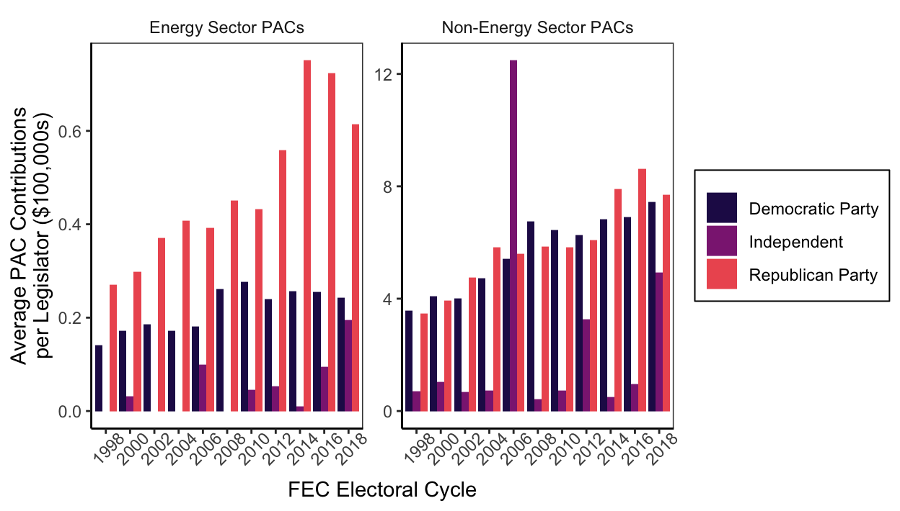
knitr::include_graphics("Figs/full-logit-pro-1.png")
```

---

layout: true

<div class="my-footer"><span>Devin Judge-Lord&emsp;&emsp;(Results from Carpenter et al. "Inequality in Administrative Democracy")</span></div> 


---


## Agency rulemaking tilts toward the rich


```{r, commenters-noncommenters, out.width= c("55%", "45%")}
knitr::include_graphics("Figs/compustat-density-1.png")
knitr::include_graphics("Figs/assets-efficacy-6.png")
```

???

The other day I mentioned work I'm doing with my mentor Dan Carpenter here on how the banks successfully pushed back on financial regulation after the financial crisis and Dodd-Frank Act by lobbying the regulatory agencies. 

There may be lessons here for how powerful incumbent interests responding to the IRA and especially if we get more regulatory legislation.

---

## Why? 

### $\rightarrow$ Big companies hire experts and lawyers

```{r, out.width= "100%"}
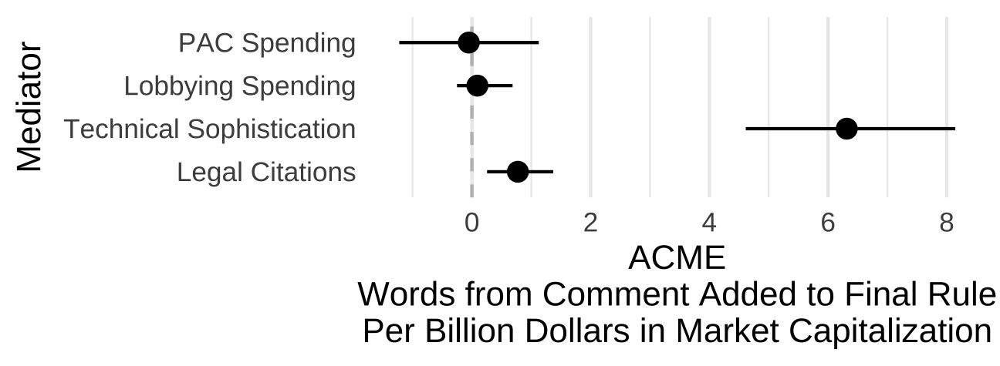
```


---

layout: true

<div class="my-footer"><span>Devin Judge-Lord&emsp;&emsp;</span></div> 

---

## When does public pressure affect agency rulemaking? 


Campaigns succeed when

1. They have broad **public support** & **showing support is easy**

???

Public support can be a resource. Presidents "go public" to get their agenda through Congress. Similarly, activists mobilize public attention when it shifts politics in their favor. 

--
1. They have **experts and lawyers**

--
2. They **shift the terms of debate** or **mobilize elected officials**

--
2. The agency has **capacity** (e.g. to address climate or environmental justice issues)


???

Pushing back against some of the skepticism about pressure.
It can help, but only in certain conditions
 involved, ideally both


The work that Carrie and Arie do at ELP is really important 

???
Framing values-based decisions as scientific may hurt more than it helps.


---

name: orgs


```{r}
# code in the top_orgs.R
load(here("data", "org_counts_summary.Rdata"))

top5 <- org_counts_summary[1:5,] %>% tally(comments)
top10 <- org_counts_summary[1:10,] %>% tally(comments)
top100 <- org_counts_summary[1:100,]  %>% tally(comments)
```

<!--Iteratively linking comments to the organizations that wrote or mobilized them (and thus strings to identify similar documents), I find that a few advocacy organizations mobilize the vast majority of comments. 
-->

### Pressure results from **organized campaigns** 


Of 58 million public comments on proposed agency rules, 2005-2020.  
- The top 100 organizations mobilized `r top100 |> prettyNum(big.mark = ",")`
- The top 10 organizations mobilized `r top10 |> prettyNum(big.mark = ",")`


```{r}
# code in the top_orgs.R
load(here("data", "org_counts_summary.Rdata"))

top10 <- org_counts_summary[1:10,]
top100 <- org_counts_summary[1:100,]

# Pretty up for presentation
org_counts_summary %>%
  dplyr::select(org_name, rules, campaigns, percent, comments, average) %>% 
  mutate(comments = comments %>% prettyNum(big.mark = ","),
         average = average %>% prettyNum(big.mark = ",")) %>% 
  rename(Organization = org_name,
         Comments = comments,
         `Rules Lobbied On` = rules, 
         `Pressure Campaigns` = campaigns,
         `Percent (Campaigns /Rules)` = percent, 
         `Average per Campaign` = average) %>% 
  select(- `Percent (Campaigns /Rules)` ,
         -contains("Campaign")) %>% 
  head() %>% 
  #mutate(Organization = Organization %>% 
           #str_rpl("Natural Resources Defense Council", "NRDC") %>% 
           #str_rpl("World Wildlife Fund", "WWF") %>% 
           #str_rpl("Pew Charitable Trusts", "Pew")) %>% 
  kable(caption = "",
         full_width = T, font_size = 20, align= c('l', rep('c', 5))) |>
  #kableExtra::kable_paper() %>% 
  kable_classic(full_width = F, html_font = "Open Sans") %>% 
  kable_styling(bootstrap_options = c("striped", "hover"), font_size = 25)
      #kableExtra::kable_styling(font_size = 22, position = "center")  #kable3(caption = "Hand-coded Lobbying Success by Type of Organization, 2005-2020")
```

---


### Getting policymakers talking about climate & EJ

```{r, out.width="90%"}
knitr::include_graphics("Figs/cj-data-agencies100-2.png")
```

---

```{r, out.width="89%"}
knitr::include_graphics("Figs/cj-data-agencies-2.png")
```

---

### Getting policymakers talking about climate & EJ

From 2005 to 2020

- 8% of relevant agency rules addressed climate change, 15% mentioned EJ 

- 20% of all public comments mentioned climate change, 12% mentioned EJ 

- 1000 supporters = ~ 65 percentage point increase in the probability that the agency addresses climate change, 46 percentage point increase that the agency addresses EJ 

- Responsiveness is surprisingly stable across administrations but varies wildly across agencies


---

 .left-column[  
### Agencies that more often address EJ are more responsive to comments demanding attention to EJ


Logit (N = 11,315 rules)

 ]
 
 .right-column[
```{r, fig.cap = "", out.width = "65%", fig.show = "hold", fig.subcap=""}

knitr::include_graphics("Figs/ej-m-PR-shareI-pres-1.png")

```
]


---

.left-column[
### When agencies adopt EJ language, environmental coalitions do better 

Cross-sectional OLS model of coalition-level lobbying success (N = 284)

]

.right-column[
```{r, out.width = "90%"}
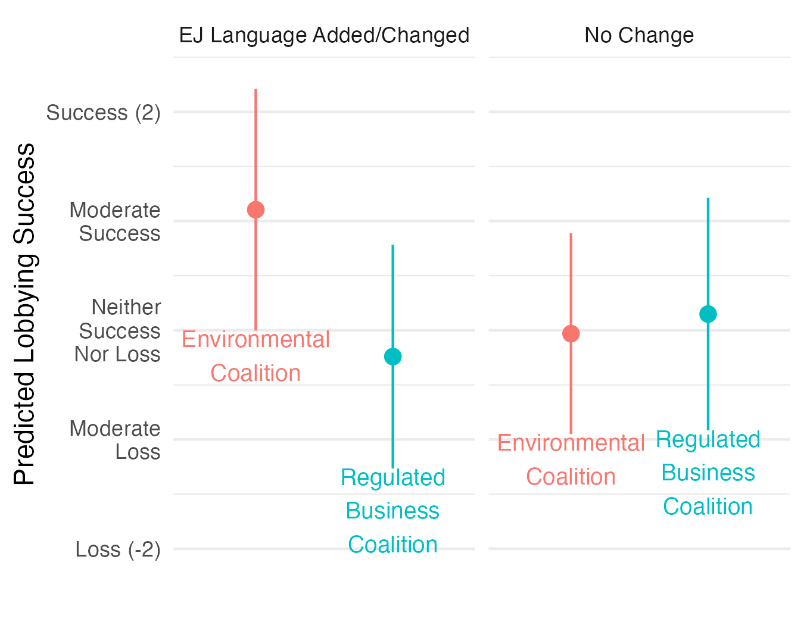
```
]

---

name: ej-org-success

.left-column[

### When agencies adopt EJ language, environmental groups do better

Within-organization (DiD) OLS model (N = 3,932 organizations)

]

.right-column[

```{r, out.width = "90%"}
knitr::include_graphics("Figs/mo1ej-obama.png")
```
]

---


name: substantive

.left-column[

### Who gets their substantive policy demands met?


- Business Associations
- Law Firms & National Advocacy Organizations


]

.right-column[

```{r substantive, out.width = "85%", fig.show = "hold"}

knitr::include_graphics("Figs/ej-success-table.png")

```
]

???

In line with previous scholarship 

Beyond previous scholarship 


```{r ej-winrates, include=FALSE}
library(kableExtra)
library(scales)
load(here::here("data", "winrate.Rdata"))
winrates %>% 
  filter(`Organization Type` %in% c("NGO", "Business", "Trade Association", "Law Firm", "Tribe", #"Environmental Group", 
                                    "Frontline EJ")) %>% 
  mutate(`Organization Type` = `Organization Type` %>% str_replace("Environmental Group", "NGO-Environmental") %>% str_replace("Frontline EJ", "NGO-Local EJ") %>% str_replace("Trade Association", "Business Association")) %>% 
  transmute(`Organization Type`= `Organization Type`, N = N,`Success Rate (Overall)` = `Overall Success Rate` %>%
           percent(accuracy = 1),
           `Success Rate (Environmental Justice)` = `EJ Success Rate` %>%
           percent(accuracy = 1) %>% replace_na("-"),
        ) %>% 
  arrange(`Organization Type`) %>% 
  #dplyr::select(-`N raising EJ`) %>% #mutate(across(where(is.numeric), pretty_num)  ) %>%
  kbl(csaption = "Hand-coded Lobbying Success by Type of Organization, 2005-2020") %>%
  kable_classic(full_width = F, html_font = "Open Sans") %>% 
  kable_styling(bootstrap_options = c("striped", "hover"))
      #kableExtra::kable_styling(font_size = 22, position = "center")  #kable3(caption = "Hand-coded Lobbying Success by Type of Organization, 2005-2020")
```


---

class: inverse

## What do we do? 

- Make it someone's job inside the agency
- Consider group representation
- Make it easy to show support
- Hire lawyers
- Mobilize elected allies and issue frames


???

The work that Carrie and Arie do at ELP is really important 


---

include: short 

.right-column[
```{r,  out.width = "75%"}
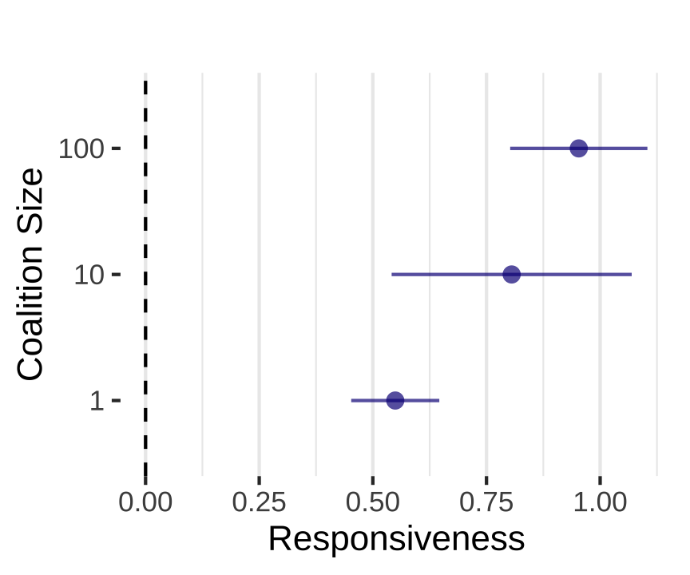
```

]

 .left-column[  
### Agencies respond to larger coalitions demanding attention to EJ

Logit (N = 11,315 rules)
 ]


---


name: toc


.pull-left[

Data & Methods: [Sample](#tree) | [Hand coding](#datasheet) | [Spatial](#spatial) | [Census race](#race) | [Zip code](#gis) | [GIS](#gis) | [Regex tables](#regex) | [Next steps](#methods-next)

Mobilizing: [Organizations](#orgs) | [Mass comments](#mass) <!-- Grassroots|Astroturf--> | [Members of Congress](#coalition-legislators)

Framing: 
- EJ rules: [by President](#ej-data-rules) | [by Agency](#ej-data-agencies) | [Comments](#ej-comments) |  [Mercury Rules](#ej-mercury-long) | [Theory](#ej-hyp) [Framing](#ej-results) | [Success](#ej-success) | [Tables](#table) | [Paper](https://judgelord.github.io/research/ej/)

]
  
.pull-right[

- Climate rules: [SIPs](#sips) | [Methane Rules](#methane) | [Data](#cj-data) | [Results](#cj-results) |  [Tables](#cj-table) | [Paper](https://judgelord.github.io/research/cj/)
 
Influence: [Models](#success-models) | [by Campaign Type](#success-coalition) | [by Legislator Support](#coalition-legislators) | [by Coalition](#ej-success) | [by Organization](#ej-org-success) | [Example demands](#example-demands)

Judicial review: [Data](#deference-data) | [Results](#deference-results) | [Table](#deference-table) | [Paper](https://judgelord.github.io/research/deference/)

]


---

name: agenda 

class: inverse 
exclude: true

.pull-left[
# Bureaucratic policymaking

- Public pressure
- Agenda setting
- Unequal influence

# Policy oversight

- Legislator capacity
- Money in politics
- Constituency service 
]

.pull-right[
# Environmental governance

- Regulatory stringency
- Certification standards 
- Transnational advocacy

# Text analysis

- Policy change
- Influence
- Combining qualitative and computational methods

]

---

name: project 

class: inverse center
exclude: `r short`

## [Public pressure]() in bureaucratic policymaking


<!--The Broader Project: Public Pressure-->


Mobilization

↓

Getting policymakers' attention and framing policy debates

↓

Substantive policy influence

↓

Surviving judicial review

???

If we want to understand modern democracy 

---

layout: true

<div class="my-head"><span>
<a href="#toc">Making Policy About Distributive Justice</a>
<span>
&emsp;&emsp;&emsp;&emsp;&emsp;&emsp;&emsp;&emsp;&emsp;&emsp;&emsp;&emsp;&emsp;&emsp;&emsp;&emsp;&emsp;&emsp;&emsp;&emsp;
&emsp;
<a href="#example">Example</a>
</span>
</span>
<span>&emsp;&emsp;&emsp;&emsp;&emsp;&emsp;&emsp;&emsp;&emsp;&emsp;&emsp;&emsp;&emsp;&emsp;&emsp;&emsp;&emsp;&emsp;&emsp;&emsp;&emsp;&emsp;&emsp;&emsp;&emsp;&emsp;&emsp;&emsp;
<a href="#theory">Theory</a>
</span>
<span>&emsp;&emsp;&emsp;&emsp;&emsp;&emsp;&emsp;&emsp;&emsp;&emsp;&emsp;&emsp;&emsp;&emsp;&emsp;&emsp;&emsp;&emsp;&emsp;&emsp;&emsp;&emsp;&emsp; &emsp;&emsp;&emsp;&emsp;&emsp;&emsp;&emsp;&emsp;&emsp;&emsp;&emsp;
<a href="#data">Data & Methods</a>
</span>
<span>&emsp;&emsp;&emsp;&emsp;&emsp;&emsp;&emsp;&emsp;&emsp;&emsp;&emsp;&emsp;&emsp;&emsp;&emsp;&emsp;&emsp;&emsp;&emsp;&emsp;&emsp;&emsp;&emsp;&emsp;&emsp;&emsp;&emsp;&emsp;&emsp;&emsp;&emsp;&emsp;&emsp;&emsp;&emsp;&emsp;&emsp;&emsp;&emsp;&emsp;&emsp;&emsp;&emsp;&emsp;
<a href="#findings">Findings</a>
</span>
<span>
&emsp;&emsp;&emsp;&emsp;&emsp;&emsp;&emsp;&emsp;&emsp;&emsp;&emsp;&emsp;&emsp;&emsp;&emsp;&emsp;&emsp;&emsp;&emsp;&emsp;&emsp;&emsp;&emsp;&emsp;&emsp;&emsp;&emsp;&emsp;&emsp;&emsp;&emsp;&emsp;&emsp;&emsp;&emsp;&emsp;&emsp;&emsp;&emsp;&emsp;&emsp;&emsp;&emsp;&emsp;&emsp;&emsp;&emsp;&emsp;&emsp;&emsp;
<a href="#conclusion">Conclusion</a>
</span>
</div> 

<div class="my-footer"><span>Devin Judge-Lord (Harvard University)&emsp;&emsp;</span></div> 

---

name: preview
class: inverse

## Preview: The Impact of Environmental Justice Advocacy

--

<!--
- [Motivation:](#motivation) 90% of U.S. policy is made by agencies  
--->

- [Theory:](#theory) Public pressure informs bureaucrats

--
- [Data:](#data) Change in 13,000 draft and final rule pairs
--
$\Longleftarrow$ 40 million public comments

--
- [Methods:](#methods) Hand-coding $\Longleftrightarrow$ computational text analysis

--
- [Findings](#findings)
 - Policy rarely addresses environmental justice
 
--
 - When groups raise concerns, policy texts change

--
 - $\uparrow$ pressure  $\rightsquigarrow$ 	$\uparrow$ change

--
 - Responsiveness varies with institutional structure

--
 - Policymakers are more responsive to national advocacy organizations

???

It matters who is raising concerns. 

Just to put all of that into a sentence...[SLIDE]

---

class: inverse  middle

## U.S. federal agencies rarely address environmental justice but are more likely to when pressured.

???

In a sentence, policymakers, that is, people making policy at U.S. federal agencies, rarely address environmental justice but are more likely to when pressured.

---


layout: true

<div class="my-head"><span>
<a href="#toc">Making Policy About Distributive Justice</a>
</span>
<span>
&emsp;&emsp;&emsp;&emsp;&emsp;&emsp;&emsp;&emsp;&emsp;&emsp;&emsp;&emsp;&emsp;&emsp;&emsp;&emsp;&emsp;&emsp;&emsp;&emsp;
&emsp;
<a href="#example">Example</a>
</span>

</div> 

<div class="my-footer"><span>Devin Judge-Lord (Harvard University)&emsp;&emsp;</span></div> 

---

background-image: url(Figs/mercury.jpeg)
background-size: cover
name: example

--

.pull-left[
# `1990 Clean Air Act: EPA shall regulate as “appropriate and necessary” for public health`
]

???


Section 112(n)(1)(A)


---

background-image: url(Figs/brianadams.png)
background-size: cover

# Safe Levels of Mercury 
--
(For Whom?)

???
Before the politics of who gets what, there is the politics of who the whos *are*. What are the groups or communities deserving consideration? 

--

.pull-left[
2004 Draft Rule: `“the U.S. population”`

&emsp;&emsp;&emsp;&emsp; ↓ 

170,000 public comments

&emsp;&emsp;&emsp;&emsp; ↓

2005 Final Rule: `Environmental justice for “minority populations”`
]

--

.pull-right[

```{r, fig.show = "hold", out.width = c("35%","50%","30%","40%")}
#, fig.cap="Example: Identifying Coalitions by the Percent of Matching Text in a Sample of Public Comments"
knitr::include_graphics("Figs/acat.png") 
knitr::include_graphics("Figs/ncai_logo.jpg") 
knitr::include_graphics("Figs/sierra_logo.png") 
knitr::include_graphics("Figs/Tom_Allen.jpeg") 


```

]


???

TOM ALLEN 

 Mercury standards that protected the average person in the US did not protect certain minority communities, in this case, many native communities who traditionally ate a lot more fish. 

I grew up in Wisconsin, in the center of the great lakes, and despite Friday fish fries, these regulations probably protected people in my family, BUT 

And there is a large Hmong population that came over after the Vietnam war, and other commenters raised produced studies that certain southeast Asian immigrant populations like the Hmong also ate a lot of freshwater fish and thus had higher rates of Mercury poisoning. Similarly,  Ojibwe people in the great lakes region had higher rates of mercury poising. 


---


background-image: url(https://assets.nrdc.org/sites/default/files/styles/full_content/public/media-uploads/midwesttoxicdoughnut_25_002chicago_steel_mills-july_1965_vl_2400.jpg?itok=yXMNtQ-Y)
background-size: cover


# The Environmental Justice Frame

???

What is environmental justice, and why does the Biden administration require 40% of federal spending to be spent in environmental justice communities? 

The EJ movement began in local resistance to toxic waste in places like the  Alt-geld Gardens housing complex on Chicago's South Side, where activists like Hazel Johnson had been organizing tenants years before a young Barak Obama showed up in 1984. Surrounded by manufacturing and toxic waste dumps, this neighborhood got the nickname “the toxic doughnut.” 

Dorceta Taylor describes how black-led campaigns like Johnson's fused with the American Indian Movement, Chicano, and farmworker movements and drew on civil rights and union organizing to push the environmental justice frame onto the national policy agenda. 

Began appearing in federal policy documents in the 1980s

My aim is to add some more systematic quantitative data on the broad trends regarding the influence of the EJ movement on the federal policy agenda that Taylor and others have mapped.


--

exclude: `r short`


"Environmental justice" is a distinct phrase (few false positives) without many synonyms (few false negatives)

<!--

1. E.O. 12898 "Federal Actions to Address Environmental Justice" (1993)
-->

--

Why this matters:


- "Environmental" policy debates are rarely about *distributions* of costs and benefits

???

--

exclude: `r short`


- Reframing policy in distributive justice terms can shape normative, political, and economic analysis.

---

layout: true

<div class="my-head"><span>
<a href="#toc">Making Policy About Distributive Justice</a>
</span>
<span>
&emsp;&emsp;&emsp;&emsp;&emsp;&emsp;&emsp;&emsp;&emsp;&emsp;&emsp;&emsp;&emsp;&emsp;&emsp;&emsp;&emsp;&emsp;&emsp;&emsp;&emsp;&emsp;
&emsp;&emsp;&emsp;&emsp;&emsp;
<a href="#theory">Theory</a>
</span>
<span>
&emsp;&emsp;&emsp;&emsp;&emsp;&emsp;&emsp;&emsp;&emsp;&emsp;&emsp;&emsp;&emsp;&emsp;&emsp;&emsp;&emsp;&emsp;&emsp;&emsp;&emsp;
&emsp;&emsp;&emsp;&emsp;&emsp;&emsp;&emsp;&emsp;
</span>
<span>
&emsp;&emsp;&emsp;&emsp;&emsp;&emsp;&emsp;&emsp;&emsp;&emsp;&emsp;&emsp;&emsp;&emsp;&emsp;&emsp;&emsp;&emsp;&emsp;&emsp;&emsp;&emsp;
&emsp;&emsp;&emsp;&emsp;&emsp;&emsp;
&emsp;&emsp;&emsp;&emsp;&emsp;&emsp;
&emsp;&emsp;&emsp;&emsp;&emsp;&emsp;
</span>
<span>
&emsp;&emsp;&emsp;&emsp;&emsp;&emsp;&emsp;&emsp;&emsp;&emsp;&emsp;&emsp;&emsp;&emsp;&emsp;&emsp;&emsp;&emsp;&emsp;&emsp;&emsp;&emsp;&emsp;&emsp;&emsp;
&emsp;&emsp;&emsp;&emsp;&emsp;&emsp;&emsp;&emsp;
&emsp;&emsp;&emsp;&emsp;&emsp;&emsp;&emsp;
&emsp;&emsp;&emsp;&emsp;&emsp;&emsp;&emsp;

</span>
</div> 

<div class="my-footer"><span>Devin Judge-Lord (Harvard University)&emsp;&emsp;</span></div> 

---

background-image: url(https://assets.nrdc.org/sites/default/files/styles/full_content/public/media-uploads/midwesttoxicdoughnut_25_002chicago_steel_mills-july_1965_vl_2400.jpg?itok=yXMNtQ-Y)
background-size: cover

class:   middle
exclude: `r short`


> # He who determines what politics is about runs the country because the definition of conflicts allocates power.

.right[
# - E.E. Schattschneider
]


???


> # "He who determines what politics is about runs the country because the definition of alternatives is the choice of conflicts, and the choice of conflicts allocates power. " - E.E. Schattschneider


---


### Do Movements Shape Policy?

Yes. [(Dahl 1956; Lipsky 1968; Piven & Cloward 1977; Tarrow 1994; Andrews 1997; McAdam 1982, 2001; McAdam & Su 2002, McCammon et al. 2011; Cress & Snow 2000; Weldon 2002)]()

???

<!--

- **Activists shape parties** (Cohen et al. 2008, Schlozman 2015, Skocpol & Williamson 2016)

???
- shape party agendas
-->

--


- Petitioning builds movements and policy agendas [(Carpenter 2021)]()

???
- that the act of petitioning the government builds power

--

- Protests inform policymakers and policy agendas [(Gillion 2013, Gause 2022, Wasow 2020)]()

???
- We don't know a lot about policy outcomes, but there is some great work showing specific policy effects of civil rights protests, for example. Dan Gillion, Latina Gause, and Omar Wasow

--

- Movements advance issue frames [(Jones & Baumgartner 1991, Woodly 2015)]()

--

- No movement, no policy [(Lowi 1972, Skocpol 2013)]()


???
- In Lowi's words, “redistributive policies have been associated with social classes and movements from the beginning”--some kinds of policy only come about when groups form and mobilize to affect policy

---

# Does public pressure affect *bureaucratic* policymaking? 

<!--
- General level of public attention?

- Specific pressure to address issues like environmental justice?

- By targeting more receptive institutions?
-->

???

MY DV 

---

exclude: `r short`


### Scholars of bureaucracy focus on *technical* information


???
- Bureaucratic policymaking, especially, is about expertise (Wagner 2010)


Everything we know about lobbying, especially lobbying in agency rulemaking, tells us that information is the currency of lobbying. 

Information causes policymakers to change their minds, *especially* when policymakers are experts and lawyers.

Indeed, research, including my own research elsewhere, shows that business groups dominate lobbying in rulemaking *because* they can generate and provide relevant information. 

Thus far, by “information,” scholars generally mean technical and legal information.

--

exclude: `r short`


### How might *political* information matter?

--

- Advancing frames about who is affected?

--

-  Novelty vs legibility?

--
- Pressure: 

 - Coalition size? [(Dwidar 2021, Nelson & Yackee 2012)]()

 - Public attention?

???

---

name: theory


### Scholars of bureaucracy focus on *technical* information

### How might *political* information matter?

- $H_1$: Agencies address distributive justice when groups raise concerns

--

- $H_2$: Agencies that more frequently address distributive justice are more responsive

--

- $H_3$: $\uparrow$ Coalition size (number of groups) $\rightsquigarrow$   $\uparrow$ Policy response

--

- $H_4$: $\uparrow$ Public attention (number of comments) $\rightsquigarrow$  $\uparrow$ Policy response


---

exclude: true

### Research tends to explain social movement emergence rather than specific impacts (McAdam 2017) 

- **“limited research on [social movement] influence”** (Andrews & Edwards 2004)
- **The DV is rarely specific policy outcomes or systematic impact**


???
In the paper, I note some of the great work in political science studying the impact of movements on policy change, but much of the systematic work focuses on explaining mobilization. Movement activity and structure are the typical DVs. 

<!--### My DV: Change in specific policies (agency rules)--> 

???
I am trying to add to recent work on the policy impact of movements and pressure campaigns by looking systematically at change in very specific policy documents.

Whether executive branch agencies are implementing recent legislation or using the authority of century-old statutes,  Rulemaking is where the teeth of federal law are forged and reforged over time.

So, I'm interested in the extent to which movements can affect agency rulemaking.

???

The aggregate impact of environmental justice campaigns across institutions and over time $\rightsquigarrow$ environmental justice movement impact

???
And I'm thinking about social movement impact as the aggregate impact of EJ campaigns across institutions and over time. 

---


layout: true

<div class="my-head"><span>
<a href="#toc">Making Policy About Distributive Justice</a>
</span>
<span>
&emsp;&emsp;&emsp;&emsp;&emsp;&emsp;&emsp;&emsp;&emsp;&emsp;&emsp;&emsp;&emsp;&emsp;&emsp;&emsp;&emsp;&emsp;&emsp;&emsp;&emsp;
&emsp;&emsp;&emsp;&emsp;&emsp;&emsp;&emsp;&emsp;
<a href="#data">Data & Methods</a>
</span>
</div> 

<div class="my-footer"><span>Devin Judge-Lord (Harvard University)&emsp;&emsp;</span></div> 

---

class: inverse  middle
name: data


# Data

### *All* 13,179 draft and final rule pairs from 40 agencies, 1993-2020 

### ~40,000,000 public comments on these draft rules

--

exclude: `r short`


~4,800,000 comments raise environmental justice concerns


???

We don't have roll call votes. 

I collected all 40 million comments on these draft and final rule pairs. 
Almost 5 million mentioned EJ.

28 thousand of these are unique --- This involved some methodological tricks that I will explain in a second, but the major point is that Human coding and computational text analysis are more powerful when combined

---

class: inverse  middle
name: methods

# Methods

### Hand coding $\Longleftrightarrow$ computational text analysis

???


---

### Identify coalitions with text reuse

.pull-left[“…jobs and our economy. <mark>I am also concerned that your proposal allows power plants to buy and sell mercury pollution credits. This</mark> would permit some plants to continue to harm…"]


.pull-right[“...pollutants like dioxin. <mark> I am also concerned that your proposal allows power plants to buy and sell mercury pollution credits. This  </mark>kind of market-based mechanism to reduce ..."]

---

exclude: `r short`

<!--## Collapsing form letters with text reuse-->

### Identify coalitions with text reuse

.left-column[
- Document A is unique
- B, C, and D share text
- E and F are the same text
]

.right-column[
```{r percent-method, fig.show = "hold", out.width = "75%"}

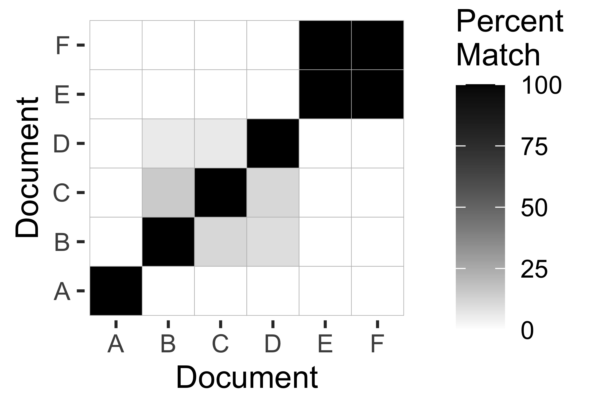
```
]


???

Elsewhere, I used these same methods to assess the change between the draft and final rule, and there are tutorials for how to do this on my website. 

Here is what this looks like on a larger set of comments

---

exclude: true

### Identify coalitions with text reuse

```{r, fig.show = "hold", out.width = "55%"}
#, fig.cap="Example: Identifying Coalitions by the Percent of Matching Text in a Sample of Public Comments"
knitr::include_graphics("Figs/comment_percent_match_plot.png") 
```

???

Using n-gram matching methods similar to plagiarism detection, I collapse form letters and petitions into representative texts. As most comments are form letters, that 5 million collapses to 28 thousand unique texts.
This figure shows the percentage of shared text in a sample of documents.
The black squares on the diagonal show that each comment has a perfect overlap with itself. 
The block of grey partial matches reflects a public pressure campaign, with a lot of shared 10-grams. 
I then attach these to lobbying coalitions by hand. 

---

## Iteratively group commenters into coalitions

```{r, out.width = "90%", fig.show='hold'}
#knitr::include_graphics("https://docs.google.com/drawings/d/e/2PACX-1vSy9MpvnXV0nbZj4kUPnWC38bwk5xiBXjRiGC3fyrddwoZVT19SmfT4WRr_AvOH5lxeKyrTenqLlKmm/pub?w=953&h=603")

knitr::include_graphics("Figs/methods-ngrams-slide.png")

```


---

exclude: `r short`

## Iteratively link comments to organizations

```{r, out.width = "75%", fig.show='hold'}
#knitr::include_graphics("https://docs.google.com/drawings/d/e/2PACX-1vRSJJgSbMdFtkpJjB94Tw5cmFElhDKrHEkOLaUb5-qFdIY-sQp4qGyC-FZoZ7UmWSLfoMZDueAkemhU/pub?w=752&h=238") 
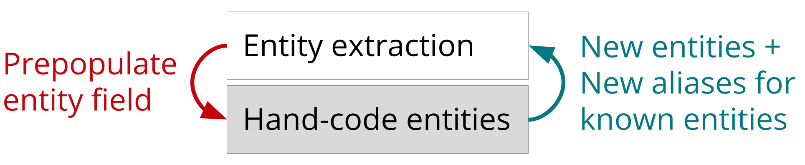

```


```{r, out.width = "20%", fig.show='hold'}

knitr::include_graphics( "Figs/logo-legislators.png")

knitr::include_graphics("Figs/logo-orgs.png" )

knitr::include_graphics("Figs/logo-regex.png")
```


---

# Measuring influence

### DV 1: Getting policymakers' attention/engagement/response

1.1 Adding policy language (All 11,315 rules)   
1.2 Changing policy language (All 1,864 rules)

### DV 2: Getting substantive policy demands

Lobbying success for all commenters on a random sample of 150 rules (10,894 hand-coded comments)

2.1 Across 284 coalitions   
2.2 Within 3,932 organizations

???

 - 284 coalitions 
 
---

name: model
class:  inverse 
exclude: true

# Modeling the probability of policy change


###(1) Variation across agencies:  
Pr(Policy Change | President) ~ Policy Demands  \+ Coalition Size  \+ Public Attention \+ Agency's Prior Rate of Addressing Environmental Justice
(\+ Interactions) 

--

###(2) Variation within agencies:  
Pr(Policy Change | President & Agency) ~ Policy Demands  \+  Coalition Size  \+  Public Attention
(\+ Interactions)


???
Both of my DVs---adding EJ language and changing existing EJ language--are dichotomous, so I m going to use logit regression. 

The main models use president and agency fixed effects, so I'm focusing on variation within presidential administrations and within the agency, but I also assess differences across presidents and agencies by estimating the same models with indicators rather than fixed effects.

Because log odds coefficients are hard to interpret and because my models have interactions, I am going to skip the regression table and just show you predicted probabilities. 


---


### (1.1a) Logit: $Y_i = \beta_{1:n} X_{i} + \delta_p + \epsilon_{ip}$

$Y_i$: the log odds of change in rule $i$ by agency $k$ under president $p$ <!--: $log[\frac{P(EJ\ in\ FR)}{1−P(EJ\ in\ FR)}]$-->

--

$X_{i}$: features of rule $i$
  - whether comments raise environmental justice
--
  
  - agency $k$'s share of prior draft rules mentioning environmental justice 
--
  
  - the number of organizations raising environmental justice (logged)
--
  
  - the total number of comments (logged) $\times$ whether comments raise environmental justice
  
$\delta_p$: president fixed effects   
$\epsilon_{ip}$: cluster-robust errors by president


???

hereoskedasticity-robust standard-errors (White correction), where it is assumed that the errors are independent but the variance of their generative law may vary.

If vcov = "cluster", then arbitrary correlation of the errors within clusters is accounted for. Same for vcov = "twoway": arbitrary correlation within each of the two clusters is accounted for.
fixest: sandwich

same as xtreg cluster in stata
---

### (1.1b) Logit:  $Y_i = \beta_{1:n} X_{i} + \gamma_k + \delta_p + \epsilon_{ipk}$

$Y_i$: the log odds of change in rule $i$ by agency $k$ under president $p$ <!--: $log[\frac{P(EJ\ in\ FR)}{1−P(EJ\ in\ FR)}]$-->

$X_{i}$: features of rule $i$
  - whether comments raise environmental justice
  - the number of organizations raising environmental justice (logged)
  - the total number of comments (logged) $\times$ whether comments raise environmental justice

$\gamma_k + \delta_p$: president & agency fixed effects   
$\epsilon_{ipk}$: cluster-robust errors  by president & agency


???

Because I expect decreasing marginal effects of additional comments, both overall (i.e., public attention) and those that mention EJ (coalition size), I use logged values. 

However, the conclusions are largely the same if I use a quadradic function instead. That analysis suggests that medium levels of attention are not so impactful. A small level of attention matters, and then it takes a very large amount of additional pressure to move things, which makes sense. For hypothesis testing, however, all of the effects are in the same direction, so I am going to present predicted probabilities from these models here.

---

layout: true

<div class="my-head"><span>
<a href="#toc">Making Policy About Distributive Justice</a>
</span>
<span>
&emsp;&emsp;&emsp;&emsp;&emsp;&emsp;&emsp;&emsp;&emsp;&emsp;&emsp;&emsp;&emsp;&emsp;&emsp;&emsp;&emsp;&emsp;&emsp;&emsp;&emsp;&emsp;
&emsp;&emsp;&emsp;&emsp;&emsp;&emsp;
&emsp;&emsp;&emsp;&emsp;&emsp;&emsp;
&emsp;&emsp;&emsp;&emsp;&emsp;&emsp;
<a href="#findings">Findings</a>
</span>
</div> 

<div class="my-footer"><span>Devin Judge-Lord (Harvard University)&emsp;&emsp;</span></div> 


---

exclude: `r exclude_stepwise`
name: findings

.left-column[  
  $H_1$ Agencies respond to environmental justice concerns  ]
 

.right-column[
```{r ej-m-PR-president1, out.width = "65%"}
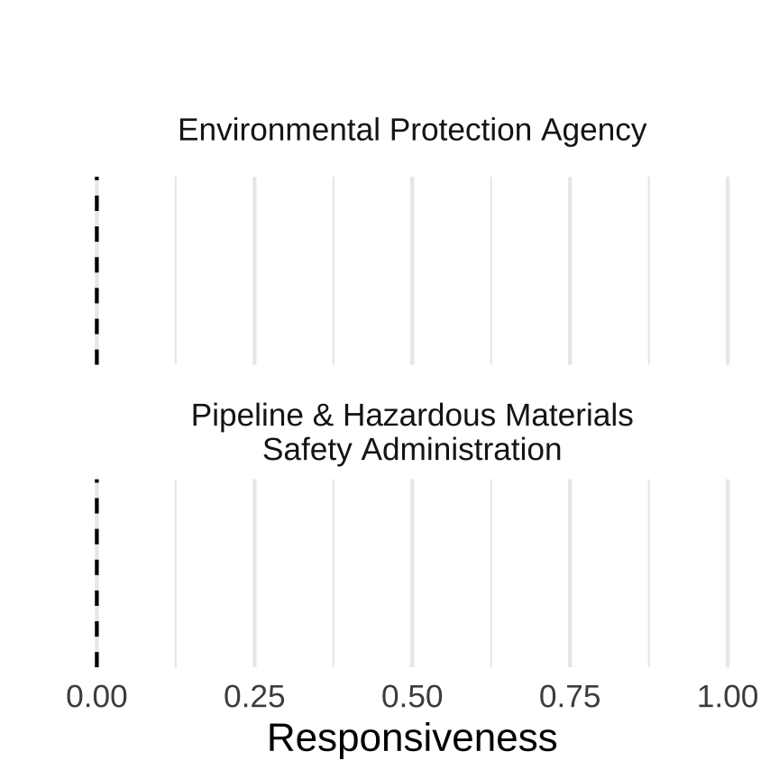
```
]

???

All of the plots I'll show have predicted probability of change on the x-axis and some predictors we care about on the y-axis. This one also shows predicted values for two different agencies, the EPA and the PHMSA. 

---

exclude: `r exclude_stepwise`


.left-column[
 $\checkmark$ $H_1$ Agencies respond to environmental justice concerns
 ]
 
.right-column[
```{r ej-m-PR-president2, out.width = "65%"}
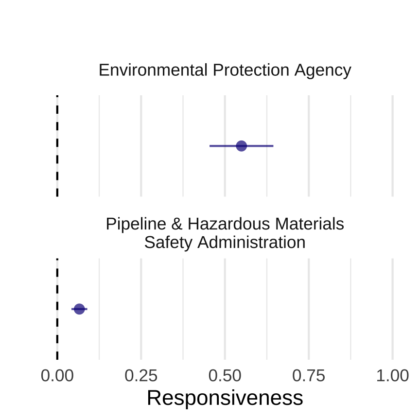
```
]

 [[TABLE]](#table)


---

.left-column[  
  $H_2$ Agencies that more frequently address environmental justice are more responsive
 ]


.right-column[
```{r ej-m-PR-shareI1, fig.cap = "", out.width = "65%", fig.show = "hold", fig.subcap=""}

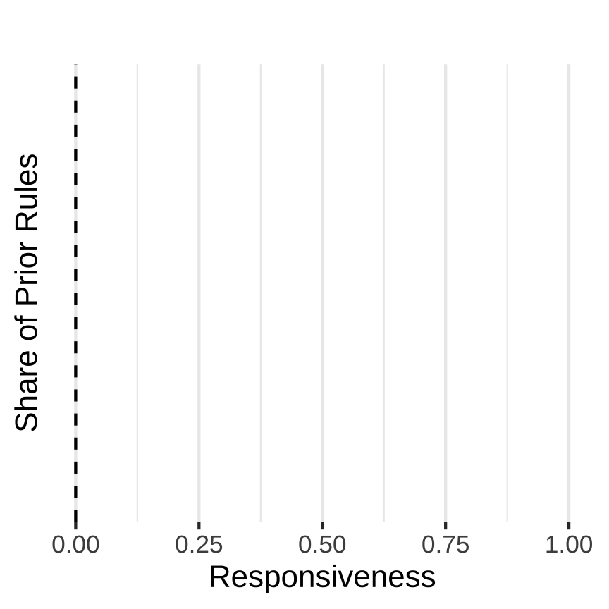

```
]


 [[TABLE]](#table)


---

 .left-column[  
 
 $\checkmark$ $H_2$ Agencies that more frequently address environmental justice are more responsive
 ]
 
 .right-column[
```{r ej-m-PR-shareI2, fig.cap = "", out.width = "65%", fig.show = "hold", fig.subcap=""}

knitr::include_graphics("Figs/ej-m-PR-shareI-pres-1.png")

```
]

 [[TABLE]](#table)
 
---


 .left-column[  
  $H_3$ Agencies respond to larger coalitions?  
 ]


.right-column[
```{r coalition1,  out.width = "75%"}
knitr::include_graphics("Figs/ej-m-PR-ejcomments-agencyFE-pres-2.png")
```
]

 [[TABLE]](#table)


---

.right-column[
```{r coalition2,  out.width = "75%"}

```

]

 .left-column[  
 $\checkmark$  $H_3$ Agencies respond to larger coalitions  
 ]


[[TABLE]](#table)

---

.left-column[
$H_4$ Agencies respond to more public attention? 
]

.right-column[
```{r attention1, out.width = "75%", fig.show = "hold"}

knitr::include_graphics("Figs/ej-m-PR-comments-share-pres-2.png")
```
]

 [[TABLE]](#table) 


---

.left-column[
$H_4$ Agencies respond to more public attention?
  ]
  

.right-column[

```{r attention2, out.width = "75%", fig.show = "hold"}
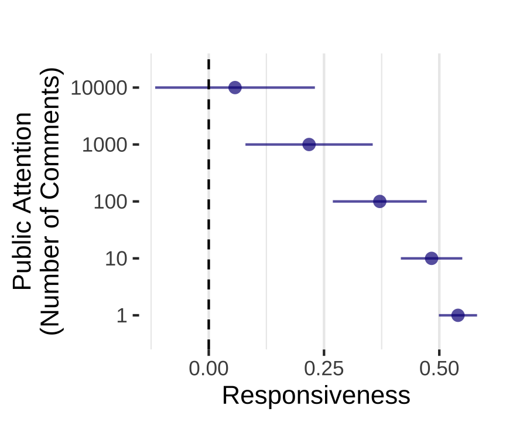
```
]

  [[TABLE]](#table) 


---

$\checkmark$ $H_4$ Agencies respond to more public attention (absent specific pressure)


```{r attention3, out.width = "90%", fig.show = "hold"}

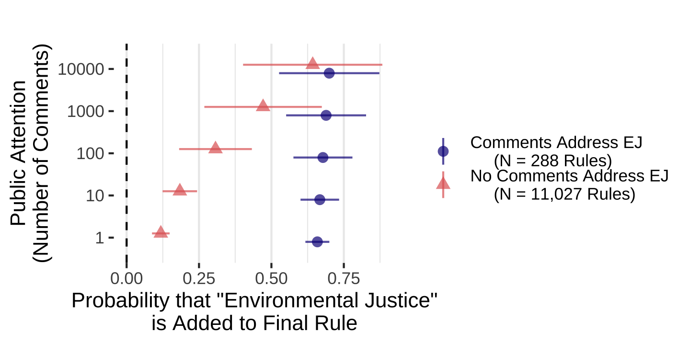

```

[[TABLE]](#table)

---

name: conclusion

## To sum up, yes, movements matter

|                                            | Environmental Justice Language Added |  
| ------------------------------------------ | :--: | 
| Environmental Justice Demands     | $\checkmark$   | 
| Prior rate                             | $\checkmark$   | 
| Coalition Size        | $\checkmark$   | 
| General Public Attention               | $\checkmark$   | 


More pressure $\rightarrow$ more likely that environmental justice language is added.
--
$\implies$ Public pressure helps advance issues frames.

--

Also true for pressure to frame rules as relevant to climate change. [[more]](#cj-results)


layout: true

<div class="my-head"><span>
<a href="#toc">Making Policy About Distributive Justice</a>
</span>
<span>
&emsp;&emsp;&emsp;&emsp;&emsp;&emsp;&emsp;&emsp;&emsp;&emsp;&emsp;&emsp;&emsp;&emsp;&emsp;&emsp;&emsp;&emsp;&emsp;&emsp;&emsp;&emsp;&emsp;&emsp;&emsp;&emsp;&emsp;&emsp;&emsp;&emsp;&emsp;&emsp;&emsp;&emsp;&emsp;&emsp;&emsp;&emsp;&emsp;&emsp;&emsp;&emsp;&emsp;&emsp;&emsp;&emsp;&emsp;&emsp;&emsp;&emsp;
<a href="#conclusion">Conclusion</a>
</span>
</div> 

<div class="my-footer"><span>Devin Judge-Lord (Harvard University)&emsp;&emsp;</span></div> 


---

class: inverse


### U.S. federal agencies rarely address  environmental justice
--
, but they are much more likely to do so when pressured
--
, especially agencies with dedicated staff. 


--

### National advocacy organizations are more likely to have substantive policy demands met.

--

## Implications:


- Make it someone's job  
--

- Consider group representation   
--

- Hire lawyers  
--

- Mobilize allies and issue frames 


???

Finally, assessing the normative implications requires us to understand who is advocating for whom. In the case of comments on federal agency rules, it is “big green" national advocacy groups that have historically led a White environmental movement. 
These "big greens" are more likely to get substantive policy demands met than Tribes and frontline community groups. So, a lot hinges on the extent to which these national organizations represent EJ communities.


---

name: project 

class: inverse center

## The Broader Project: Public Pressure


Mobilization

↓

Getting policymakers' attention and framing policy debates

↓

Substantive policy influence

↓

Surviving judicial review


---

layout: true

<div class="my-head"><span>
<a href="#toc">Making Policy About Distributive Justice</a>
</span>
<span>&emsp;&emsp;&emsp;&emsp;&emsp;&emsp;&emsp;&emsp;&emsp;&emsp;&emsp;&emsp;&emsp;&emsp;&emsp;&emsp;&emsp;&emsp;&emsp;&emsp;&emsp;
<a href="#example">Example</a>
</span>
<span>&emsp;&emsp;&emsp;&emsp;&emsp;&emsp;&emsp;&emsp;&emsp;&emsp;&emsp;&emsp;&emsp;&emsp;&emsp;&emsp;&emsp;&emsp;&emsp;&emsp;&emsp;&emsp;&emsp;&emsp;&emsp;&emsp;&emsp;&emsp;
<a href="#theory">Theory</a>
</span>
<span>&emsp;&emsp;&emsp;&emsp;&emsp;&emsp;&emsp;&emsp;&emsp;&emsp;&emsp;&emsp;&emsp;&emsp;&emsp;&emsp;&emsp;&emsp;&emsp;&emsp;&emsp;&emsp;&emsp; &emsp;&emsp;&emsp;&emsp;&emsp;&emsp;&emsp;&emsp;&emsp;&emsp;&emsp;
<a href="#data">Data & Methods</a>
</span>
<span>&emsp;&emsp;&emsp;&emsp;&emsp;&emsp;&emsp;&emsp;&emsp;&emsp;&emsp;&emsp;&emsp;&emsp;&emsp;&emsp;&emsp;&emsp;&emsp;&emsp;&emsp;&emsp;&emsp;&emsp;&emsp;&emsp;&emsp;&emsp;&emsp;&emsp;&emsp;&emsp;&emsp;&emsp;&emsp;&emsp;&emsp;&emsp;&emsp;&emsp;&emsp;&emsp;&emsp;&emsp;
<a href="#findings">Findings</a>
</span>
<span>
&emsp;&emsp;&emsp;&emsp;&emsp;&emsp;&emsp;&emsp;&emsp;&emsp;&emsp;&emsp;&emsp;&emsp;&emsp;&emsp;&emsp;&emsp;&emsp;&emsp;&emsp;&emsp;&emsp;&emsp;&emsp;&emsp;&emsp;&emsp;&emsp;&emsp;&emsp;&emsp;&emsp;&emsp;&emsp;&emsp;&emsp;&emsp;&emsp;&emsp;&emsp;&emsp;&emsp;&emsp;&emsp;&emsp;&emsp;&emsp;&emsp;&emsp;
<a href="#conclusion">Conclusion</a>
</span>
<span>
&emsp;&emsp;&emsp;&emsp;&emsp;&emsp;&emsp;&emsp;&emsp;&emsp;&emsp;&emsp;&emsp;&emsp;&emsp;&emsp;&emsp;&emsp;&emsp;&emsp;&emsp;&emsp;&emsp;&emsp;&emsp;&emsp;
&emsp;&emsp;&emsp;&emsp;&emsp;&emsp;&emsp;&emsp;
&emsp;&emsp;&emsp;&emsp;&emsp;&emsp;&emsp;
&emsp;&emsp;&emsp;&emsp;&emsp;&emsp;&emsp;&emsp;&emsp;&emsp;&emsp;&emsp;&emsp;&emsp;&emsp;
<a href="#toc">Extra</a>
</span>
</div> 

<div class="my-footer"><span>Devin Judge-Lord (Harvard University)&emsp;&emsp;</span></div> 


---

class: inverse middle
name: thanks

## Thank you!

- Papers, slides, data (Rdata, SQL): [judgelord.github.io](judgelord.github.io/)  
--

- Rules relevant to climate or environmental justice currently open for comment: [judgelord.github.io/rulemaking/open]( https://judgelord.github.io/rulemaking/open)


---

class: inverse

# Next 

- [Audit study](): What causes institutional receptivity?
- [Co-framing](): EJ + “health", "disaster", "climate" & changes in term frequency
- [Surveys]() to compare comments to public opinion
- [Lobbying networks]()
- [Feedback](): The mobilizing and demobilizing effects of the policy process

???

Carving out a paper: More or less on mobilization or hand-coded influence? 

Is the aggregate influence of related campaigns a defensible working deff of a social movement, or is there a better way of talking about this? 

co-framing (Baumgartner and Jones) 

Next Steps
- More on coalition structure and policy success, especially opposing coalitions
- Better (hand-coded) measures of policy change
- Model changes in texts that already discuss climate/EJ/CJ

Framing 
- More on how social movements may impact policy. Petitioning and protest? Lobbying?


---

name: race

### EJ Comments by Census Race

```{r ejcommentsbyrace, fig.cap = 'Estimated Racial Distribution from Census Surnames of Commenters raising "Environmental Justice" Concerns in Rulemaking', fig.height = 1.5, fig.width=2, out.width = "40%", fig.show = "hold"}
load(here::here("data", "ej_race.Rdata"))

Race %>% ggplot() + 
  aes(y =Race, x = Probability) + 
  geom_col() +
  theme_minimal() +
  theme(panel.grid.major.y = element_blank())
```

---

name: gis

background-image: URL(Figs/ej-gis.png)
background-size: contain


---


```{r ej-gis-hist,  out.width = "80%"}
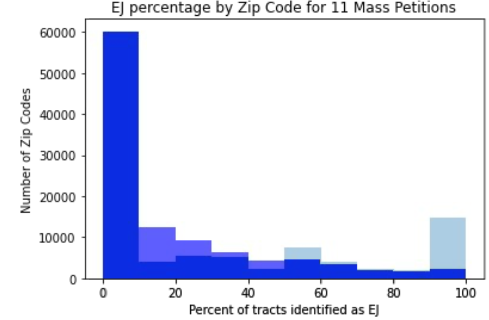
```

---

background-image: URL(Figs/ej-gis-diesel.png)
background-size: contain

---

name: methods 
class: inverse center middle

# Methods 


---

Human coding and computational text analysis are more powerful when combined in an iterative workflow.
<!--I show how search and text-reuse tools can aid common hand-coding tasks. 
Human coding can both inform and be informed by rule-based information extraction---iteratively structuring queries on unstructured text.-->

1. Text analysis tools can strategically **select texts for human coders**---texts representing larger samples and outlier texts of high inferential value.
2. Preprocessing can **speed up hand-coding** by extracting features like names and key sentences. 
3. Humans and computers can iteratively **tag entities** using regex tables 
<!--(e.g., identify organizations)--> and **group texts by key features** (e.g., identify lobbying coalitions by common policy demands)

---

Applying simple search and text-reuse methods to public comments on all U.S. federal agency rules, a **sample of 10,894 hand-coded comments** yields **41 million as-good-as-hand-coded comments** regarding both the organizations that mobilized them and the extent to which policy changed in the direction they sought. <!--This large sample enables new analyses of lobbying coalitions, social movements, and policy change.-->

<!--

# The Broader Project: Public Pressure

Mobilization


(grassroots, astroturf, elected officials)

↓

Getting policymakers' attention and framing policy debates

↓

Substantive policy influence

↓

Surviving judicial review


# 50 million public comments on proposed agency rules

---->


---

### Hand-coding dynamic data

<!--

- 15 coders 

```{r greyhound, fig.cap= "Incorrectly Labeled Coalition Identified by Automated Check"}
knitr::include_graphics(here("figs", "greyhound.png"))
```

--->

Workflow: `googlesheets4` allows analysis and improving data in real time. For example: 

- The "org_name" column is populated with a guess from automated methods. As humans identify new organizations and aliases, other documents with the same entity strings are auto-coded to match human coding.   
- As humans identify each organization's policy "ask," other texts with the same ask are put in their coalition.   
- If the organization and coalition become known, it no longer needs hand coding.

---

name: datasheet

Coded Public Comments in a Google Sheet

```{r datasheet2, fig.show = "hold", out.width = "100%"}
 
knitr::include_graphics("Figs/datasheet.png")
```

---


# Grouping with key phrases

1. Humans identify groups of selected documents (e.g., lobbying coalitions)
2. Humans copy and paste key phrases
3. Computer puts other documents containing those phrases in the same group (coalition)

*Preprocessing tip:* 
<!--**Digitized text** allows humans to paste text exactly matching machine-read strings.  -->
**Summaries** speed hand-coding (e.g., use `textrank` to select representative sentences).

---


name: regex

### Regex tables to tag entities


- **Deductive:** Start with databases of known entities.


<!--### Consolidating entity name variants with regex tables-->


```{r regex-crp}
#CRP data
here("data", "Lobbbying_Summary.csv") |>
read_csv() |>
  filter(parentName %in% c("Teamsters Union", "3M Co") ) |>
  filter(!orgName %in% "3M Cogent") |>
  mutate(orgName = orgName %>% str_replace(".*Teamsters.*", "Teamsters")) |> 
  distinct(orgName, parentName) |> 
  group_by(parentName) |>
  summarize(pattern = str_c(orgName, collapse = "|") ) |>
  mutate(pattern = pattern %>% str_replace("Teamsters & ", "Teamsters|Teamsters.{1:4}") |>
           str_replace("Maint ", "Maint[a-z]* ") |>
           str_replace("Trucking Pension", "(Trucking|Pension)") |>
           str_replace_all("&|and", "(and|&)") |>
           str_remove_all(" Div")) |>
  rename(Entity = parentName, Pattern = pattern) |>
  knitr::kable(caption = "Lookup Table Deduced from Center for Responsive Politics Lobbying Data, Collapsed into an Initial Regular Expression Table", full_width = T) |>
  kableExtra::kable_paper()
```

---

name: entity

### Regex tables to tag entities

- **Inductive:** Add entity strings that frequently appear in the data to regex tables.  
- **Iterative:** Add to regex tables as humans identify new entities or new aliases for known entities. Update data (Google Sheets) to speed up hand coding.

<!--### Add to regex tables as hand coders identify new aliases-->


**Fig 2:** Iteratively Building Regex Tables

```{r, out.width = "100%", fig.show='hold'}
#knitr::include_graphics("https://docs.google.com/drawings/d/e/2PACX-1vRSJJgSbMdFtkpJjB94Tw5cmFElhDKrHEkOLaUb5-qFdIY-sQp4qGyC-FZoZ7UmWSLfoMZDueAkemhU/pub?w=752&h=238") 

knitr::include_graphics("Figs/methods-regex.png")

#knitr::include_graphics(here::here("legislators" , "man", "figures", "logo.png") %>% str_remove("dissertation"))
```

---

The `legislators` package adds name variants (e.g., "Liz Warren") to standard legislator names.

```{r legislators, eval = FALSE}
library(legislators)

members |>
  filter(first_name == "Elizabeth", congress == 117) |>
  select(Entity = bioname, Pattern = pattern) |>
  mutate(Pattern = Pattern |> 
           str_replace_all("\\\\b" , "\\\\\\\\b") %>% 
           str_remove_all("na |\\|herring, e\\\b|\\|herring, elizabeth|\\|liz herring|\\|warren, l\\\\b") %>% 
           str_replace("representative fletcher\\\\b.\\{1,4\\}tx", "\\|representative fletcher") %>% 
           #str_replace("fletcher\\|fletcher", "fletcher") %>% 
           str_replace("senator warren\\\\b.\\{1,4\\}ma", "\\|senator warren") |>
  str_replace_all("\\\\b", "\\\\\\b") )%>% 
  kable( caption = 'Regex Table for Legislators Named Elizabeth in the 117th Congress', full_width = T)|>
  kableExtra::kable_paper()
```


For example, the `legislators` package uses a regex table, adding variants (e.g., "AOC") to standard legislator names to detect them in messy text.

---


name: mass

###  Most public comments result from organized pressure campaigns

**Fig. 5:** Public Comments on Regulations.gov, 2005-2020

```{r comments-mass, out.width = "80%", fig.show = "hold"}
knitr::include_graphics("Figs/comments-mass-1.png")
```

Comments that share a 10-gram with 99 or more others are part of a mass comment campaign.

---

name: methods-next 

### Next steps: 

Methods   
- Compare exact entity linking (regex tables) to probabilistic methods (`linkit`, `fastlink`, supervised classified with hand-coded training set)
- Compare exact grouping (e.g., by policy demands) to supervised probabilistic classifiers/clustering

Substantive   
- Test policy receptivity using rates of addressing Climate and EJ out of sample (direct rules & notices)
- Better measures of policy change
- Alternative estimation (hierarchical Bayes)
- Cumulative effects over time (hazard models)
- Placebo test? 


---


class: inverse center middle 

# Environmental Justice 

---


background-image: url(Figs/brianadams.png)
background-size: cover
name: ej-mercury-long

### Example: Safe Levels of Mercury (For Whom?)

???
Before the politics of who gets what, there is the politics of who the whos *are*. What are the groups or communities deserving consideration? 

- 2000 Notice: "the U.S. population."

--

- 2002 Draft: Regulated entities + "Other types of entities not listed could also be
affected."

--

- 2011 Draft: disparate impacts on "vulnerable populations" including "African Americans," "Hispanic,"
"Native American," and "Other and Multi-racial" groups.

--

- 2012 Final Rule: EJ analysis adds "minority, low income, and indigenous"
--

- 2020 Rollback: "These communities may experience foregone benefits" 

--

- 2021 Draft: 2012 Final Rule categories + "differentiated subsistence fisher
populations" + "children exposed prenatally"


???
2011 Draft: Five pages of EJ analysis of the disparate impacts
on

- 2020 Rollback: "While these communities may experience foregone benefits as a result of this action, the potential foregone [health benefits] are small." 

⁉️

30/51 pages in Biden

---


background-image: url(Figs/brianadams.png)
background-size: cover


### Public comments on proposed agency rules

> `"The amount of methyl-mercury and other bioaccumulative chemicals consumed by Alaskans (especially Alaskan Natives) could potentially be much higher than is assumed" - Heather McCausland of the Alaska Community Action on Toxics (ACAT)`

---


background-image: url(Figs/earthjustice.png)
background-size: cover
background-position: bottom
background-color: white


> `"Such an approach ignores the cumulative pollution burdens experienced by environmental justice communities." - Amanda Goodin, Staff Attorney, Earthjustice on behalf of Communities for a Better Environment et al.`

---

### Public comments on proposed agency rules


> `"Attached are files containing the names of 11,478 individuals who have submitted public comments urging the Bureau of Land Management (BLM) to strengthen the proposed regulations on methane waste and pollution on federal and tribal lands"` 

---

background-image: url(Figs/Clinton-ej.jpg)
background-size: cover


`“Addressing disproportionately high and adverse human health or environmental effects of programs, policies, and activities on minority populations and low-income populations.”`


---

### Data: Comments on Draft Rules

Of 13,111 relevant agency rules, less than 15% addressed environmental justice, and 8%  addressed climate change, despite growing activist demand.

Of 39,392,957 public comments 

- 20% <!--, 17,857,018 (421,880 unique)--> raise "climate change"

- 2% <!--, 3,248,697 (2,138 unique)--> also mention environmental justice or climate justice

- 82% of all comments raising EJ also mention climate change, but only 14% of **unique** comments raising EJ also mention climate change


---

name: ej-data-rules


```{r, fig.show = "hold", out.width = "90%"}

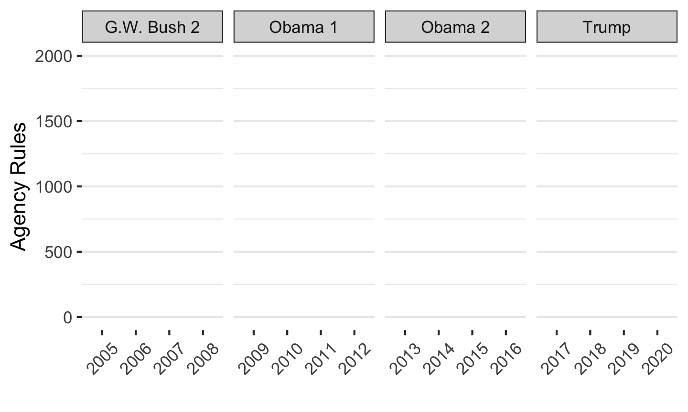  
```


---


```{r, fig.show = "hold", out.width = "90%"}

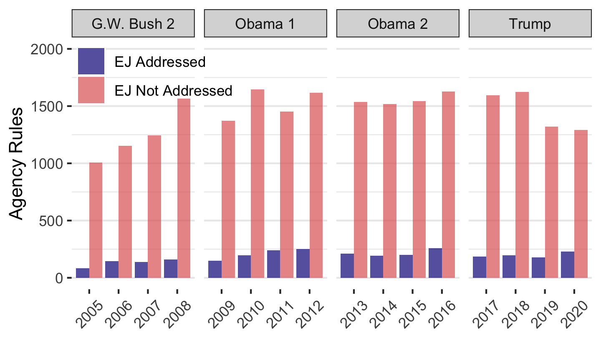  
```


---


```{r, fig.show = "hold", out.width = "90%"}

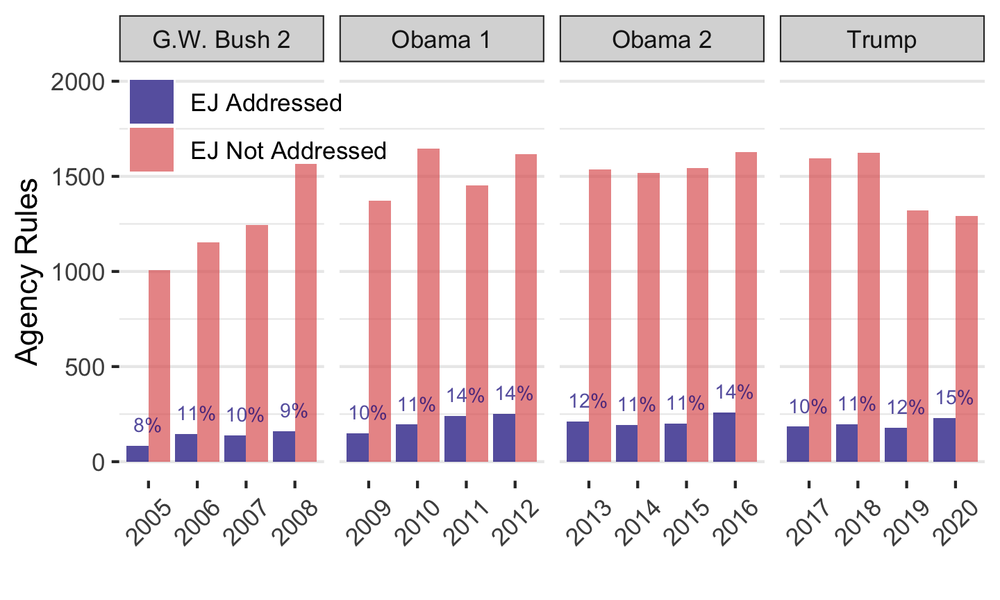  
```


---


```{r, fig.show = "hold", out.width = "90%"}

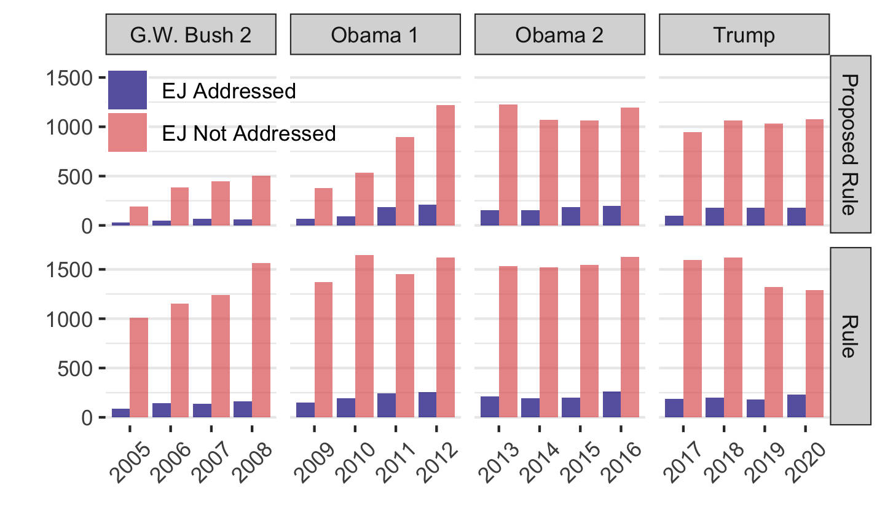  
```

---


```{r, fig.show = "hold", out.width = "90%"}

  
```


---

### Data: Final Rules

```{r, fig.show = "hold", out.width = "100%"}

knitr::include_graphics("Figs/ej-data-ejfr-1.png")  
```

---

### Data: Proposed Rules

```{r, fig.show = "hold", out.width = "100%"}

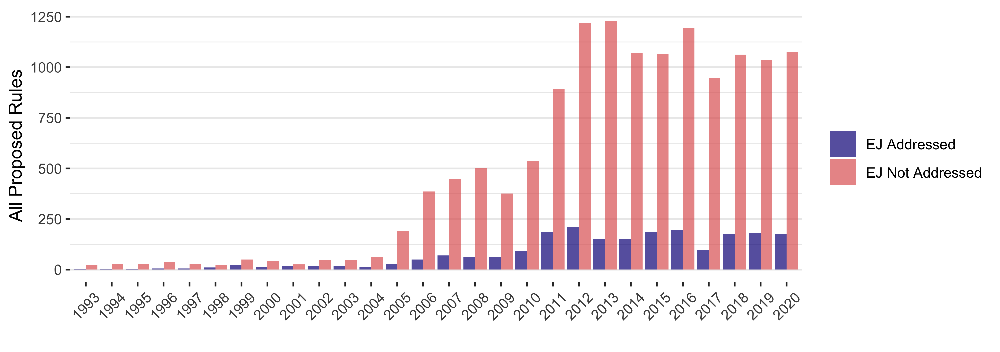  
```

---


name: ej-data-agencies


```{r ej-data-agencies, out.width = "95%"}

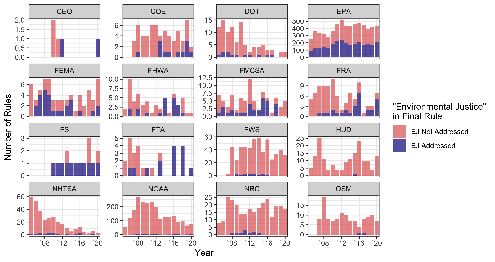
```

---

exclude: `r short`
name: president 


.left-column[  
 $\checkmark$  $H_1$ Agencies respond to environmental justice concerns 
 
 
(Random effects model)
 ]
 

.right-column[
```{r ej-m-PR-president-median-1, out.width = "65%"} 
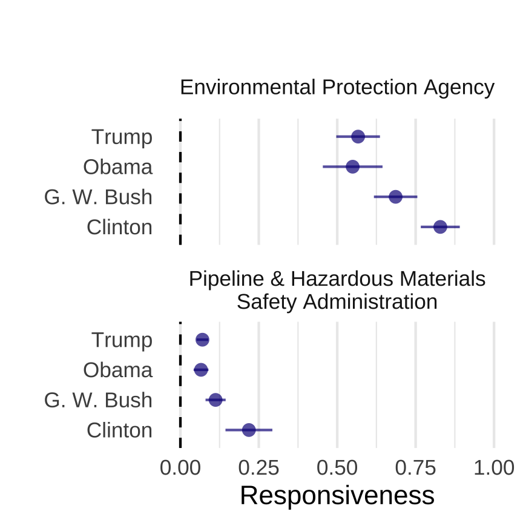
```
]


---

name: ej-comments


### Data: ~40,000,000 Public Comments


```{r ej, out.width = "70%"}

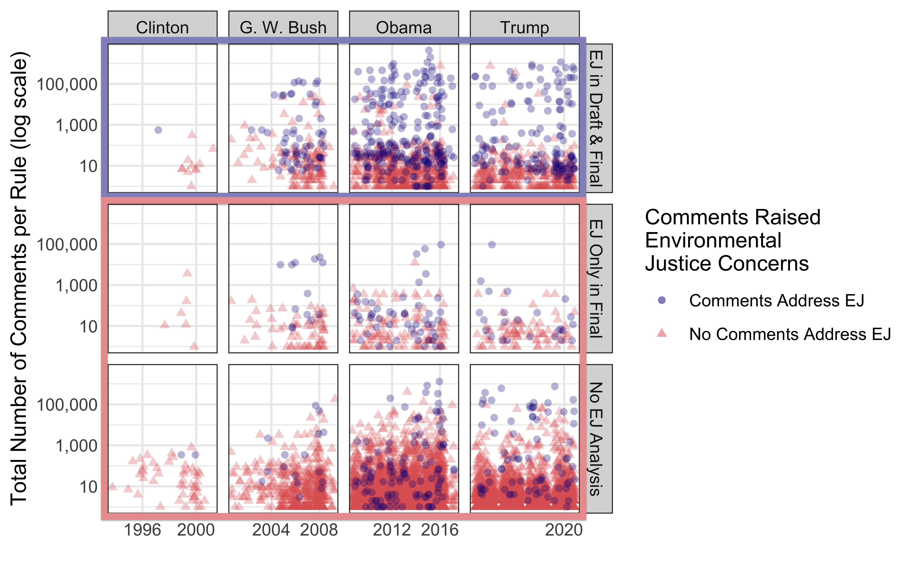
```


???

I collected all 40 million comments on these draft and final rule pairs. 
Almost 5 million mentioned EJ.

The top row of plots with the purple border shows proposed rules that did address EJ; I use this set to assess whether EJ language changed between the draft and the final. 

The lower two rows in the red box show proposed rules that did not address EJ, and the middle row shows rules where EJ language was added. 

Each point is a rule. 
Blue ones are the ones where commenters raised EJ concerns. 
Red ones are where no comments raised EJ concerns.
Y-axis is the total number of comments the rule received. 

---


### Data: ~40,000,000 Public Comments

~4,800,000 (~28,000 unique) comments raise EJ concerns


```{r, fig.show = "hold", out.width = "45%"}
#, fig.cap="Example: Identifying Coalitions by the Percent of Matching Text in a Sample of Public Comments"
knitr::include_graphics("Figs/comment_percent_match_plot.png") 
```

???

Using n-gram matching methods similar to plagiarism detection, I collapse form letters and petitions into representative texts. As most comments are form letters, that 5 million collapses to 28 thousand unique texts.
This figure shows the percentage of shared text in a sample of documents.
The black squares on the diagonal show that each comment has a perfect overlap with itself. 
The block of grey partial matches reflects a public pressure campaign, with a lot of shared 10-grams. 
I then attach these to lobbying coalitions by hand. 


---


### Data: Comments on Draft Rules

Of 13,111 relevant agency rules, less than 15% addressed environmental justice, and 8%  addressed climate change, despite growing activist demand.

Of 39,392,957 public comments 

- 20% <!--, 17,857,018 (421,880 unique)--> raise "climate change"

- 2% <!--, 3,248,697 (2,138 unique)--> also mention environmental justice or climate justice

- 82% of all comments raising EJ also mention climate change, but only 14% of **unique** comments raising EJ also mention climate change


---


background-image: url(https://assets.nrdc.org/sites/default/files/styles/full_content/public/media-uploads/midwesttoxicdoughnut_25_002chicago_steel_mills-july_1965_vl_2400.jpg?itok=yXMNtQ-Y)
background-size: cover


### Why EJ?

1. Variation in issue framing: "environmental" policy is inconsistently racialized +  inconsistently focused on *distributions* of costs and benefits

1. Distinct phrase (few false positives) without many synonyms (few false negatives)

1. E.O. 12898 "Federal Actions to Address Environmental Justice" (1993)


$\Rightarrow$ Administrative Procedures Act lawsuits: 
> "environmental justice analysis can be reviewed under NEPA and the APA" (*Protect Our Communities Foundation v. Salazar* 2013; *Communities Against Runway Expansion, Inc. v. FAA* 2004)

???

Environmental Justice For All Act (2020) introduced by Senator Harris

The day after Biden's executive order was launched, Rep. Cori Bush (D-MO) and Sens. Tammy Duckworth (D-IL) and Ed Markey (D-MA) introduced the Environmental Justice Mapping and Data Collection Act of 2021, which builds on many of the concepts in the executive order and would create a whole-of-government initiative, including data infrastructure and funding to “identify communities most at risk from environmental injustices.”

---

name: ej-hyp

### *Distributive Claims Hypothesis*: 

> Policymakers are more likely to address distributive justice when groups raise distributive justice concerns.

 $\color{\green}{\checkmark}$ Pro: "norms and values are set communicatively" (Habermas 1996), "identifying interests" shapes policy (Gellhorn 1972)   

$\Large\color{\red}{\unicode{10007}}$ Con: Bureaucratic policymaking is about "technical expertise" (Epstein et al. 2014)

???
First, we might expect policymakers are more likely to address distributive justice when groups raise distributive justice concerns.

Conversely, if bureaucratic policymaking is about "technical expertise"

---

### *Coalition Size Hypothesis*

> Policymakers are more likely to address concerns as more groups raise them.

✅ :
Coalition size (Nelson and Yackee  2012) & pressure (Gillion 2013; Wasow 2020)

❌ : "Informational value" (Epstein et al. 2014; Gailmard & Patty 2017; Libgober 2018)

???

On the one hand, we might expect policymakers to respond to the scale of pressure to address EJ.

On the other hand, all of the formal models to date are focused on providing new information. 
I really like Brian Libgober's model of how comments inform rulemaking, but it relies on telling policymakers something they didn't already know. 

---

### *Policy Receptivity Hypothesis*

> Policymakers that more frequently address certain concerns will be more responsive to groups raising those concerns.

<!-- "Legibility" (Scott 1998), -->
✅ : "Opportunity structure" (Marks & McAdam 2007; McAdam 2010) "fit inside the legal narrative" (Scott 1998; Deloria 2009; Hilson 2002; Delaney 2017)   

❌ : "New information" Farina (2018)

???
Regarding policy receptivity
Political opportunity may not just be about access to policymakers but also in terms of political receptivity to the claims being made." (Hilson 2002, p. 242)

Claims may be more impactful when they are more legible to policymakers and fit inside their existing legal narrative and self-concept of what their job is.

Other legal scholars and formal models suggest that information should matter most when it is not something policymaker is already thinking about. If they are right, then we should expect the opposite---that activists raising EJ concerns are most influential at agencies that DON'T usually think about EJ---where it presents them with something new.

---

### *Public Attention Hypothesis*

> Policies are more likely to change when they receive more public attention (e.g., more public comments).

✅ : Leech (2010)

❌ : Lowery (2013), Balla et al. (2020)

???

Finally, there is this debate over whether high or low-salience policies are more likely to change. 

We might expect that policies are more likely to change when there is more overall public attention, regardless of pressure to address EJ in particular. 

On the other hand, if it is easier to lobby out of the public spotlight, we might expect low-salience policies to be more likely to change. 

Balla et al.'s study of responses to comments in rulemaking suggests a null effect. Legal scholars tend to see the scale of public attention is just not a legal concern. 

And again, formal models don't really have a parameter for public attention or pressure. 

---

name: ej-results


### Adding EJ to Policy

```{r ej-m-PR-ejcomments-agencyFE,  out.width = "80%"}
knitr::include_graphics("Figs/ej-m-PR-ejcomments-agencyFE-1.png")
```

- ✊🏿 🔁   Coalition Size 📈 

---

### Adding EJ to Policy (EPA rules only)

```{r ej-m-PR-epa-1,  out.width = "80%"}
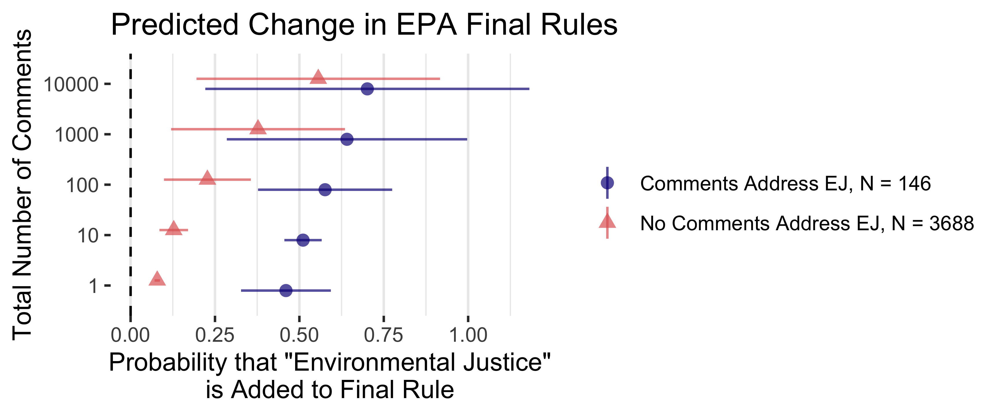
```

- ✊🏿  Distributive Claims 📈 
- 📢  General Public Pressure/Attention 📈  (when comments don't raise EJ)

---

###  Changing Existing EJ Language by Coalition Size

```{r ej-mejPR-ejcomments-agencyFE, out.width = "80%"}

knitr::include_graphics("Figs/ej-mejPR-ejcomments-agencyFE-1.png")
```


- ✊🏿🔁  Coalition Size 📈 

---

###  Changing Existing EJ Language by Attention

```{r ej-mejPR-comments, out.width = "80%"}

knitr::include_graphics("Figs/ej-mejPR-comments-agencyFE-1.png")
```


- ✊🏿  Distributive Claims 📈 
- 📢  General Public Attention 📉 (when comments don't raise EJ)

---

exclude: true

###  To sum up, yes, movements matter

Strong framing effects, but substantive policy change is driven by national advocacy groups.

|                                            | Add EJ Language | Change EJ Language |
| ------------------------------------------ | :--: | :--: |
| ✊🏿  Distributive Claims (EJ Concerns)     | 📈 | 📈 |
| ✊🏿 🔁  Coalition Size /  Pressure        | 📈 | 📈 |
| 🏛️  Policy Receptivity                             | 📈 | 📈 |
| 📢  General Public Attention               | 📈 | 📉 |


<!--| 📢x✊🏿 Specific (Conditional) Pressure            | 📉 | ❓ | -->

With larger coalitions and more public attention, agencies are more likely  📈 to **add** EJ language **where there was none**, BUT agencies also anticipate public attention, making **existing** EJ analyses less likely 📉 to **change** on higher-salience rules.

--

[Replicates with "climate change"](https://judgelord.github.io/research/cj/)


---

name: cj 
class: inverse center middle

# Climate Change


---

name: cj-data


### Data: 40,139 policy documents (13,111 proposed and final rule pairs) from 46 agencies

```{r cj-data-agencies100, out.width = "90%"}
knitr::include_graphics("Figs/cj-data-agencies100-2.png")
```

---

```{r cj-data-agencies, out.width = "90%"}

knitr::include_graphics("Figs/cj-data-agencies-2.png")
```

---

### Data: 39,392,957 public comments

- 20% <!--, 17,857,018 (421,880 unique)--> raise "climate change"

- 2% <!--, 3,248,697 (2,138 unique)--> also mention environmental justice or climate justice

- 82% of all comments raising EJ also mention climate change, but only 14% of **unique** comments raising EJ also mention climate change


---

name: sips 

### Example: EPA responds to comments 

2013 Obama EPA proposed rule: *Air Quality State Implementation Plans; Approvals and Promulgations: Navajo Nation; Regional Haze Requirements for Navajo Generating Station* 

- No mention of climate change, one paragraph on environmental justice.

In response to 421 comments raising climate justice concerns, the final rule added nine paragraphs on environmental justice and a brief mention of climate change: 

> "EPA agrees that climate change is an important issue...Although regulation of greenhouse gases is conducted under separate statutory requirements from regional haze."


<!--, EPA is mindful that this BART determination for NGS is not the only regulatory program that affects this facility and the region."-->

---

### Example: EPA ignores comments

2017 Trump EPA proposed rule: *State of Texas, Regional Haze and Interstate Visibility Transport Federal Implementation Plan* makes no mention of climate change. 
<!--
 "Texas' participation in the Cross-State Air Pollution Rule’s (CSAPR) trading program for ozone-season NOX qualifies as an alternative to BART. We are approving Texas’ determination that its EGUs are not subject to BART for particulate matter (PM)."
-->
A short EJ section mentions only SO2, not NOX or PM.

61 Comments, including EarthJustice et al.: 

> "Climate change may also have an effect on the outdoor air pollutant concentrations, especially ozone."

The final rule makes no mention of climate change and no change to the EJ section.


???

[EartheJustice et al.] (https://www.regulations.gov/comment/EPA-R06-OAR-2016-0611-0083)

The EPA believes that this action does not have disproportionately high and adverse human health or environmental effects on minority populations, low-income populations, and/or indigenous peoples, as specified in Executive Order 12898 (59 FR 7629, February 16, 1994). We have determined that this rule will not have disproportionately high and adverse human health or environmental effects on minority or low-income populations because it increases the level of environmental protection for all affected populations without having any disproportionately high and adverse human health or environmental effects on any population, including any minority or low-income population. The rule limits emissions of SO

Bernard, S., Samet, JM, Grambsch, A, Ebi, KL, and Romieu, I, The Potential Impacts of Climate Variability and Change on Air Pollution-Related Health Effects in the United States. Environmental Health Perspectives 2001. 109(Supplement 2): p. 199-209.


---

name: methane

### 2022 EPA Methane Rules 

> "The Clean Air Act standards in the supplemental proposal will work hand-in-hand with *new
resources* and programs in the Inflation Reduction Act, which will incentivize early
implementation of innovative methane reduction technologies and support methane
mitigation and monitoring activities. These complementary efforts will allow the United
States to achieve greater methane emissions reductions more quickly.

---

### 2022 EPA Methane Rules 

> The IRA amended the CAA by adding section 136, “Methane Emissions and Waste
Reduction Incentive Program for Petroleum and Natural Gas Systems.” Under this new section
of the CAA, subsection 136(c), “Waste Emission Charge,” requires the Administrator to “impose
and collect a charge on methane emissions that exceed an applicable waste emissions threshold
under subsection (f) from an owner or operator of an applicable facility that reports more than
25,000 metric tons of carbon dioxide equivalent of greenhouse gases emitted per year pursuant to
subpart W of part 98 of title 40, Code of Federal Regulations (40 CFR part 98), regardless of the
reporting threshold under that subpart.” An “applicable facility” is defined under CAA section
136(d) by reference to specific industry segments as defined in the Greenhouse Gas Reporting
Program (GHGRP) petroleum and natural gas systems source category (40 CFR Part 98, subpart
W, also referred to as “GHGRP subpart W”). Pursuant to CAA section 136(g)


---

### 2022 EPA Methane Rules 

>“The American Lung Association appreciates the agency’s consideration of the hundreds of thousands of comments received for the initial proposal – including from national and state health and medical organizations, more than 300 health professionals, and more than 300 individuals. We recommend that EPA require that the oil and gas industry take the strongest steps possible to prevent fugitive emissions of methane and other gases from all operations, including small producing wells, and halt all routine flaring of methane. 

>“We thank EPA for their work on proposing stricter methane standards for new and existing oil and gas wells and urge the agency to quickly finalize stronger standards to fully protect health.” - https://www.lung.org/media/press-releases/epa-methane-proposal-statement-2022

---

### 2022 EPA Methane Rules 

> “API looks forward to reviewing the proposed rule in its entirety and will continue to work with EPA in support of a final rule that is cost-effective, promotes innovation, and creates the regulatory certainty needed for long-term planning

---

name: cj-data

Draft rules that did and did not address climate

```{r climate-comments, out.width = "85%"}

knitr::include_graphics("Figs/climate-comments-1.png")
```

---

exclude: true

Draft rules that did and did not address EJ/CJ

```{r cj-comments, out.width = "85%"}
knitr::include_graphics("Figs/cj-comments-1.png")
```


---

name: cj-results


###  Adding Climate Change to Policy

```{r climate-m-PR-president-median-1, out.width = "55%"}
knitr::include_graphics("Figs/climate-m-PR-president-median-1.png")
```

- 🔬 Scientific Information ✅  

---

exclude: true


###  Adding Climate Justice to Policy

```{r cj-m-PR-president-median-1, out.width = "50%"}
knitr::include_graphics("Figs/cj-m-PR-president-median-1.png")
```

- ✊🏿 Distributive Information ✅  

---


###  Adding Climate Change to Policy 

```{r climate-m-PR-climatecomments-agencyFE,  out.width = "70%"}
knitr::include_graphics("Figs/climate-m-PR-climatecomments-agencyFE-1.png")

```

- 🔬🔁 Coalition Size ✅  


---

exclude: false


###  Adding Climate Justice to Policy 

```{r cj-m-PR-cjcomments-agencyFE,  out.width = "70%"}
knitr::include_graphics("Figs/cj-m-PR-cj-comments-agencyFE-1.png")

```

- ✊🏿🔁 Coalition Size ✅  

---


## Results: Adding Climate Change to Policy

```{r climate-m-PR-comments-agencyFE, out.width = "70%", fig.show = "hold"}

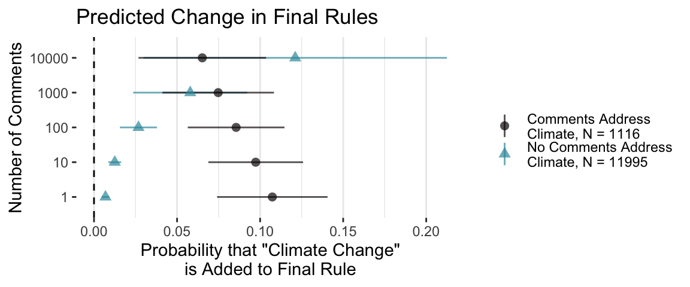

```

- 🔬 Scientific Information ✅  
- 📢 General Public Pressure/Attention ✅  


---


###  Adding Climate Justice issues to Policy

```{r cj-m-PR-comments-agencyFE, out.width = "70%", fig.show = "hold"}
knitr::include_graphics("Figs/cj-m-PR-comments-agencyFE-1.png")

```

- ✊🏿 Distributive Information ✅  
- 📢 General Public Pressure/Attention ✅  

---

exclude: true


### To sum up, yes, movements matter (even when victories are rare)

|                                            | Add Language
| ------------------------------------------ | :--: | :--: |
| 🔬 Scientific Information (Climate Concerns)  | 📈 |
| ✊🏿 Distributive Information (EJ/CJ Concerns)     | 📈 | 
| 🔬/✊🏿🔁 Coalition Size           | 📈 | 
| 🏛️ Policy Receptivity                             | 📈 |
| 📢 General Level of Public Attention               | 📈 | 


<!--| 📢x✊🏿 Specific (Conditional) Pressure            | 📉 | ❓ | -->

With larger coalitions and more public attention, agencies are more likely  📈 to **add**  language **where there was none**<!--, BUT agencies also anticipate public attention, making **existing** EJ analyses less likely 📉 to **change** on higher-salience rules.-->


---


class: inverse center middle
name: influence

#  Substantive Lobbying Success 

---

name: example-demands

### Example Demands

- Categorically Protect Certain Other Waters, including Vernal Pools, Pocosins, Sinkhole Wetlands, Rainwater Basin Wetlands, Sand Hills Wetlands, Playa Lakes, Interdunal Wetlands, Carolina and Delmarva bays, and Other Coastal Plain Depressional Wetlands, and Prairie Potholes. 

- Waters Substantially Affect Interstate Commerce and Should be Categorically Protected

- The Rule Should Not Exempt Ditches

- The Rule Should Limit the Current Exemption for Waste Treatment Systems


---

name: tree 

.left-column[#Hand-coded sample]

```{r tree, out.width = "36%"}
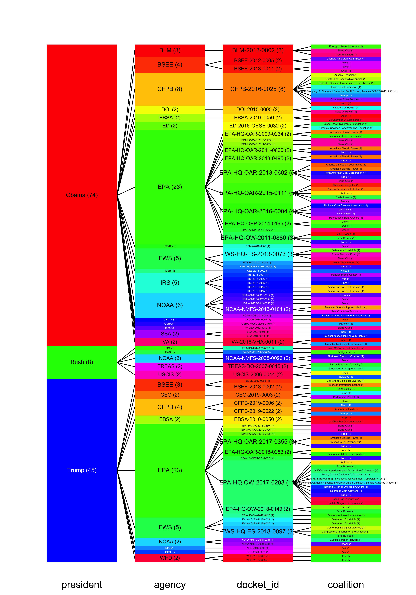
```


---

name: spatial


```{r spatial, out.width = "70%"}
knitr::include_graphics("Figs/spatial-coding-1.png")
```

---


exclude: true

### Lobbying Success by Campaign Size

```{r coded-coalition-success, out.width = "60%"}
knitr::include_graphics(here::here("figs", "coded-coalition-success-1.png"))
```

---

name: success-models

### (1) Variation across coalitions

Pr(coalition success | agency + president)
~ coalition + business coalition + coalition size +  supports rule + pressure campaign (+ interactions)


### (2) Variation within organizations that lobby on multiple rules

Pr(organization success | organization + agency + president) ~ coalition + business coalition + coalition size +  supports rule + pressure campaign (+ interactions)

---

### Variation across coalitions (OLS): $Y_{i} = \beta_{1:n} X_i +  \gamma_k + \delta_p + \epsilon_{ik}$  

$Y_i$ is the success of each coalition $i$  [-2:2]
on rule $j$, by agency $k$ under president $p$.  
 
  
$X_i$ includes
- whether the coalition is more than one organization [0,1]
- whether the coalition is business-led [0,1]
- whether the coalition's issue frame was adopted [0,1]
- the number of organizations in that coalition 
- whether the coalition supports the proposed rule [0,1]
- whether the coalition mobilized a pressure campaign  

$\gamma_j + \delta_p$ are fixed effects  
$\epsilon_{ik}$ errors clustered at agency level


???
As each coalition is unique to a rule, and each rule is unique to an agency and president, $y_{ijkp} \equiv y_i$   

The dependent variable, $Y$, is the lobbying success of each coalition. To estimate the relationship between a coalition's lobbying success and the scale of public pressure it mobilizes, I model the success of each coalition $i$ lobbying a rule $j$ published by an agency $k$ under a president $p$. Each coalition is unique to a rule; each rule is unique to an agency (I assigned joint rules to the lead agency only) and presidential administration. I thus use the simpler notation $y_i$ rather than the equivalent, more specific notation $y_{ijkp}$. 

The main variable of interest is the total number of form-letter public comments that a lobbying coalition mobilized.
The base model (Equation \@ref(eq:success)) uses an indicator for whether coalition $i$ used a public pressure campaign, i.e., mobilized mass comments (by definition, more than 99 mass comments). $\beta_1$ estimates the difference in lobbying success when coalition $i$ uses a pressure campaign compared to when it does not. Other models use either the logged number of comments or a quadratic term to account for the different marginal effects of additional public comments for smaller and larger campaigns. 


\begin{equation} 
Y_{i} = \beta_1 \textbf{Pressure campaign}_{i} + \beta_{2:n} X_i +  \gamma_j + \delta_p + \epsilon_{i} (\#eq:success)
\end{equation} 


The base models include agency and president fixed effects ($\gamma_k + \delta_p$) and control for other coalition-level factors that may affect a coalition's lobbying success, $X_i$. Controls include <!-- of the relative length of the (lead) organizations comment, -->
whether the coalition is lobbying unopposed, the coalition's size (the number of distinct organizations and elected officials), and the type of coalition (e.g., whether it is a business coalition or a public-interest coalition). $\beta_{2:n}$ are the effects of these other coalition-level factors on lobbying success. I estimate these relationships using OLS regression. <!--I also estimated hand-coded lobbying success with beta regression and ordered logit, which is more appropriate but less interpretable. For the automated measures of lobbying success, I estimate beta regression models with the same variables.-->


---


### Within organizations (OLS): $Y_{ij} = \beta_{1:n} X_{ij} + \alpha_i + \gamma_k + \delta_p + \epsilon_{ij}$

$Y_i$: success of each organization $i$ [-2:2]
on rule $j$ by agency $k$ under president $p$.  

$X_{ij}$: features of organization $i$'s coalition on for each rule $j$ 
  - whether the organization is part of a coalition [0,1]
  - whether their coalition is business-led [0,1]
  - whether the coalition's issue frame was adopted [0,1]
  - the number of organizations in their coalition 
  - whether the coalition supports the proposed rule [0,1]
  - whether the coalition mobilized public pressure [0,1]   
  
$\alpha_i + \gamma_j + \delta_p$: fixed effects   
$\epsilon_{ij}$: errors clustered at the organization level

???

As each rule is unique to an agency and president, $y_{ijkp}$ $\equiv$ $y_{ij}$ 

---


name: success-coalition

.left-column[
### Larger coalitions  $\rightsquigarrow$  more likely to win 

Coalition-level OLS model
]

 
```{r m-influence, out.width = "35%"}
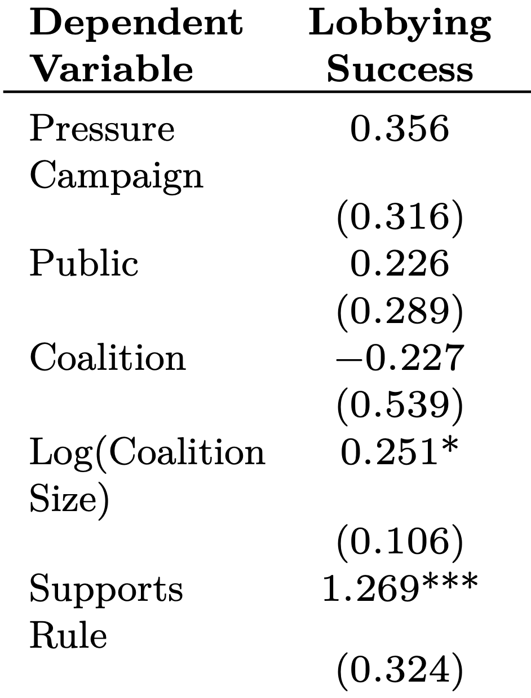
```

---

name: coalition-legislators

.left-column[
### Pressure campaigns seem to mobilize legislators 

Coalition-level Poisson model
([Table](#mediation-table))
]


.right-column[
```{r m-congress, out.width = "80%"}
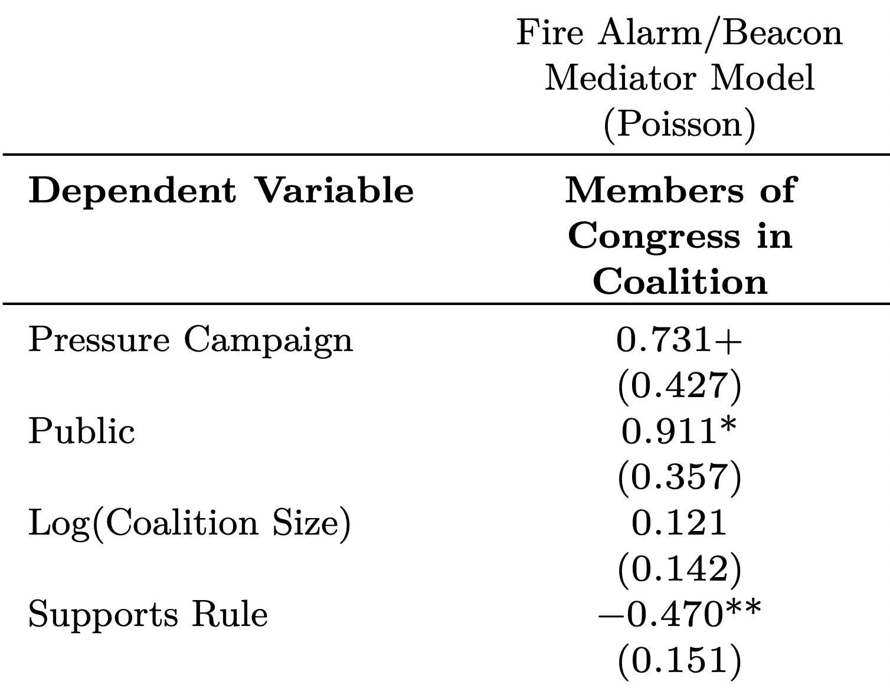
```
]

---

.left-column[
### When organizations mobilize more legislators, they may be more likely to win 


Within-org OLS model

]

.right-column[
```{r m-diffindiff, out.width = "90%"}
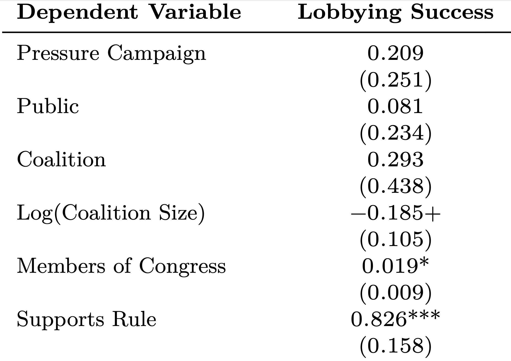
```
]

---

exclude: true

$Y_{i} = \beta_1 \textbf{Pressure campaign}_{i} + \beta_{2:n} X_i +  \gamma_j + \delta_p + \epsilon_{i}$


---

name: ej-success

.left-column[
### When coalitions mobilize frames, they are more likely to win 

Cross-sectional OLS model of coalition-level lobbying success 
([Rates](#substantive), [Table](#coalition-success-table), [DiD version](#ej-org-success))

]

.right-column[
```{r mc1ej-obama, out.width = "90%"}

```
]

---

name: ej-org-success

.left-column[

### When organizations mobilize frames, they are more likely to win 

Within-organization OLS model
([Rates](#substantive), [Table](#org-success-table), [Cross-sectional version](#ej-success))

]

.right-column[

```{r mo1ej-obama, out.width = "90%"}
knitr::include_graphics("Figs/mo1ej-obama.png")
```
]

---

.left-column[
### When organizations mobilize frames, they are more likely to win 


Within-organization OLS model
([Table](#org-success-table), [Cross-sectional version](#ej-success))
]

.right-column[

```{r mo1ej-trump, out.width = "90%"}
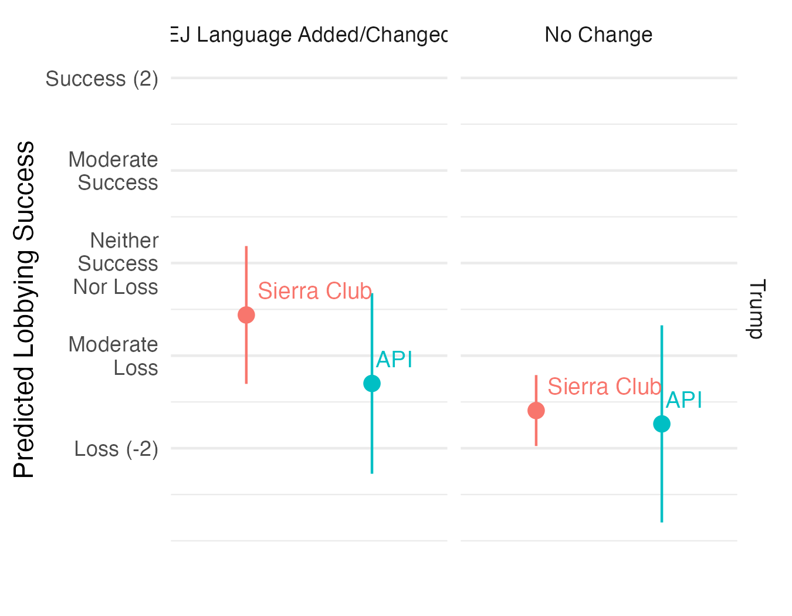
```
]


---


include: short

## Why do moneyed interests win in rulemaking?


By buying congressional support?  
--
No 

```{r, out.width="49%"}
knitr::include_graphics("figs/mediation-marketcap-lobbying-1.png")
knitr::include_graphics("figs/mediation-marketcap-lobbying-2.png")
```

---

## Why do moneyed interests win in rulemaking?

**They hire experts and lawyers**

```{r, out.width="100%"}
#knitr::include_graphics("figs/mediation-marketcap-bluebook-1.png")
knitr::include_graphics("figs/mediation-marketcap-bluebook-1.png")
```

???

Unlike congress, the key variable that explains the relationship between wealth and influence appears to be the ability to hire lawyers and experts. 

---


class: inverse middle center

# Judicial Review

---

name: deference-data

# Data

All SCOTUS cases + a random sample of 175 federal circuit court cases that mention "Administrative Law" in the LexisNexis headnotes, 1984-2020.
- **Ideology:** Justices (Segal-Cover scores) × Policy (Spaeth criteria)
- Parties, briefs, opinions, outcomes

Draft & final **rules** + **comments** where rule is at issue


---

name: deference-results

\#1. Does the policymaking process affect judicial review? 

- ❌ -  expertise
- ❌ -  accountability 
- ✅ - participatory/controversial
- ✅ - deregulatory


\#2. Why are policies made through notice and comment more likely to be struck down

- ❌ -  ideological voting 
- ❌ -  selection from lower courts
- ✅ -  controversial/salient (but see #1)

???

 \#3. Is/was *Chevron/Mead* a jurisprudential regime?

- The jurisprudential regimes methods debate used 1984-2000 data; **should we revisit? **

---


layout: true

<div class="back-head">
</div> 

<div class="back-footer"></div> 


---


name: deference-table

background-image: url(Figs/deference-table.png)
background-size: contain
background-color: white


---

name: table

background-image: url(Figs/ej-table-paper.png)
background-size: contain
background-color: white

---

name: cj-table

background-image: url(Figs/cj-table.png)
background-size: contain
background-color: white

---

name: coalition-success-table

background-image: url(Figs/coalition-success-table.png)
background-size: contain
background-color: white

---

name: mediation-table

background-image: url(Figs/mediation-table.png)
background-size: contain
background-color: white

---

name: org-success-table

background-image: url(Figs/org-success-table.png)
background-size: contain
background-color: white

---

name: org-success-table-ej

background-image: url(Figs/org-success-table-ej.png)
background-size: contain
background-color: white