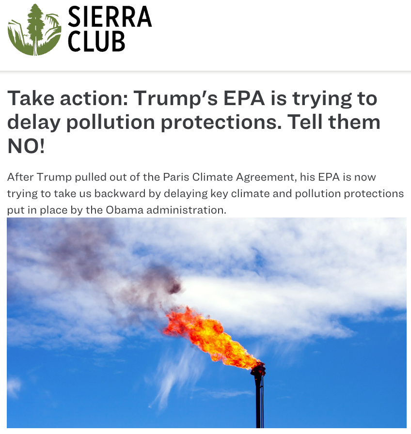

<!--
An example dashboard is available here: <https://judgelord.github.io/correspondence/FERC/DOE_FERC-letter-coding.html

<!--
```{r check-company, fig.cap= "Checking for Disparities Among Coders in Real Time", out.width="100%"}
include_graphics(here("figs", "check-company.png"))
```


```{r check-backslashes, fig.cap= "Checking for Incorrect Coding in Real Time", fig.height=4, fig.width=5.5}
include_graphics(here("figs", "check-backslashes.png"))
```

# References 

```{r, include=FALSE}
knitr::write_bib(c('knitr','rmarkdown','posterdown','pagedown'), 'packages.bib')
```


<!--
TODO 
Bloomington

The textrank algorithm creates a bipartite network of sentence pairs that share words and then applies Google Pagerank on the sentence network to rank sentences [@textrank]. This is the summary method I use, in part because many federal agencies used the textrank algorithm to summarize public comments. This means that the sentences chosen by textrank may be especially likely to be seen and quoted by agency officials responding to comments.  

Topic models also provide helpful summary information. Frequent and exclusive words associated with the topic(s) occurring in the highest proportions in the document may be helpful summary information. 

Similarly, the results of supervised machine classification can also simplify human coding [@Sebok2021]. For example, @Chou2019 use k-means clustering to classify sentences in audit reports and select sentences close to cluster centroids as summaries for human auditors. Humans with basic domain knowledge are well-suited to check and correct the results of machine coding. Human coders might dig deeper into cases where the machine coding looks off (given other available metadata, like associated entities, summaries, or topics). As humans do such a task, they likely learn how the classifier(s) tend to error. Future human and computational attention can then be paid to those cases. 


Nothing is language-dependent. Whereas statistical models of word frequencies require language-dependent preprocessing for dimension reduction [@Lucas2015], regex tables and text reuse are not.


# Classification 
"The tasks of estimating category percentages (quantification) or classifying individual documents (classification) both begin by analyzing a small subset of documents with (usually hand-coded) category labels." [@Jerzak2019]

The brand of linguistics that focuses on the combinations of words we use emphasises the recurring nature of phrases. 
"utterances are formed by repetition, modification, and concatenation of previously-known phrases consisting of more than one word...we speak mostly by stitching together swatches of text that we have heard before."
[@Becker1975]

Numerical representation of text documents can have an outsized impact on the results (see Denny and Spirling, 2016; Levy, Goldberg, and Dagan, 2015). 

A corpus may lack textual discrimination regarding word frequencies [@Jerzak2019], but still be classified by phrases long enough that they are highly unlikely to appear by chance. 

Another advangage of key phrases is that it cleanly allows texts to appear in multiple groups. 
--> 


<!---

class: inverse center

# The Broader Project: Public Pressure


Mobilization


(Grassroots, Astroturf, Elected officials)

↓

Getting policymakers' attention and framing policy debates

↓

Substantive policy influence

↓

Surviving judicial review

???
Hi, my name is Devin Judge-Lord; I'm a postdoc at Harvard Univ.
I am so grateful to be able to share some of my research with you.

- The paper I am presenting today is a part of a larger BOOK project EXPLORING the impact of public pressure on policymaking in the United States.

Chapters of the book cover everything from how groups mobilize people and elected officials to assessing the substantive policy influence of public pressure campaigns and then even to assessing the effects of public pressure on judicial review---whether courts uphold or strike down policies. 

---

class: inverse center

# The Broader Project: Public Pressure


Mobilization (Ch. 1-4)


(Grassroots, Astroturf, Elected officials)

↓

Getting policymakers' attention and framing policy debates (Ch. 5-6)

↓

Substantive policy influence (Ch. 7)

↓

Surviving judicial review (Ch. 8)

???
Hi, my name is Devin Judge-Lord; I'm a postdoc at Harvard Univ.
I am so grateful to be able to share some of my research with you.

- The paper I am presenting today is a part of a larger BOOK project EXPLORING the impact of public pressure on policymaking in the United States.

Chapters of the book cover everything from how groups mobilize people and elected officials, to assessing the substantive policy influence of public pressure campaigns, and then even to assessing the effects of public pressure on judicial review---whether courts uphold or strike down policies. 

---


class: inverse center

# The Broader Project: Public Pressure


Mobilization


(Grassroots, Astroturf, Elected officials)

<mark>↓

<mark>Getting policymakers' attention and framing policy debates</mark>

↓

Substantive policy influence

↓

Surviving judicial review


???

It is a middle step in the causal chain from mobilization to substantive policy influence.

Specifically, I'm going assess the aggregate effects of many linked campaigns on the discourse and issue frames in the policy process---that is, how a movement affects policymaking across institutions and over time.


???

Given  that slide, you are pro

Mobilizing in bureaucratic policymaking 

- unelected bureaucrats should not care 

--->


<!--
But before I talk about environmental justice and climate change activism, I first want to start with two broader observations about our American politics and democracy that motivate my work

---

class: inverse center middle

# Public participation

???

The first is about the nature of public participation. And I'm focusing here no participation beyond elections, but participation in particular policy debates. 

When we think about voice in government decision, the image that comes to mind might be something like this Norman Rockwell painting 

---

class: inverse center middle
background-image: URL(Figs/freedom-of-speech.jpg)
background-size: contain

???

Here a man stands up and voices his opinion at a public meeting. From is dress, we are told that he is working class, not elite, and yet he is heard. 

But a fundamental observation from the literature on public participation, going back to Verba and Nie and the vast literature on social movements, is that most people particpate when they are mobilized by public pressure campaigns run by organized groups.

To be acurate today. Rockwell would need to paint this man and his allies in matching t-shirts reading from the script provided by the mobilizing organization. 

---

class: inverse center middle


# Public participation 
# *is mobilized by groups*

???

So that is the first observation, that participation is mobilized by groups. 

---


background-image: url(Figs/EPA-protest-nurses.jpg)
background-size: cover

---

background-image: url(Figs/EPA_protest_kills_jobs.jpg)
background-size: cover

<!--

---

background-image: url(Figs/climatemarchDC.jpg)
background-size: cover

---

background-image: url(Figs/climatemarchDCej.jpg)
background-size: cover

-->

???

but Today, instead of standing up at a public meeting, or attending a protest, the vast majority of public engagment with policymakers increasingly takes place online

Most people engage in policymaking when mobilized online by social media posts, and online ads, and emails like this.

---

class: inverse center middle
background-size: contain


```{r, out.width = "50%"}
knitr::include_graphics("Figs/sierra-action.png")
```


???
Here the Sierra Club is mobilizing people to push the Obama administration to strenthen pollution regulations on the oil and gas industry.


The sierra club, which is one of the largest groups in the US environmental movment. 

Clicking on "Take action" button it takes you to a website where you can submit a comment on the draft regulations. 

---

class: inverse center middle
background-size: contain


```{r, out.width = "50%"}

```

???

And here the Sierra Club is using the same graphic to mobilize people to write to the Trump administration asking it not to reverse the Obama-era regulations. 


And the internet makes it much easier to mobilize large numbers of people to engage in specific policy processes. You can on proposed policies from your phone.

---

class: inverse center middle
background-size: contain


```{r, out.width = "50%"}
knitr::include_graphics("Figs/sierra.jpeg")
```

???

And this is really the modal way that people engage with policymakers---submitting a letter drafted by a large national advocacy group.

There is a long tradition of letter writing and petitioning policymakers in the US,

AND NOW, With the internet, social media, and campaign technologies, pressure campaigns are mobilizing millions more people to engage in particular policy fights than ever before. 

But our institutions for incorporating public input on proposed policies are not built for this digital massi mobilizing. At the end, I'll return to what my research says about how we can make government more responsive in the age of digtial campaigns. 


NOW,  THE FACT that the sierra club is targeting the Environmental Protection Agency, leads me to the second observation about modern American Politics, which comes from a completely different literature.

When we think of where law is made, we think of Congress. 
HOWEVER, scholars of the policy process know that MOST US POLICY IS MADE IN THE BUREAUCRACY. 

---

```{r, out.width = "20%"}
knitr::include_graphics("Figs/congress.png")
```


# U.S. law  *is mostly made in the bureaucracy*


```{r,out.width = "20%"}
knitr::include_graphics(c("Figs/epa-hq.jpeg", "Figs/dot-hq.jpeg","Figs/usda-hq.jpeg", "Figs/fcc-hq.jpeg"))
```

???

This is especially true in some policy areas like  environmental policy, where nearly all of the policy action has been in the agencies for my entire life---regulating under one administration, deregulating under the next---and courts reviewing agency policies. 

The process by which agencies make policy is different than Congress.
Agency rulemaking---rulemaking is the process by which agencies make binding law---is where most policy fights now take place.

---


class: inverse center middle center


# Mobilized public pressure 
# in bureaucracy policymaking


???

Putting these two observations together, I argue that to understand our democracy, we must understand the role of public pressure in bureaucratic policymaking. 

And, importantly, this is true EVEN WHEN CONGRESS DOES LEGISLATE.

For years, I have been working on this, thinking about this question, if Congress Passes landmark legislation like the GND, 

---


<!--

## Hand-coded coalitions and key demands

---

## Iteratively adding texts to groups with text reuse

---

## Selecting Texts of High-inferential Value {#select}

---

## Inferring Lobbying Success From the Success of Others in a Coalition {#success}

### Coding commenter demands

<!--

## Coding policy positions {#spatial}


```{r spatial-coding, fig.cap= "Coding the Spatial Position of Comments on Proposed Policy Changes", fig.height=4, fig.width=5.5}
include_graphics(here("figs", "spatial-coding-1.png"))
```


---

### Comments from Legislators Correlate with Public Pressure

---

### The Dependent Variable: Lobbying Success

---

--->
