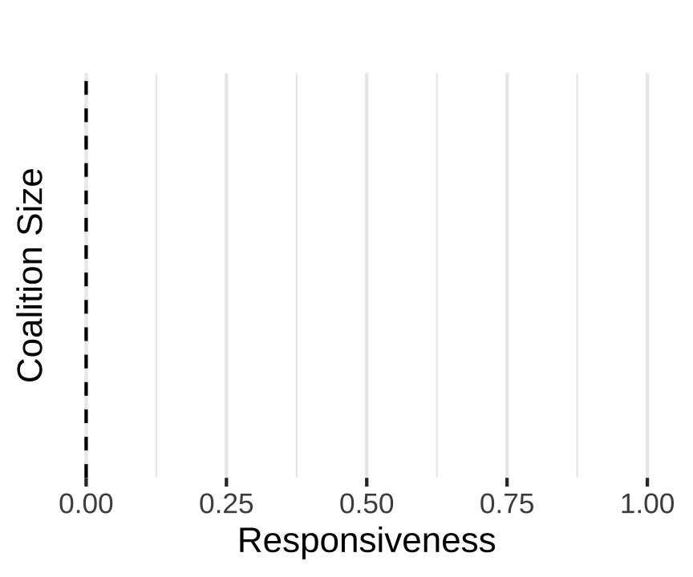
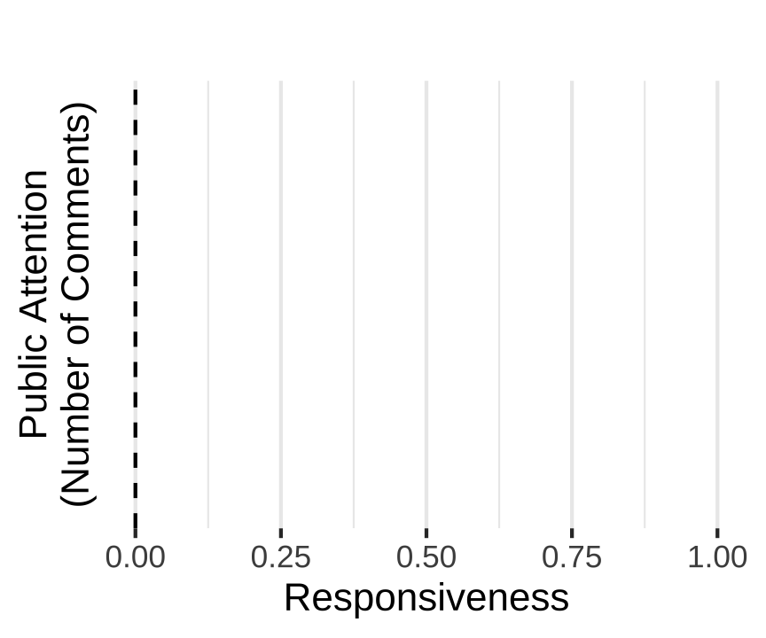

---
# TODO add name and email to all slides
# knit: ( function(input, ...){rmarkdown::render(input) } )
# rmarkdown::render("docs/present/methods-pres.Rmd")
knit: ( function(input, ...){xaringan::infinite_moon_reader(input) } )
title: "Making Policy About Distributive Justice"
subtitle: "The Environmental Justice Movement's Impact on Agency Rulemaking"
author: "Devin Judge-Lord <br>  Harvard University"
bibliography: '`r here::here("assets/dissertation.bib")`'
biblio-style: '`r here::here("assets/apsr.bst")`'
link_col: cyan
date: "Papers, slides, & data:  [judgelord.github.io]()"
titletext_fontfamily: "Roboto:wght@100"
middle_fontfamily: "Roboto"
font_family: "Roboto:wght@100"
urlcolor: cyan
output:
  xaringan::moon_reader:
    self_contained: true
    footer: These slides available at http://bit.ly/myslides
    lib_dir: libs
    mathjax: "https://cdn.bootcss.com/mathjax/2.7.1/MathJax.js?config=TeX-AMS_HTML"
    css: ["footer-header.css", "xaringan-themer.css"]
    nature:
      ratio: '16:9'
      highlightStyle: github
      highlightLines: true
      countIncrementalSlides: false
      slideNumberFormat: "%current%/36"           # 12/42 
editor_options: 
  chunk_output_type: console
---


```{r setup, include = FALSE}
short = "false"
exclude_stepwise = "false"
exclude_extra = "false"

# cache everything 
knitr::opts_chunk$set(warning = FALSE, 
                      message = FALSE,
                      echo = FALSE, 
                      #fig.path = "Figs/",
                      fig.topcaption=TRUE,
                      cache = TRUE, 
                      fig.align = 'center',
                      fig.retina = 2,
                      fig.show="hold",
                      fig.pos= "htbp",
                      fig.path = "figs/",
                      fig.cap = '   ',
                      out.width = "100%",
                      out.extra = "")


# Xaringan: https://slides.yihui.name/xaringan/
library("xaringan")
library("xaringanthemer")
library("here")
library("tidyverse")
library("magrittr")
library("knitr")
library("kableExtra")


style_mono_light(base_color = "#3b444b",
          link_color	
 = "#B7E4CF",
          inverse_link_color	
 = "#B7E4CF",
          #background_image = "Figs/ej-superfund-light.jpeg",
          background_color = "#FFFFFF", #FAF0E6", # linen
          header_background_content_padding_top = "7rem",
 header_font_google = google_font("Open Sans"), 
          text_font_google = google_font("Open Sans"), 
 #text_font_family = "cm-web-fonts",
 #text_font_url = "https://cdn.jsdelivr.net/gh/aaaakshat/cm-web-fonts@latest/fonts.css",
          base_font_size = "30px",
  text_font_size = "1rem",
 code_font_size = "1rem",
 header_h1_font_size = "1.75rem",
  header_h2_font_size = "1.5rem",
  header_h3_font_size = "1.25rem",
          padding = "15px",
          code_font_google = google_font("Inconsolata"), 
          code_inline_background_color    = "#FFFFFF", 
          #table_row_even_background_color = "grey"#, extra_css = list(".remark-slide-number" = list("display" = "none"))
 )
```

```{r, eval = FALSE, include= FALSE}

# setup
devtools::install_github("yihui/xaringan")
devtools::install_github("gadenbuie/xaringanthemer")

pagedown::chrome_print() 


install.packages("webshot")
# webshot::install_phantomjs()

library(webshot)

# export to pdf
pagedown::chrome_print("docs/present/methods-pres.Rmd")

file <- here("present/methods-pres.html")
webshot(file, "methods-pres.pdf")
```


name: project 

class: inverse center

## The Broader Project: Public Pressure


Mobilization

↓

Getting policymakers' attention and framing policy debates

↓

Substantive policy influence

↓

Surviving judicial review


---
layout: true

<div class="my-head"><span>
Making Policy About Distributive Justice
</span>
</div> 

<div class="my-footer"><span>Devin Judge-Lord (Harvard University)&emsp;&emsp;</span></div> 

---

class: inverse  middle
exclude: true

> # "He who determines what politics is about runs the country because the definition of alternatives is the choice of conflicts, and the choice of conflicts allocates power. " - E.E. Schattschneider


???
The broader project is part of a recent movement to bring back some of EE SchttschNeider's insights about politics as organized conflict over policy. 

Antagonists rarely agree on what the issues are because power is involved in the definition...

This paper especially builds on the insight that 
The ability to affect what politics is about---the terms of the debate---can have major impacts on political outcomes. 

But to ground my larger quantitative analysis, I want to start with an example of regulations on Mercury pollution. 

---


#If groups successfully push Congress to pass the Green New Deal, what happens when 30+ agencies write the actual policies? 

???
What happens when dozens of agencies then write the implementing rules?

And Congress keeps making me change this slide. 

If groups build the power to pass Build Back Better

---

#If groups successfully push Congress to pass the ~~Green New Deal~~
# Build Back Better Act, what happens when 30+ agencies write the actual policies? 

---

#If groups successfully push Congress to pass the ~~Green New Deal~~   
#~~Build Back Better Act~~
# Inflation Reduction Act, what happens when 33 agencies write the actual policies? 

???
AND NOW THAT climate groups HAVE pushed through landmark climate policy in the Inflation Reduction Act THAT DOES, in fact, by my count, task at least 33 agencies with writing rules about how exactly this massive amount of money will be spent AND new regulations requiring companies to use the technologies funded by the act.

For example, consider that the Biden Administration has pledged to spend 40% of climate and energy spending, including billions of dollars from IRA and bipartisan infrastructure bills in disadvantaged and EJ communities. Those funding criteria that determine who is eligible are being developed through agency rulemaking. 

---

class: inverse  


# Does public pressure affect bureaucratic policymaking?


<!--
If so, by what mechanisms?

- General level of public attention?

- Specific pressure to address issues like environmental justice?

- By targeting more receptive institutions?
-->

???
Will organized public pressure carry over to agency policymaking? 

- If so, what kinds of politics are influential? Is it general attention? Is it specific pressure groups like environmental justice activists?

- are some institutions more receptive to pressure on EJ than others? 

Puzzle: Does public pressure work on specific policies?

Even those made y bureaucrats? 

???
Bureaucratic policymaking, especially, is about expertise. 

???

All our theories tell us that this probably does not occur, and if it does occur, it should not matter. 

Everything we know about lobbying, especially lobbying in agency rulemaking, tells us that information is the currency of lobbying. 

Information causes policymakers to change their minds, *especially* when policymakers are experts and lawyers.

Indeed, research, including my own research elsewhere, shows that business groups dominate lobbying in rulemaking *because* they can generate and provide relevant information. 

To preview the rest of the talk.

---

layout: true

<div class="my-head"><span>
Making Policy About Distributive Justice
<span>
&emsp;&emsp;&emsp;&emsp;&emsp;&emsp;&emsp;&emsp;&emsp;&emsp;&emsp;&emsp;&emsp;&emsp;&emsp;&emsp;&emsp;&emsp;&emsp;&emsp;
&emsp;
<a href="#toc">Example</a>
</span>
</span>
<span>&emsp;&emsp;&emsp;&emsp;&emsp;&emsp;&emsp;&emsp;&emsp;&emsp;&emsp;&emsp;&emsp;&emsp;&emsp;&emsp;&emsp;&emsp;&emsp;&emsp;&emsp;&emsp;&emsp;&emsp;&emsp;&emsp;&emsp;&emsp;
<a href="#toc">Theory</a>
</span>
<span>&emsp;&emsp;&emsp;&emsp;&emsp;&emsp;&emsp;&emsp;&emsp;&emsp;&emsp;&emsp;&emsp;&emsp;&emsp;&emsp;&emsp;&emsp;&emsp;&emsp;&emsp;&emsp;&emsp; &emsp;&emsp;&emsp;&emsp;&emsp;&emsp;&emsp;&emsp;&emsp;&emsp;&emsp;
<a href="#toc">Data & Methods</a>
</span>
<span>&emsp;&emsp;&emsp;&emsp;&emsp;&emsp;&emsp;&emsp;&emsp;&emsp;&emsp;&emsp;&emsp;&emsp;&emsp;&emsp;&emsp;&emsp;&emsp;&emsp;&emsp;&emsp;&emsp;&emsp;&emsp;&emsp;&emsp;&emsp;&emsp;&emsp;&emsp;&emsp;&emsp;&emsp;&emsp;&emsp;&emsp;&emsp;&emsp;&emsp;&emsp;&emsp;&emsp;&emsp;
<a href="#toc">Findings</a>
</span>
<span>&emsp;&emsp;&emsp;&emsp;&emsp;&emsp;&emsp;&emsp;&emsp;&emsp;&emsp;&emsp;&emsp;&emsp;&emsp;&emsp;&emsp;&emsp;&emsp;&emsp;&emsp;&emsp;&emsp;&emsp;&emsp;&emsp;&emsp;&emsp;&emsp;&emsp;&emsp;&emsp;&emsp;&emsp;&emsp;&emsp;&emsp;&emsp;&emsp;&emsp;&emsp;&emsp;&emsp;&emsp;&emsp;&emsp;&emsp;&emsp;&emsp;&emsp;&emsp;
<a href="#toc">Conclusion</a>
</span>
</div> 

<div class="my-footer"><span>Devin Judge-Lord (Harvard University)&emsp;&emsp;</span></div> 

---

name: preview
class: inverse

## Preview 

???

So now that I have persuaded you that studying the politics of bureaucratic policymaking is massively important and interesting, I'm putting a roadmap for the rest of the talk on the top of my slides. I'll talk a bit about what we know and what existing theory tells us to expect. 
Then I'll review the novel data and methods I am bringing to this question
Then I'll show some of the results and conclude with implications for theory, including implications from the broader project. 

--

<!--
- [Motivation:](#motivation) 90% of U.S. policy is made by agencies  
--->

- [Theory:](#theory) Public pressure informs bureaucrats
--

- [Data:](#data) Change in 13,000 draft and final rule pairs
--
$\Longleftarrow$ 40 million public comments
--

- [Methods:](#methods) Hand-coding $\Longleftrightarrow$ computational text analysis


???
13k policy pairs, for example, the draft and final version of the mercury rule

I used a combination of quantitative and qualitative text analysis to analyze 40 million public comments. Nearly all public comments received on thousands of draft policies by 40 agencies that make policies related to environmental justice. The larger project looks at 161 agencies, but here I focus on agencies that make environmental policy---or, more precisely, agencies that make policy that is occasionally framed as environmental policy.

--

- [Findings](#findings)   
 - Policy rarely addresses environmental justice
???

There is a lot of potential for change, which is a tough road for the movement, but helpful for the scientist trying to measure change.
--

 - When groups raise concerns, policy texts change 

???

And when I say policy texts, I mean agency rules.

--
 - $\uparrow$ pressure  $\rightsquigarrow$ 	$\uparrow$ change 

???

Today, I'm going to show that public pressure can affect the policy process. 
WHEN groups raise concerns, policy texts change to reflect them. 
And when more groups and people are mobilized, the probability that policymakers respond increases.

???

It matters whether policymakers adopt these issue frames because redefining problems can change policymakers' calculations, both political and economic. For example, if you make a policy about climate change, a whole avalanche of new costs and benefits enter the equation. 
If activists can get policymakers thinking about DISTRIBUTIE justice---how costs and benefits of policies are unequally distributed---this can change the math as well.
Issue frames affect the cost-benefit analysis.

But there are several important caveats. And the caveats are often the most interesting part. 

The first caveat is that pressure matters more to more receptive policymakers.
--
 - Responsiveness varies with institutional structure  

???
-policymakers who are used to thinking about ej at institutions with organizational processes for addressing EJ. 

The second caveat is that these results are driven by historically-White national advocacy organizations, not tribes or local “frontline” local groups in those "environmental justice communities” that the Biden administration is referencing with the justice 40 initiative.

??? 


--
 - Policymakers are more responsive to national advocacy organizations 

???

It matters who is raising concerns. 

---

class: inverse  middle

## U.S. federal agencies rarely address environmental justice but are more likely to when pressured.

???

In a sentence, policymakers, that is, people making policy at U.S. federal agencies, rarely address environmental justice but are more likely to when pressured.

And furthermore, I'll show that it is receptive policymakers who have not already taken a position.


???

Finally, assessing the normative implications requires us to understand who is advocating for whom. In the case of comments on federal agency rules, it is “big green” national advocacy groups that have historically led a White environmental movement. 
These ”big greens” are more likely to get substantive policy demands met than Tribes and frontline community groups. So, a lot hinges on the extent to which these national organizations represent EJ communities.


---


layout: true

<div class="my-head"><span>
Making Policy About Distributive Justice
</span>
<span>
&emsp;&emsp;&emsp;&emsp;&emsp;&emsp;&emsp;&emsp;&emsp;&emsp;&emsp;&emsp;&emsp;&emsp;&emsp;&emsp;&emsp;&emsp;&emsp;&emsp;
&emsp;
<a href="#toc">Example</a>
</span>

</div> 

<div class="my-footer"><span>Devin Judge-Lord (Harvard University)&emsp;&emsp;</span></div> 

---

background-image: url(Figs/mercury.jpeg)
background-size: cover


???


If you or your partner has been pregnant, you know that you need to be really careful about fish because mercury pollution accumulates in fish and is really harmful to brain development in fetuses and young kids. 

Coal-fired power plants are the largest source of mercury; they emit 72% of all mercury pollution in the United States. Every state in the country has issued a fish advisory of some type because of unsafe mercury contamination.

So, how did policymakers respond to mercury pollution? 

background-image: url(Figs/brianadams.png)
background-size: contain

--

.pull-left[
# `1990 Clean Air Act: EPA shall regulate as “appropriate and necessary” for public health`
]

???
EPA had to then merely had to fill in little details like questions like who is the public and, what is health, what is appropriate and necessary? 


AND the Environmental Protection Agency (the EPA) Clinton and GW Bush administrations 
produced Mercury regulations under the authority of the clean air act.

When an agency does this, it must go through a process called rulemaking.

Section 112(n)(1)(A)


---

# Safe Levels of Mercury 
--
(For Whom?)

???
Before the politics of who gets what, there is the politics of who the whos *are*. What are the groups or communities deserving consideration? 

--

.pull-left[
2004 Draft Rule: `“the U.S. population”`

&emsp;&emsp;&emsp;&emsp;`↓`

10,000 comments

&emsp;&emsp;&emsp;&emsp;`↓`

2005 Final Rule: `Environmental justice for “minority populations”`
]

.pull-right[

```{r, fig.show = "hold", out.width = c("35%","50%","30%","40%")}
#, fig.cap="Example: Identifying Coalitions by the Percent of Matching Text in a Sample of Public Comments"
 
knitr::include_graphics("Figs/ncai_logo.jpg") 
knitr::include_graphics("Figs/sierra_logo.png") 
knitr::include_graphics("Figs/Tom_Allen.jpeg") 


```

]


???

https://www.momscleanairforce.org/how-mercury-poisoning-works/

10,000+ comments

For example, the Alaska Community Action on Toxic wrote
`“The amount of methyl-mercury and other bioaccumulative chemicals consumed by Alaskans (especially Alaskan Natives) could potentially be much higher than is assumed” - Heather McCausland of the Alaska Community Action on Toxics (ACAT).`

Advocates like Heather argued that mercury standards that protected the average person in the US did not protect certain minority communites, in this case, many native communities who traditionally ate a lot more fish. 

I grew up in Wisconsin, in the center of the great lakes, and despite Friday fish fries, these regulations probably protected people in my family, BUT 

And there is a large Hmong population that came over after the Vietnam war, and other commenters raised produced studies that certain southeast Asian immigrant populations like the Hmong also ate a lot of freshwater fish and thus had higher rates of Mercury poisoning. Similarly,  Ojibwe people in the great lakes region had higher rates of mercury poising. 

So, after all of this pressure, the Bush EPA made changes. [SLIDE]

The Final Rule included a new section on the unequal impacts of mercury pollution. Even half of the cost-benefit analysis now talked about how the costs of mercury pollution were unequally distributed. This goal of environmental justice was the justification for imposing social costs of power plant regulation. 

And when the Obama EPA returned to the topic of mercury pollution, they received half a million comments, many raising environmental justice concerns. 

when the Trump Admin and Biden admin


---


background-image: url(https://assets.nrdc.org/sites/default/files/styles/full_content/public/media-uploads/midwesttoxicdoughnut_25_002chicago_steel_mills-july_1965_vl_2400.jpg?itok=yXMNtQ-Y)
background-size: cover


# The Environmental Justice Frame

???

What is environmental justice, and why does the Biden administration require 40% of federal spending to be spent in environmental justice communities? 

The EJ movement began in local resistance to toxic waste in places like the  Alt-geld Gardens housing complex on Chicago's South Side, where activists like Hazel Johnson had been organizing tenants years before a young Barak Obama showed up in 1984. Surrounded by manufacturing and toxic waste dumps, this neighborhood got the nickname “the toxic doughnut.” 

Dorceta Taylor describes how black-led campaigns like Johnson's fused with the American Indian Movement, Chicano, and farmworker movements and drew on civil rights and union organizing to push the environmental justice frame onto the national policy agenda. 

Began appearing in federal policy documents in the 1980s

My aim is to add some more systematic quantitative data on the broad trends regarding the influence of the EJ movement on the federal policy agenda that Taylor and others have mapped.


--


1. Distinct phrase (few false positives) without many synonyms (few false negatives)

--

1. E.O. 12898 "Federal Actions to Address Environmental Justice" (1993)


--

Why this matters:


- "Environmental" policy is
 - inconsistently racialized
 - inconsistently focused on *distributions* of costs and benefits

--

- Reframing policy in distributive justice terms can shape normative, political, and even economic analysis.

---

layout: true

<div class="my-head"><span>
Making Policy About Distributive Justice
</span>
<span>
&emsp;&emsp;&emsp;&emsp;&emsp;&emsp;&emsp;&emsp;&emsp;&emsp;&emsp;&emsp;&emsp;&emsp;&emsp;&emsp;&emsp;&emsp;&emsp;&emsp;&emsp;&emsp;
&emsp;&emsp;&emsp;&emsp;&emsp;
<a href="#toc">Theory</a>
</span>
<span>
&emsp;&emsp;&emsp;&emsp;&emsp;&emsp;&emsp;&emsp;&emsp;&emsp;&emsp;&emsp;&emsp;&emsp;&emsp;&emsp;&emsp;&emsp;&emsp;&emsp;&emsp;
&emsp;&emsp;&emsp;&emsp;&emsp;&emsp;&emsp;&emsp;
</span>
<span>
&emsp;&emsp;&emsp;&emsp;&emsp;&emsp;&emsp;&emsp;&emsp;&emsp;&emsp;&emsp;&emsp;&emsp;&emsp;&emsp;&emsp;&emsp;&emsp;&emsp;&emsp;&emsp;
&emsp;&emsp;&emsp;&emsp;&emsp;&emsp;
&emsp;&emsp;&emsp;&emsp;&emsp;&emsp;
&emsp;&emsp;&emsp;&emsp;&emsp;&emsp;
</span>
<span>
&emsp;&emsp;&emsp;&emsp;&emsp;&emsp;&emsp;&emsp;&emsp;&emsp;&emsp;&emsp;&emsp;&emsp;&emsp;&emsp;&emsp;&emsp;&emsp;&emsp;&emsp;&emsp;&emsp;&emsp;&emsp;
&emsp;&emsp;&emsp;&emsp;&emsp;&emsp;&emsp;&emsp;
&emsp;&emsp;&emsp;&emsp;&emsp;&emsp;&emsp;
&emsp;&emsp;&emsp;&emsp;&emsp;&emsp;&emsp;

</span>
</div> 

<div class="my-footer"><span>Devin Judge-Lord (Harvard University)&emsp;&emsp;</span></div> 

---


exclude: `r short`

## Do Movements Cause Policy Change?

**Yes.** [(Dahl 1956; Lipsky 1968; Piven & Cloward 1977; Tarrow 1994; Andrews 1997; McAdam 1982, 2001; McAdam & Su 2002, McCammon et al. 2011; Cress & Snow 2000; Weldon 2002)]()

???

There is more about what social movement shot. 

The big question is whether social movements impact policy.

- There is a lot of research on social movements, much of it from sociology, but political scientists tell us that social movements shape policy  

<!--

- **Activists shape parties** (Cohen et al. 2008, Schlozman 2015, Skocpol & Williamson 2016)

???
- shape party agendas

--


- **Petitioning government builds movements and policy agendas** [(Carpenter 2021)]()

???
- that the act of petitioning the government builds power

-->

--

- **Protests inform policymakers and policy agendas** [(Gillion 2013, Gause 2022, Wasow 2020)]()

???
- We don't know a lot about policy outcomes, but there is some great work showing specific policy effects of civil rights protests, for example. Dan Gillion, Latina Gause, and Omar Wasow

--

- **No movement, no policy** [(Skocpol 2013)]()

???
- And as Theda Skocpol found in her study of why climate legislation failed, a movement is often a necessary condition for policy change

- **Redistributive policies often require  movements** (Lowi & Nicholson 2015)

???
- In Lowi's words, “redistributive policies have been associated with social classes and movements from the beginning”--some kinds of policy only come about when groups form and mobilize to affect policy

---


### Scholars of bureaucracy focus on *technical* information


???
- Bureaucratic policymaking, especially, is about expertise (Wagner 2010)


Everything we know about lobbying, especially lobbying in agency rulemaking, tells us that information is the currency of lobbying. 

Information causes policymakers to change their minds, *especially* when policymakers are experts and lawyers.

Indeed, research, including my own research elsewhere, shows that business groups dominate lobbying in rulemaking *because* they can generate and provide relevant information. 

Thus far, by “information,” scholars generally mean technical and legal information.

--

### Does *political* information matter?

- Frames about who is affected? [(Jones & Baumgartner 1991, Lowi 1972, Schneider & Ingram 1993, Woodly 2015)]()

- Coalition size? [(Dwidar 2021, Nelson & Yackee 2012)]()

- Public attention? [(Schattschneider 1972 vs. Balla et al. 2020)]()

???

But none of these papers have XXXX

I am going to test these in a large-scale way.

Lowi TODO 

Coalition size = NUMBER OF GROUPS 

(Balla et al. 2020 find that “legal imperatives trump political considerations”)

(Jones and Baumgartner 2009)

I ask about the role of a different kind of information---what we might call POLITICAL information, building on Nelson and Yackee's finding that coalition size matters.

We might also wonder if groups raising distributive claims would matter (Lowi would say distributions of costs and benefits should matter) 

I'm also curious whether public pressure or public attention matter. Here scholarship is skeptical. Balla et al. concluded that mass comment campaigns don't matter because “legal imperatives trump political considerations.” in responding to comments. That technocratic rationality dominates, meaning that political information is not affecting the policy process. I want to test this claim. 

---


### Scholars of bureaucracy focus on *technical* information

### Does *political* information matter?

- H1: Policymakers address distributive justices when pressured

- H2: $\uparrow$ Coalition size (number of groups) $\rightarrow$  $\uparrow$ Policy response

- H3: $\uparrow$ Public attention $\rightarrow$ $\uparrow$ Policy response

--

+ Heterogeneous effects by organization and institution

---

exclude: true

### Research tends to explain social movement emergence rather than specific impacts (McAdam 2017) 

- **“limited research on [social movement] influence”** (Andrews & Edwards 2004)
- **The DV is rarely specific policy outcomes or systematic impact**


???
In the paper, I note some of the great work in political science studying the impact of movements on policy change, but much of the systematic work focuses on explaining mobilization. Movement activity and structure are the typical DVs. 

<!--### My DV: Change in specific policies (agency rules)--> 

???
I am trying to add to recent work on the policy impact of movements and pressure campaigns by looking systematically at change in very specific policy documents.

Whether executive branch agencies are implementing recent legislation or using the authority of century-old statutes,  Rulemaking is where the teeth of federal law are forged and reforged over time.

So, I'm interested in the extent to which movements can affect agency rulemaking.

???

The aggregate impact of environmental justice campaigns across institutions and over time $\rightsquigarrow$ environmental justice movement impact

???
And I'm thinking about social movement impact as the aggregate impact of EJ campaigns across institutions and over time. 

---


layout: true

<div class="my-head"><span>
Making Policy About Distributive Justice
</span>
<span>
&emsp;&emsp;&emsp;&emsp;&emsp;&emsp;&emsp;&emsp;&emsp;&emsp;&emsp;&emsp;&emsp;&emsp;&emsp;&emsp;&emsp;&emsp;&emsp;&emsp;&emsp;
&emsp;&emsp;&emsp;&emsp;&emsp;&emsp;&emsp;&emsp;
<a href="#toc">Data & Methods</a>
</span>
</div> 

<div class="my-footer"><span>Devin Judge-Lord (Harvard University)&emsp;&emsp;</span></div> 

---

class: inverse  middle
name: data


# Data

## 13,179 draft and final rule pairs from 40 agencies, 1993-2020 

## ~40,000,000 public comments on these draft rules

--

~4,800,000 (~28,000 unique) comments raise environmental justice concerns


???

I collected all 40 million comments on these draft and final rule pairs. 
Almost 5 million mentioned EJ.

28 thousand of these are unique --- This involved some methodological tricks that I will explain in a second, but the major point is that Human coding and computational text analysis are more powerful when combined

---

class: inverse  middle

# Methods

## Hand coding $\Longleftrightarrow$ computational text analysis

???

If you remember, one thing about the methods here is that Human coding and computational text analysis are more powerful when combined, and I have several ways of doing that. 

First, I use something like plagiarism detection to identify linked sets of documents that indicate that groups of commenters are in a lobbying coalition.

---

## Identify coalitions with text reuse

.pull-left[“…jobs and our economy. <mark>I am also concerned that your proposal allows power plants to buy and sell mercury pollution credits. This</mark> would permit some plants to continue to harm…"]


.pull-right[“...pollutants like dioxin. <mark> I am also concerned that your proposal allows power plants to buy and sell mercury pollution credits. This  </mark>kind of market-based mechanism to reduce ..."]

---

<!--## Collapsing form letters with text reuse-->

## Identify coalitions with text reuse

.pull-left[
- Document A is distinct
- B, C, and D share some text
- E and F are the same text
]

.pull-right[
```{r percent-method, fig.show = "hold", out.width = "100%"}

knitr::include_graphics(here::here("figs", "comment_percent_match_plot-2.png")  )
```
]


???

Elsewhere, I used these same methods to assess the change between the draft and final rule, and there are tutorials for how to do this on my website. 

Here is what this looks like on a larger set of comments

---

exclude: true

### Identify coalitions with text reuse

```{r, fig.show = "hold", out.width = "55%"}
#, fig.cap="Example: Identifying Coalitions by the Percent of Matching Text in a Sample of Public Comments"
knitr::include_graphics("Figs/comment_percent_match_plot.png") 
```

???

Using n-gram matching methods similar to plagiarism detection, I collapse form letters and petitions into representative texts. As most comments are form letters, that 5 million collapses to 28 thousand unique texts.
This figure shows the percentage of shared text in a sample of documents.
The black squares on the diagonal show that each comment has a perfect overlap with itself. 
The block of grey partial matches reflects a public pressure campaign, with a lot of shared 10-grams. 
I then attach these to lobbying coalitions by hand. 

---

## Iteratively group commenters into coalitions

```{r, out.width = "85%", fig.show='hold'}
#knitr::include_graphics("https://docs.google.com/drawings/d/e/2PACX-1vSy9MpvnXV0nbZj4kUPnWC38bwk5xiBXjRiGC3fyrddwoZVT19SmfT4WRr_AvOH5lxeKyrTenqLlKmm/pub?w=953&h=603")

knitr::include_graphics("Figs/methods-ngrams-slide.png")

```


---

## Iteratively link comments to organizations

```{r, out.width = "100%", fig.show='hold'}
#knitr::include_graphics("https://docs.google.com/drawings/d/e/2PACX-1vRSJJgSbMdFtkpJjB94Tw5cmFElhDKrHEkOLaUb5-qFdIY-sQp4qGyC-FZoZ7UmWSLfoMZDueAkemhU/pub?w=752&h=238") 

knitr::include_graphics("Figs/methods-regex-slide.png")

#knitr::include_graphics(here::here("legislators" , "man", "figures", "logo.png") %>% str_remove("dissertation"))
```


---

# Measuring influence

### I. Getting policymakers' attention/engagement/response

- Adding policy language (N = 11,315)
- Changing policy language (N = 1,864)

### II. Getting substantive policy demands

-  Lobbying success for all commenters on 150 rules
 - 10,894 hand-coded documents
 - 284 coalitions 
 
---

layout: true

<div class="my-head"><span>
Making Policy About Distributive Justice
</span>
<span>
&emsp;&emsp;&emsp;&emsp;&emsp;&emsp;&emsp;&emsp;&emsp;&emsp;&emsp;&emsp;&emsp;&emsp;&emsp;&emsp;&emsp;&emsp;&emsp;&emsp;&emsp;&emsp;
&emsp;&emsp;&emsp;&emsp;&emsp;&emsp;
&emsp;&emsp;&emsp;&emsp;&emsp;&emsp;
&emsp;&emsp;&emsp;&emsp;&emsp;&emsp;
<a href="#toc">Findings</a>
</span>
</div> 

<div class="my-footer"><span>Devin Judge-Lord (Harvard University)&emsp;&emsp;</span></div> 


---


class:  inverse 

# Model Results 


--

## (1) Variation across agencies:  
Pr(Policy Change | President) ~ Policy Demands  \+ Coalition Size  \+ Public Attention \+ Policymaker (Agency) Receptivity

--

## (2) Variation within agencies:  
Pr(Policy Change | President + Agency) ~ Policy Demands  \+  Coalition Size  \+  Public Attention

???
Both of my DVs---adding EJ language and changing existing EJ language--are dichotomous, so I m going to use logit regression. 

The main models use president and agency fixed effects, so I'm focusing on variation within presidential administrations and within the agency, but I also assess differences across presidents and agencies by estimating the same models with indicators rather than fixed effects.

Because log odds coefficients are hard to interpret and because my models have interactions, I am going to skip the regression table and just show you predicted probabilities. 


???

Because I expect decreasing marginal effects of additional comments, both overall (i.e., public attention) and those that mention EJ (coalition size), I use logged values. 

However, the conclusions are largely the same if I use a quadradic function instead. That analysis suggests that medium levels of attention are not so impactful. A small level of attention matters, and then it takes a very large amount of additional pressure to move things, which makes sense. For hypothesis testing, however, all of the effects are in the same direction, so I am going to present predicted probabilities from these models here.

---

exclude: `r exclude_stepwise`
class: right


```{r ej-m-PR-president1, out.width = "45%"}
knitr::include_graphics("Figs/ej-m-PR--median-pres-2.png")
```

???

All of the plots I'll show have predicted probability of change on the x-axis and some predictors we care about on the y-axis. This one also shows predicted values for two different agencies, the EPA and the PHMSA. 

---

class: right
exclude: `r exclude_stepwise`

```{r ej-m-PR-president2, out.width = "45%"}

```

 $\color{\green}{\checkmark}$ Distributive Justice Claims 📈 + heterogeneous effects [[TABLE]](#table)

---

class: right

```{r ej-m-PR-president-median-1, out.width = "45%"} 

knitr::include_graphics("Figs/ej-m-PR-president-median-pres-1.png")

```

 $\color{\green}{\checkmark}$ Distributive Justice Claims 📈 + heterogeneous effects [[TABLE]](#table) 


---

class: right

```{r ej-m-PR-shareI1, fig.cap = "", out.width = "45%", fig.show = "hold", fig.subcap=""}

knitr::include_graphics("Figs/ej-m-PR-shareI-pres-2.png")

```

 [[TABLE]](#table) 


---

class: right

```{r ej-m-PR-shareI2, fig.cap = "", out.width = "45%", fig.show = "hold", fig.subcap=""}

knitr::include_graphics("Figs/ej-m-PR-shareI-pres-1.png")

```

 $\color{\green}{\checkmark}$ Distributive Justice Claims 📈 + heterogeneous effects [[TABLE]](#table)
 
---

class: right


```{r coalition1,  out.width = "50%"}

```

 [[TABLE]](#table) 


---

class: right


```{r coalition2,  out.width = "50%"}
knitr::include_graphics("Figs/ej-m-PR-ejcomments-agencyFE-pres-1.png")
```

 $\color{\green}{\checkmark}$ Coalition size 📈  [[TABLE]](#table)

---

class: right


```{r attention1, out.width = "50%", fig.show = "hold"}



```

 [[TABLE]](#table) 


---

class: right


```{r attention2, out.width = "50%", fig.show = "hold"}

knitr::include_graphics("Figs/ej-m-PR-comments-share-pres-1.png")

```

  Public attention  [[TABLE]](#table) 

---

class: right

```{r attention3, out.width = "90%", fig.show = "hold"}

knitr::include_graphics("Figs/ej-m-PR-comments-share-pres2-1.png")

```

$\color{\green}{\checkmark}$     Public attention 📈* *only absent specific pressure  [[TABLE]](#table)
 
---

name: substantive

### Getting substantive policy demands

```{r ej-winrates}
library(kableExtra)
library(scales)
load(here::here("data", "winrate.Rdata"))
winrates %>% 
  filter(`Organization Type` %in% c("NGO", "Business", "Trade Association", "Law Firm", "Tribe", "Environmental Group", "Frontline EJ")) %>% 
  mutate(`Organization Type` = `Organization Type` %>% str_replace("Environmental Group", "NGO-Environmental") %>% str_replace("Frontline EJ", "NGO-Local EJ") %>% str_replace("Trade Association", "Business Association")) %>% 
  transmute(`Organization Type`= `Organization Type`, N = N,`Success Rate (Overall)` = `Overall Success Rate` %>%
           percent(accuracy = 1),
           `Success Rate (EJ)` = `EJ Success Rate` %>%
           percent(accuracy = 1) %>% replace_na("-"),
        ) %>% 
  arrange(`Organization Type`) %>% 
  #dplyr::select(-`N raising EJ`) %>% #mutate(across(where(is.numeric), pretty_num)  ) %>%
  kbl(caption = "Hand-coded Lobbying Success by Type of Organization, 2005-2020") %>%
  kable_classic(full_width = F, html_font = "Open Sans")#%>% 
      #kableExtra::kable_styling(font_size = 22, position = "center")  #kable3(caption = "Hand-coded Lobbying Success by Type of Organization, 2005-2020")
```

---

layout: true

<div class="my-head"><span>
Making Policy About Distributive Justice
</span>
<span>
&emsp;&emsp;&emsp;&emsp;&emsp;&emsp;&emsp;&emsp;&emsp;&emsp;&emsp;&emsp;&emsp;&emsp;&emsp;&emsp;&emsp;&emsp;&emsp;&emsp;&emsp;&emsp;&emsp;&emsp;&emsp;
&emsp;&emsp;&emsp;&emsp;&emsp;&emsp;&emsp;&emsp;
&emsp;&emsp;&emsp;&emsp;&emsp;&emsp;&emsp;
&emsp;&emsp;&emsp;&emsp;&emsp;&emsp;
<a href="#conclusion">Conclusion</a>
</span>
</div> 

<div class="my-footer"><span>Devin Judge-Lord (Harvard University)&emsp;&emsp;</span></div> 

---

## To sum up, yes, movements matter

|                                            | Distributive Justice Language |  
| ------------------------------------------ | :--: | 
| Distributive Justice Claims     | 📈 | 
| Coalition Size        | 📈 | 
| General Public Attention               | 📈* | 
| Prior rate                             | 📈 | 

More public pressure $\rightarrow$ agencies are more likely  📈 to add EJ language.
--
$\implies$ Strong framing effects.

--

Replicates with "climate change" [[more]](https://judgelord.github.io/research/cj/)


---

class: inverse


### U.S. federal agencies rarely address  environmental justice
--
, but they are much more likely to do so when pressured.


--

### National advocacy organizations are more likely to have substantive policy demands met.

--

## Thank you!

- Paper, slides, data: [judgelord.github.io](judgelord.github.io/)  
--

- Rules relevant to climate or environmental justice currently open for comment: [judgelord.github.io/rulemaking/open]( https://judgelord.github.io/rulemaking/open)


???

Finally, assessing the normative implications requires us to understand who is advocating for whom. In the case of comments on federal agency rules, it is “big green" national advocacy groups that have historically led a White environmental movement. 
These "big greens" are more likely to get substantive policy demands met than Tribes and frontline community groups. So, a lot hinges on the extent to which these national organizations represent EJ communities.

---

layout: true

<div class="my-head"><span>
Making Policy About Distributive Justice
</span>
<span>&emsp;&emsp;&emsp;&emsp;&emsp;&emsp;&emsp;&emsp;&emsp;&emsp;&emsp;&emsp;&emsp;&emsp;&emsp;&emsp;&emsp;&emsp;&emsp;&emsp;&emsp;
<a href="#toc">Motivation</a>
</span>
<span>&emsp;&emsp;&emsp;&emsp;&emsp;&emsp;&emsp;&emsp;&emsp;&emsp;&emsp;&emsp;&emsp;&emsp;&emsp;&emsp;&emsp;&emsp;&emsp;&emsp;&emsp;&emsp;&emsp;&emsp;&emsp;&emsp;&emsp;&emsp;
<a href="#toc">Theory</a>
</span>
<span>&emsp;&emsp;&emsp;&emsp;&emsp;&emsp;&emsp;&emsp;&emsp;&emsp;&emsp;&emsp;&emsp;&emsp;&emsp;&emsp;&emsp;&emsp;&emsp;&emsp;&emsp;&emsp;&emsp; &emsp;&emsp;&emsp;&emsp;&emsp;&emsp;&emsp;&emsp;&emsp;&emsp;&emsp;
<a href="#toc">Data & Methods</a>
</span>
<span>&emsp;&emsp;&emsp;&emsp;&emsp;&emsp;&emsp;&emsp;&emsp;&emsp;&emsp;&emsp;&emsp;&emsp;&emsp;&emsp;&emsp;&emsp;&emsp;&emsp;&emsp;&emsp;&emsp;&emsp;&emsp;&emsp;&emsp;&emsp;&emsp;&emsp;&emsp;&emsp;&emsp;&emsp;&emsp;&emsp;&emsp;&emsp;&emsp;&emsp;&emsp;&emsp;&emsp;&emsp;
<a href="#toc">Findings</a>
</span>
<span>&emsp;&emsp;&emsp;&emsp;&emsp;&emsp;&emsp;&emsp;&emsp;&emsp;&emsp;&emsp;&emsp;&emsp;&emsp;&emsp;&emsp;&emsp;&emsp;&emsp;&emsp;&emsp;&emsp;&emsp;&emsp;&emsp;&emsp;&emsp;&emsp;&emsp;&emsp;&emsp;&emsp;&emsp;&emsp;&emsp;&emsp;&emsp;&emsp;&emsp;&emsp;&emsp;&emsp;&emsp;&emsp;&emsp;&emsp;&emsp;&emsp;&emsp;
<a href="#toc">Conclusion</a>
</span>
<span>
&emsp;&emsp;&emsp;&emsp;&emsp;&emsp;&emsp;&emsp;&emsp;&emsp;&emsp;&emsp;&emsp;&emsp;&emsp;&emsp;&emsp;&emsp;&emsp;&emsp;&emsp;&emsp;&emsp;&emsp;&emsp;&emsp;
&emsp;&emsp;&emsp;&emsp;&emsp;&emsp;&emsp;&emsp;
&emsp;&emsp;&emsp;&emsp;&emsp;&emsp;&emsp;
&emsp;&emsp;&emsp;&emsp;&emsp;&emsp;&emsp;&emsp;&emsp;&emsp;&emsp;&emsp;&emsp;&emsp;&emsp;
<a href="#toc">Extra</a>
</span>
</div> 

<div class="my-footer"><span>Devin Judge-Lord (Harvard University)&emsp;&emsp;</span></div> 


---

name: project 

class: inverse center

## The Broader Project: Public Pressure


Mobilization

↓

Getting policymakers' attention and framing policy debates

↓

Substantive policy influence

↓

Surviving judicial review


---

class: inverse


# Next 

- [Audit study](): What causes institutional receptivity?
- [Co-framing](): EJ + “health", "disaster", "climate" & changes in term frequency
- [Surveys]() to compare comments to public opinion
- [Lobbying networks]()
- [Feedback](): The mobilizing and demobilizing effects of the policy process

???

Carving out a paper: More or less on mobilization or hand-coded influence? 

Is the aggregate influence of related campaigns a defensible working deff of a social movement, or is there a better way of talking about this? 

co-framing (Baumgartner and Jones) 

Next Steps
- More on coalition structure and policy success, especially opposing coalitions
- Better (hand-coded) measures of policy change
- Model changes in texts that already discuss climate/EJ/CJ

Framing 
- More on how social movements may impact policy. Petitioning and protest? Lobbying?


---

background-image: url(Figs/brianadams.png)
background-size: cover

## Example: Safe Levels of Mercury 
--
(For Whom?)

???
Before the politics of who gets what, there is the politics of who the whos *are*. What are the groups or communities deserving consideration? 

- 2000 Notice: "the U.S. population."

--

- 2002 Draft: Regulated entities + "Other types of entities not listed could also be
affected."

--

- 2011 Draft: disparate impacts on "vulnerable populations" including "African Americans," "Hispanic,"
"Native American," and "Other and Multi-racial" groups.

--

- 2012 Final Rule: EJ analysis adds "minority, low income, and indigenous"
--

- 2020 Rollback: "These communities may experience foregone benefits" 

--

- 2021 Draft: 2012 Final Rule categories + "differentiated subsistence fisher
populations" 


???
2011 Draft: Five pages of EJ analysis of the disparate impacts
on

- 2020 Rollback: "While these communities may experience foregone benefits as a result of this action, the potential foregone [health benefits] are small." 

⁉️

30/51 pages in Biden

---

### Data: 13,179 Draft and Final Rule Pairs* from 40 agencies, 1993-2020

```{r, fig.show = "hold", out.width = "90%"}

knitr::include_graphics("Figs/ej-data-ejpr-1.png")  
```

*A few rulemaking dockets have more than one draft or final rule.


---

### Data: Rates of Addressing Climate & Environmental Justice 2005-2020

```{r ej-data-agencies, out.width = "80%"}

# TODO knitr::include_graphics("Figs/ej-data-agencies-1.png")
```


---

exclude: `r short`


## Data: ~40,000,000 Public Comments


```{r ej, out.width = "70%"}

knitr::include_graphics("Figs/ej-comments-1.png")
```


???

I collected all 40 million comments on these draft and final rule pairs. 
Almost 5 million mentioned EJ.

The top row of plots with the purple border shows proposed rules that did address EJ; I use this set to assess whether EJ language changed between the draft and the final. 

The lower two rows in the red box show proposed rules that did not address EJ, and the middle row shows rules where EJ language was added. 

Each point is a rule. 
Blue ones are the ones where commenters raised EJ concerns. 
Red ones are where no comments raised EJ concerns.
Y-axis is the total number of comments the rule received. 

---


## Data: ~40,000,000 Public Comments

~4,800,000 (~28,000 unique) comments raise EJ concerns


```{r, fig.show = "hold", out.width = "50%"}
#, fig.cap="Example: Identifying Coalitions by the Percent of Matching Text in a Sample of Public Comments"
knitr::include_graphics("Figs/comment_percent_match_plot.png") 
```

???

Using n-gram matching methods similar to plagiarism detection, I collapse form letters and petitions into representative texts. As most comments are form letters, that 5 million collapses to 28 thousand unique texts.
This figure shows the percentage of shared text in a sample of documents.
The black squares on the diagonal show that each comment has a perfect overlap with itself. 
The block of grey partial matches reflects a public pressure campaign, with a lot of shared 10-grams. 
I then attach these to lobbying coalitions by hand. 


---


## Data: Comments on Draft Rules

Of 13,111 relevant agency rules, less than 15% addressed environmental justice, and 8%  addressed climate change, despite growing activist demand.

Of 39,392,957 public comments 

- 20% <!--, 17,857,018 (421,880 unique)--> raise "climate change"

- 2% <!--, 3,248,697 (2,138 unique)--> also mention environmental justice or climate justice

- 82% of all comments raising EJ also mention climate change, but only 14% of **unique** comments raising EJ also mention climate change


---

exclude: `r short`

## Lobbying Success by Campaign Size

```{r coded-coalition-success, out.width = "60%"}
knitr::include_graphics(here::here("figs", "coded-coalition-success-1.png"))
```

---

exclude: `r short`

## Who does notice and comment rulemaking empower? 

```{r ejcommentsbyrace, fig.cap = 'Estimated Racial Distribution from Census Surnames of Commenters raising "Environmental Justice" Concerns in Rulemaking', fig.height = 1.5, fig.width=2, out.width = "40%", fig.show = "hold"}
load(here::here("data", "ej_race.Rdata"))

Race %>% ggplot() + 
  aes(y =Race, x = Probability) + 
  geom_col() +
  theme_minimal() +
  theme(panel.grid.major.y = element_blank())
```

---

name: table

background-image: url(Figs/ej-table-paper.png)
background-size: contain
background-color: white

---

## Adding EJ to Policy

```{r ej-m-PR-ejcomments-agencyFE,  out.width = "90%"}
knitr::include_graphics("Figs/ej-m-PR-ejcomments-agencyFE-1.png")
```

- ✊🏿 🔁   Coalition Size 📈 


- ✊🏿  Distributive Claims 📈 
- 📢  General Public Pressure/Attention 📈  (when comments don't raise EJ)

---

##  Changing Existing EJ Language

```{r ej-mejPR-ejcomments-agencyFE, out.width = "90%"}

knitr::include_graphics("Figs/ej-mejPR-ejcomments-agencyFE-1.png")
```


- ✊🏿🔁  Coalition Size 📈 

---

##  Changing Existing EJ Language

```{r ej-mejPR-comments, out.width = "90%"}

knitr::include_graphics("Figs/ej-mejPR-comments-agencyFE-1.png")
```


- ✊🏿  Distributive Claims 📈 
- 📢  General Public Attention 📉 (when comments don't raise EJ)

---

##  To sum up, yes, movements matter

Strong framing effects, but substantive policy change is driven by national advocacy groups.

|                                            | Add EJ Language | Change EJ Language |
| ------------------------------------------ | :--: | :--: |
| ✊🏿  Distributive Claims (EJ Concerns)     | 📈 | 📈 |
| ✊🏿 🔁  Coalition Size /  Pressure        | 📈 | 📈 |
| 🏛️  Policy Receptivity                             | 📈 | 📈 |
| 📢  General Public Attention               | 📈 | 📉 |


<!--| 📢x✊🏿 Specific (Conditional) Pressure            | 📉 | ❓ | -->

With larger coalitions and more public attention, agencies are more likely  📈 to **add** EJ language **where there was none**, BUT agencies also anticipate public attention, making **existing** EJ analyses less likely 📉 to **change** on higher-salience rules.

--

[Replicates with "climate change"](https://judgelord.github.io/research/cj/)


---


## Data: 40,139 policy documents (13,111 proposed and final rule pairs) from 46 agencies

```{r cj-data-agencies100, out.width = "90%"}

# TODO knitr::include_graphics("figs/cj-data-agencies100-2.png")
```

---

```{r cj-data-agencies, out.width = "90%"}

knitr::include_graphics("figs/cj-data-agencies-2.png")
```

---

## Data: 39,392,957 public comments

- 20% <!--, 17,857,018 (421,880 unique)--> raise "climate change"

- 2% <!--, 3,248,697 (2,138 unique)--> also mention environmental justice or climate justice

- 82% of all comments raising EJ also mention climate change, but only 14% of **unique** comments raising EJ also mention climate change


---

## Methods: Unique and duplicate comments


```{r percent-match, fig.show = "hold", out.width = "60%", fig.cap="Example: Identifying Coalitions by the Percent of Matching Text in a Sample of Public Comments"}

knitr::include_graphics("figs/comment_percent_match_plot.png")
```

---

## Methods: Hand-coded coalitions and policy change

```{r datasheet, fig.show = "hold", out.width = "100%", fig.cap="Example: Identifying Coalitions by Hand"}

knitr::include_graphics("figs/datasheet.png")
```

---

## Draft rules that did and did not address climate

```{r climate-comments, out.width = "85%"}

#TODO knitr::include_graphics("figs/climate-comments-1.png")
```

---

## Draft rules that did and did not address EJ/CJ

```{r cj-comments, out.width = "85%"}
#TODO knitr::include_graphics("figs/cj-comments-1.png")
```


---

class: inverse middle center

# Results 

---

```{r table,  out.width = "80%"}

knitr::include_graphics("figs/cj-table.png")
```

---

##  Adding Climate Change to Policy

```{r climate-m-PR-president-median-1, out.width = "60%"}
#TODO knitr::include_graphics("figs/climate-m-PR-president-median-1.png")
```

- 🔬 Scientific Information ✅  

---

##  Adding Climate Justice to Policy

```{r cj-m-PR-president-median-1, out.width = "60%"}
#TODO knitr::include_graphics("figs/cj-m-PR-president-median-1.png")
```

- ✊🏿 Distributive Information ✅  

---

##  Adding Climate Change to Policy 

```{r climate-m-PR-climatecomments-agencyFE,  out.width = "80%"}


knitr::include_graphics("figs/climate-m-PR-climatecomments-agencyFE-1.png")

```

- 🔬🔁 Coalition Size ✅  


---

##  Adding Climate Justice to Policy 

```{r cj-m-PR-cjcomments-agencyFE,  out.width = "80%"}


#TODO knitr::include_graphics("figs/cj-m-PR-cj-comments-agencyFE-1.png")

```

- ✊🏿🔁 Coalition Size ✅  


## To sum up, yes, movements matter (even when victories are rare)

|                                            | Add Language
| ------------------------------------------ | :--: | :--: |
| 🔬 Scientific Information (Climate Concerns)  | 📈 |
| ✊🏿 Distributive Information (EJ/CJ Concerns)     | 📈 | 
| 🔬/✊🏿🔁 Coalition Size           | 📈 | 
| 🏛️ Policy Receptivity                             | 📈 |
| 📢 General Level of Public Attention               | 📈 | 


<!--| 📢x✊🏿 Specific (Conditional) Pressure            | 📉 | ❓ | -->

With larger coalitions and more public attention, agencies are more likely  📈 to **add** EJ language **where there was none**<!--, BUT agencies also anticipate public attention, making **existing** EJ analyses less likely 📉 to **change** on higher-salience rules.-->

---


##  Adding Climate Justice issues to Policy

```{r cj-m-PR-comments-agencyFE, out.width = "80%", fig.show = "hold"}

#TODO knitr::include_graphics("figs/cj-m-PR-comments-agencyFE-1.png")

```

- ✊🏿 Distributive Information ✅  
- 📢 General Public Pressure/Attention ✅  
<!-- 📢 x ✊🏿 Conditional Public Pressure/Attention ⏪  -->

---


class: inverse center middle

#  Substantive Lobbying Success 


---

## Larger coalitions → more likely to win 
(coalition-level OLS Regression)


```{r m-influence, out.width = "30%"}
knitr::include_graphics(here::here("figs", "m-influence.png"))
```

---

## Pressure campaigns mobilize legislators 
(coalition-level Poisson Regression)

```{r m-congress, out.width = "50%"}
knitr::include_graphics(here::here("figs", "m-congress.png"))
```

---

## When organizations mobilize more legislators, they are more likely to win 
(within-organization OLS)

```{r m-diffindiff, out.width = "45%"}
knitr::include_graphics(here::here("figs", "m-diffindiff.png"))
```


---

exclude: `r exclude_extra`

# Next steps: methods

- Test policy receptivity using rates of addressing EJ out of sample (direct rules & notices)
- Better measures of policy change
- cor(EJ Language, Lobbying Success)
- Alternative estimation (hierarchical Bayes)
- Cumulative effects over time (hazard models)
- Placebo test? 

---

exclude: `r exclude_extra`


```{r cj-table2,  out.width = "80%"}

knitr::include_graphics("Figs/cj-table.png")
```


---
 
Human coding and computational text analysis are more powerful when combined in an iterative workflow.
<!--I show how search and text-reuse tools can aid common hand-coding tasks. 
Human coding can both inform and be informed by rule-based information extraction---iteratively structuring queries on unstructured text.-->

1. Text analysis tools can strategically **select texts for human coders**---texts representing larger samples and outlier texts of high inferential value.
2. Preprocessing can **speed up hand-coding** by extracting features like names and key sentences. 
3. Humans and computers can iteratively **tag entities** using regex tables 
<!--(e.g., identify organizations)--> and **group texts by key features** (e.g., identify lobbying coalitions by common policy demands)

---

Applying simple search and text-reuse methods to public comments on all U.S. federal agency rules, a **sample of 10,894 hand-coded comments** yields **41 million as-good-as-hand-coded comments** regarding both the organizations that mobilized them and the extent to which policy changed in the direction they sought. <!--This large sample enables new analyses of lobbying coalitions, social movements, and policy change.-->

<!--

# The Broader Project: Public Pressure

Mobilization


(grassroots, astroturf, elected officials)

↓

Getting policymakers' attention and framing policy debates

↓

Substantive policy influence

↓

Surviving judicial review


# 50 million public comments on proposed agency rules

---->


---

# Hand-coding dynamic data

<!--

- 15 coders 

```{r greyhound, fig.cap= "Incorrectly Labeled Coalition Identified by Automated Check"}
knitr::include_graphics(here("figs", "greyhound.png"))
```

--->

Workflow: `googlesheets4` allows analysis and improving data in real-time. For example, in Fig. 1: 

- The "org_name" column is populated with a guess from automated methods. As humans identify new organizations and aliases, other documents with the same entity strings are auto-coded to match human coding.   
- As humans identify each organization's policy "ask," other texts with the same ask are put in their coalition.   
- If the organization and coalition become known, it no longer needs hand coding.

---

**Fig. 1:** Coded Public Comments in a Google Sheet

```{r datasheet2, fig.show = "hold", out.width = "100%"}
 
knitr::include_graphics(here("figs", "datasheet.png"))
```

---

# Regex tables to tag entities


- **Deductive:** Start with databases of known entities.


<!--### Consolidating entity name variants with regex tables-->


```{r regex-crp}
#CRP data
here("data", "Lobbbying_Summary.csv") |>
read_csv() |>
  filter(parentName %in% c("Teamsters Union", "3M Co") ) |>
  filter(!orgName %in% "3M Cogent") |>
  mutate(orgName = orgName %>% str_replace(".*Teamsters.*", "Teamsters")) |> 
  distinct(orgName, parentName) |> 
  group_by(parentName) |>
  summarize(pattern = str_c(orgName, collapse = "|") ) |>
  mutate(pattern = pattern %>% str_replace("Teamsters & ", "Teamsters|Teamsters.{1:4}") |>
           str_replace("Maint ", "Maint[a-z]* ") |>
           str_replace("Trucking Pension", "(Trucking|Pension)") |>
           str_replace_all("&|and", "(and|&)") |>
           str_remove_all(" Div")) |>
  rename(Entity = parentName, Pattern = pattern) |>
  knitr::kable(caption = "Lookup Table Deduced from Center for Responsive Politics Lobbying Data, Collapsed into an Initial Regular Expression Table", full_width = T) |>
  kableExtra::kable_paper()
```

---

- **Inductive:** Add entity strings that frequently appear in the data to regex tables.  
- **Iterative:** Add to regex tables as humans identify new entities or new aliases for known entities. Update data (Google Sheets) to speed up hand coding.

<!--### Add to regex tables as hand coders identify new aliases-->


---

**Fig 2:** Iteratively Building Regex Tables

```{r, out.width = "100%", fig.show='hold'}
#knitr::include_graphics("https://docs.google.com/drawings/d/e/2PACX-1vRSJJgSbMdFtkpJjB94Tw5cmFElhDKrHEkOLaUb5-qFdIY-sQp4qGyC-FZoZ7UmWSLfoMZDueAkemhU/pub?w=752&h=238") 

knitr::include_graphics(here::here("figs", "methods-regex.png"))

#knitr::include_graphics(here::here("legislators" , "man", "figures", "logo.png") %>% str_remove("dissertation"))
```

---

The `legislators` package adds name variants (e.g., "Liz Warren") to standard legislator names.

```{r legislators, eval = FALSE}
library(legislators)

members |>
  filter(first_name == "Elizabeth", congress == 117) |>
  select(Entity = bioname, Pattern = pattern) |>
  mutate(Pattern = Pattern |> 
           str_replace_all("\\\\b" , "\\\\\\\\b") %>% 
           str_remove_all("na |\\|herring, e\\\b|\\|herring, elizabeth|\\|liz herring|\\|warren, l\\\\b") %>% 
           str_replace("representative fletcher\\\\b.\\{1,4\\}tx", "\\|representative fletcher") %>% 
           #str_replace("fletcher\\|fletcher", "fletcher") %>% 
           str_replace("senator warren\\\\b.\\{1,4\\}ma", "\\|senator warren") |>
  str_replace_all("\\\\b", "\\\\\\b") )%>% 
  kable( caption = 'Regex Table for Legislators Named Elizabeth in the 117th Congress', full_width = T)|>
  kableExtra::kable_paper()
```


For example, the `legislators` package uses a regex table, adding variants (e.g., "AOC") to standard legislator names to detect them in messy text.

---


###  Who mobilizes public comments?

```{r}
# code in the top_orgs.R
load(here("data", "org_counts_summary.Rdata"))

top5 <- org_counts_summary[1:5,] %>% tally(comments)
top10 <- org_counts_summary[1:10,] %>% tally(comments)
top100 <- org_counts_summary[1:100,]  %>% tally(comments)
```

<!--Iteratively linking comments to the organizations that wrote or mobilized them (and thus strings to identify similar documents), I find that a few advocacy organizations mobilize the vast majority of comments. 
-->
Of 58 million public comments on proposed agency rules, the top 100 organizations mobilized `r top100 |> prettyNum(big.mark = ",")`. The top ten organizations mobilized `r top10 |> prettyNum(big.mark = ",")`.


```{r}
# code in the top_orgs.R
load(here("data", "org_counts_summary.Rdata"))

top10 <- org_counts_summary[1:10,]
top100 <- org_counts_summary[1:100,]

# Pretty up for presentation
org_counts_summary %>%
  dplyr::select(org_name, rules, campaigns, percent, comments, average) %>% 
  mutate(comments = comments %>% prettyNum(big.mark = ","),
         average = average %>% prettyNum(big.mark = ",")) %>% 
  rename(Organization = org_name,
         Comments = comments,
         `Rules Lobbied On` = rules, 
         `Pressure Campaigns` = campaigns,
         `Percent (Campaigns /Rules)` = percent, 
         `Average per Campaign` = average) %>% 
  head() %>% 
  #mutate(Organization = Organization %>% 
           #str_rpl("Natural Resources Defense Council", "NRDC") %>% 
           #str_rpl("World Wildlife Fund", "WWF") %>% 
           #str_rpl("Pew Charitable Trusts", "Pew")) %>% 
  kable(caption = "The Top 5 Organizations Mobilized 20 Million Public Comments",
         full_width = T, font_size = 5, align= c('l', rep('c', 5))) |>
  kableExtra::kable_paper()
```


# Grouping with text reuse {.mybreak}

**Fig. 3:** Iteratively Group Documents

```{r, out.width = "100%", fig.show='hold'}
#knitr::include_graphics("https://docs.google.com/drawings/d/e/2PACX-1vSy9MpvnXV0nbZj4kUPnWC38bwk5xiBXjRiGC3fyrddwoZVT19SmfT4WRr_AvOH5lxeKyrTenqLlKmm/pub?w=953&h=603")

knitr::include_graphics(here::here("figs", "methods-ngrams.png"))

```


<!--## Collapsing form letters with text reuse-->


**Fig 4:** Identifying Groups of Linked Documents with Text Reuse (a 10-gram Window Function)

```{r percent-match2, fig.show = "hold", out.width = "55%"}

knitr::include_graphics(here::here("figs", "comment_percent_match_plot-2.png")  )
```

- Document A shares no 10-word phrases with the others 
- B, C, and D share some text (they are part of an organized mass comment campaign) 
- E and F are the same text that was submitted twice

---

###  Most public comments result from organized pressure campaigns

**Fig. 5:** Public Comments on Regulations.gov, 2005-2020

```{r comments-mass, out.width = "100%", fig.show = "hold"}
knitr::include_graphics(here::here("figs", "comments-mass-1.png"))
```

Comments that share a 10-gram with 99 or more others are part of a mass comment campaign.

---

# Grouping with key phrases

1. Humans identify groups of selected documents (e.g., lobbying coalitions)
2. Humans copy and paste key phrases
3. Computer puts other documents containing those phrases in the same group (coalition)

*Preprocessing tip:* 
<!--**Digitized text** allows humans to paste text exactly matching machine-read strings.  -->
**Summaries** speed hand-coding (e.g., use `textrank` to select representative sentences).


<!--

## Hand-coded coalitions and key demands

---

## Iteratively adding texts to groups with text reuse

---

## Selecting Texts of High-inferential Value {#select}

---

## Inferring Lobbying Success From the Success of Others in a Coalition {#success}

### Coding commenter demands

<!--

## Coding policy positions {#spatial}


```{r spatial-coding, fig.cap= "Coding the Spatial Position of Comments on Proposed Policy Changes", fig.height=4, fig.width=5.5}
include_graphics(here("figs", "spatial-coding-1.png"))
```


---

### Comments from Legislators Correlate with Public Pressure

---

### The Dependent Variable: Lobbying Success

---

--->


**Fig. 7:** Policy Text Change by Coalition Size

```{r ej-m-PR-ejcomments-agencyFE2,  out.width = "100%", small.mar = TRUE}
knitr::include_graphics("Figs/ej-m-PR-ejcomments-agencyFE-1.png")
```


```{r ej-winrates2, eval=FALSE}
load(here::here("data", "winrate.Rdata"))
winrates %>% 
  mutate(`EJ Success Rate` = `EJ Success Rate` %>%
           percent(accuracy = 1) %>% replace_na("-"),
         `Overall Success Rate` = `Overall Success Rate` %>%
           percent(accuracy = 1)) %>% 
  dplyr::select(-`N raising EJ`) %>% #mutate(across(where(is.numeric), pretty_num)  ) %>%
      knitr::kable(caption = "Lobbying Success by Type of Organization, 2005-2020") %>% 
  kable_paper() |>
      kableExtra::kable_styling(position = "center")  #kable3(caption = )
```


# Next steps

- Compare exact entity linking (regex tables) to probabilistic methods (`linkit`, `fastlink`, supervised classified with hand-coded training set)
- Compare exact grouping (e.g., by policy demands) to supervised probabilistic classifiers/clustering

<!--
An example dashboard is available here: <https://judgelord.github.io/correspondence/FERC/DOE_FERC-letter-coding.html

<!--
```{r check-company, fig.cap= "Checking for Disparities Among Coders in Real Time", out.width="100%"}
include_graphics(here("figs", "check-company.png"))
```


```{r check-backslashes, fig.cap= "Checking for Incorrect Coding in Real Time", fig.height=4, fig.width=5.5}
include_graphics(here("figs", "check-backslashes.png"))
```

# References 

```{r, include=FALSE}
knitr::write_bib(c('knitr','rmarkdown','posterdown','pagedown'), 'packages.bib')
```


<!--
TODO 
Bloomington

The textrank algorithm creates a bipartite network of sentence pairs that share words and then applies Google Pagerank on the sentence network to rank sentences [@textrank]. This is the summary method I use, in part because many federal agencies used the textrank algorithm to summarize public comments. This means that the sentences chosen by textrank may be especially likely to be seen and quoted by agency officials responding to comments.  

Topic models also provide helpful summary information. Frequent and exclusive words associated with the topic(s) occurring in the highest proportions in the document may be helpful summary information. 

Similarly, the results of supervised machine classification can also simplify human coding [@Sebok2021]. For example, @Chou2019 use k-means clustering to classify sentences in audit reports and select sentences close to cluster centroids as summaries for human auditors. Humans with basic domain knowledge are well-suited to check and correct the results of machine coding. Human coders might dig deeper into cases where the machine coding looks off (given other available metadata, like associated entities, summaries, or topics). As humans do such a task, they likely learn how the classifier(s) tend to error. Future human and computational attention can then be paid to those cases. 


Nothing is language-dependent. Whereas statistical models of word frequencies require language-dependent preprocessing for dimension reduction [@Lucas2015], regex tables and text reuse are not.


# Classification 
"The tasks of estimating category percentages (quantification) or classifying individual documents (classification) both begin by analyzing a small subset of documents with (usually hand-coded) category labels." [@Jerzak2019]

The brand of linguistics that focuses on the combinations of words we use emphasises the recurring nature of phrases. 
"utterances are formed by repetition, modification, and concatenation of previously-known phrases consisting of more than one word...we speak mostly by stitching together swatches of text that we have heard before."
[@Becker1975]

Numerical representation of text documents can have an outsized impact on the results (see Denny and Spirling, 2016; Levy, Goldberg, and Dagan, 2015). 

A corpus may lack textual discrimination regarding word frequencies [@Jerzak2019], but still be classified by phrases long enough that they are highly unlikely to appear by chance. 

Another advangage of key phrases is that it cleanly allows texts to appear in multiple groups. 
--> 


<!---

class: inverse center

# The Broader Project: Public Pressure


Mobilization


(Grassroots, Astroturf, Elected officials)

↓

Getting policymakers' attention and framing policy debates

↓

Substantive policy influence

↓

Surviving judicial review

???
Hi, my name is Devin Judge-Lord; I'm a postdoc at Harvard Univ.
I am so grateful to be able to share some of my research with you.

- The paper I am presenting today is a part of a larger BOOK project EXPLORING the impact of public pressure on policymaking in the United States.

Chapters of the book cover everything from how groups mobilize people and elected officials to assessing the substantive policy influence of public pressure campaigns and then even to assessing the effects of public pressure on judicial review---whether courts uphold or strike down policies. 

---

class: inverse center

# The Broader Project: Public Pressure


Mobilization (Ch. 1-4)


(Grassroots, Astroturf, Elected officials)

↓

Getting policymakers' attention and framing policy debates (Ch. 5-6)

↓

Substantive policy influence (Ch. 7)

↓

Surviving judicial review (Ch. 8)

???
Hi, my name is Devin Judge-Lord; I'm a postdoc at Harvard Univ.
I am so grateful to be able to share some of my research with you.

- The paper I am presenting today is a part of a larger BOOK project EXPLORING the impact of public pressure on policymaking in the United States.

Chapters of the book cover everything from how groups mobilize people and elected officials, to assessing the substantive policy influence of public pressure campaigns, and then even to assessing the effects of public pressure on judicial review---whether courts uphold or strike down policies. 

---


class: inverse center

# The Broader Project: Public Pressure


Mobilization


(Grassroots, Astroturf, Elected officials)

<mark>↓

<mark>Getting policymakers' attention and framing policy debates</mark>

↓

Substantive policy influence

↓

Surviving judicial review


???

It is a middle step in the causal chain from mobilization to substantive policy influence.

Specifically, I'm going assess the aggregate effects of many linked campaigns on the discourse and issue frames in the policy process---that is, how a movement affects policymaking across institutions and over time.


???

Given  that slide, you are pro

Mobilizing in bureaucratic policymaking 

- unelected bureaucrats should not care 

--->

# TO WORK IN 

<!--
But before I talk about environmental justice and climate change activism, I first want to start with two broader observations about our American politics and democracy that motivate my work

---

class: inverse center middle

# Public participation

???

The first is about the nature of public participation. And I'm focusing here no participation beyond elections, but participation in particular policy debates. 

When we think about voice in government decision, the image that comes to mind might be something like this Norman Rockwell painting 

---

class: inverse center middle
background-image: URL(Figs/freedom-of-speech.jpg)
background-size: contain

???

Here a man stands up and voices his opinion at a public meeting. From is dress, we are told that he is working class, not elite, and yet he is heard. 

But a fundamental observation from the literature on public participation, going back to Verba and Nie and the vast literature on social movements, is that most people particpate when they are mobilized by public pressure campaigns run by organized groups.

To be acurate today. Rockwell would need to paint this man and his allies in matching t-shirts reading from the script provided by the mobilizing organization. 

---

class: inverse center middle


# Public participation 
# *is mobilized by groups*

???

So that is the first observation, that participation is mobilized by groups. 

---


background-image: url(Figs/EPA-protest-nurses.jpg)
background-size: cover

---

background-image: url(Figs/EPA_protest_kills_jobs.jpg)
background-size: cover

<!--

---

background-image: url(Figs/climatemarchDC.jpg)
background-size: cover

---

background-image: url(Figs/climatemarchDCej.jpg)
background-size: cover

-->

???

but Today, instead of standing up at a public meeting, or attending a protest, the vast majority of public engagment with policymakers increasingly takes place online

Most people engage in policymaking when mobilized online by social media posts, and online ads, and emails like this.

---

class: inverse center middle
background-size: contain


```{r, out.width = "50%"}
knitr::include_graphics("Figs/sierra-action.png")
```


???
Here the Sierra Club is mobilizing people to push the Obama administration to strenthen pollution regulations on the oil and gas industry.


The sierra club, which is one of the largest groups in the US environmental movment. 

Clicking on "Take action" button it takes you to a website where you can submit a comment on the draft regulations. 

---

class: inverse center middle
background-size: contain


```{r, out.width = "50%"}
knitr::include_graphics("Figs/sierra-action-trump.png")
```

???

And here the Sierra Club is using the same graphic to mobilize people to write to the Trump administration asking it not to reverse the Obama-era regulations. 


And the internet makes it much easier to mobilize large numbers of people to engage in specific policy processes. You can on proposed policies from your phone.

---

class: inverse center middle
background-size: contain


```{r, out.width = "50%"}

```

???

And this is really the modal way that people engage with policymakers---submitting a letter drafted by a large national advocacy group.

There is a long tradition of letter writing and petitioning policymakers in the US,

AND NOW, With the internet, social media, and campaign technologies, pressure campaigns are mobilizing millions more people to engage in particular policy fights than ever before. 

But our institutions for incorporating public input on proposed policies are not built for this digital massi mobilizing. At the end, I'll return to what my research says about how we can make government more responsive in the age of digtial campaigns. 


NOW,  THE FACT that the sierra club is targeting the Environmental Protection Agency, leads me to the second observation about modern American Politics, which comes from a completely different literature.

When we think of where law is made, we think of Congress. 
HOWEVER, scholars of the policy process know that MOST US POLICY IS MADE IN THE BUREAUCRACY. 

---

```{r, out.width = "20%"}
knitr::include_graphics("Figs/congress.png")
```


# U.S. law  *is mostly made in the bureaucracy*


```{r,out.width = "20%"}
knitr::include_graphics(c("Figs/epa-hq.jpeg", "Figs/dot-hq.jpeg","Figs/usda-hq.jpeg", "Figs/fcc-hq.jpeg"))
```

???

This is especially true in some policy areas like  environmental policy, where nearly all of the policy action has been in the agencies for my entire life---regulating under one administration, deregulating under the next---and courts reviewing agency policies. 

The process by which agencies make policy is different than Congress.
Agency rulemaking---rulemaking is the process by which agencies make binding law---is where most policy fights now take place.

---


class: inverse center middle center


# Mobilized public pressure 
# in bureaucracy policymaking


???

Putting these two observations together, I argue that to understand our democracy, we must understand the role of public pressure in bureaucratic policymaking. 

And, importantly, this is true EVEN WHEN CONGRESS DOES LEGISLATE.

For years, I have been working on this, thinking about this question, if Congress Passes landmark legislation like the GND, 

---


background-image: url(Figs/brianadams.png)
background-size: cover


# Public comments on proposed agency rules

> `"The amount of methyl-mercury and other bioaccumulative chemicals consumed by Alaskans (especially Alaskan Natives) could potentially be much higher than is assumed" - Heather McCausland of the Alaska Community Action on Toxics (ACAT)`

---


background-image: url(Figs/earthjustice.png)
background-size: cover
background-position: bottom
background-color: white


> `"Such an approach ignores the cumulative pollution burdens experienced by environmental justice communities." - Amanda Goodin, Staff Attorney, Earthjustice on behalf of Communities for a Better Environment et al.`

---

# Public comments on proposed agency rules


> `"Attached are files containing the names of 11,478 individuals who have submitted public comments urging the Bureau of Land Management (BLM) to strengthen the proposed regulations on methane waste and pollution on federal and tribal lands"` 

exclude: `r short`

background-image: url(Figs/clinton-ej.jpg)
background-size: cover


`“Addressing disproportionately high and adverse human health or environmental effects of programs, policies, and activities on minority populations and low-income populations.”`

---


background-image: url(Figs/brianadams.png)
background-size: cover

## Example: Safe Levels of Mercury 
--
(For Whom?)

???
Before the politics of who gets what, there is the politics of who the whos *are*. What are the groups or communities deserving consideration? 

- 2000 Notice: "the U.S. population."

--

- 2002 Draft: Regulated entities + "Other types of entities not listed could also be
affected."

--

- 2011 Draft: disparate impacts on "vulnerable populations" including "African Americans," "Hispanic,"
"Native American," and "Other and Multi-racial" groups.

--

- 2012 Final Rule: EJ analysis adds "minority, low income, and indigenous"
--

- 2020 Rollback: "These communities may experience foregone benefits" 

--

- 2021 Draft: 2012 Final Rule catagories + "differentiated subsistence fisher
populations" + "children exposed prenatally"


???
2011 Draft: Five pages of EJ analysis of the disparate impacts
on

- 2020 Rollback: "While these communities may experience foregone benefits as a result of this action, the potential foregone [health benefits] are small." 

⁉️

30/51 pages in Biden

---


## Data: Comments on Draft Rules

Of 13,111 relevant agency rules, less than 15% addressed environmental justice, and 8%  addressed climate change, despite growing activist demand.

Of 39,392,957 public comments 

- 20% <!--, 17,857,018 (421,880 unique)--> raise "climate change"

- 2% <!--, 3,248,697 (2,138 unique)--> also mention environmental justice or climate justice

- 82% of all comments raising EJ also mention climate change, but only 14% of **unique** comments raising EJ also mention climate change

---


exclude: `r short`

background-image: url(https://assets.nrdc.org/sites/default/files/styles/full_content/public/media-uploads/midwesttoxicdoughnut_25_002chicago_steel_mills-july_1965_vl_2400.jpg?itok=yXMNtQ-Y)
background-size: cover


## Why EJ?

1. Variation in issue framing: "environmental" policy is inconsistently racialized +  inconsistently focused on *distributions* of costs and benefits

1. Distinct phrase (few false positives) without many synonyms (few false negatives)

1. E.O. 12898 "Federal Actions to Address Environmental Justice" (1993)


???

--> Administrative Procedures Act lawsuits: 
> "environmental justice analysis can be reviewed under NEPA and the APA" (*Protect Our Communities Foundation v. Salazar* 2013; *Communities Against Runway Expansion, Inc. v. FAA* 2004)


Environmental Justice For All Act (2020) introduced by Senator Harris

The day after Biden's executive order was launched, Rep. Cori Bush (D-MO) and Sens. Tammy Duckworth (D-IL) and Ed Markey (D-MA) introduced the Environmental Justice Mapping and Data Collection Act of 2021, which builds on many of the concepts in the executive order and would create a whole-of-government initiative, including data infrastructure and funding to “identify communities most at risk from environmental injustices.”

---

When I state my hypotheses, I put them in the direction that EJ campaigns do affect policy, while noting equally powerful intuitions going the other direction. 
I really think there are good intuitions going both ways. 
These are very much two-tailed tests. 

---

### *Distributive Claims Hypothesis*: 

> Policymakers are more likely to address distributive justice when groups raise distributive justice concerns.

 $\color{\green}{\checkmark}$ Pro: "norms and values are set communicatively" (Habermas 1996), "identifying interests" shapes policy (Gellhorn 1972)   

$\Large\color{\red}{\unicode{10007}}$ Con: Bureaucratic policymaking is about "technical expertise" (Epstein et al. 2014)

???
First, we might expect policymakers are more likely to address distributive justice when groups raise distributive justice concerns.

Conversely, if bureaucratic policymaking is about "technical expertise"

---

### *Coalition Size Hypothesis*

> Policymakers are more likely to address concerns as more groups raise them.

✅ :
Coalition size (Nelson and Yackee  2012) & pressure (Gillion 2013; Wasow 2020)

❌ : "Informational value" (Epstein et al. 2014; Gailmard & Patty 2017; Libgober 2018)

???

On the one hand we might expect policymakers to respond to the scale of pressure to address EJ.

On the other hand, all of the formal models to date are focused on providing new information. 
I really like Brian Libgober's model of how comments inform rulemaking, but it relies on telling policymakers something they didn't already know. 

---

### *Policy Receptivity Hypothesis*

> Policymakers that more frequently address certain concerns will be more responsive to groups raising those concerns.

<!-- "Legibility" (Scott 1998), -->
✅ : "Opportunity structure" (Marks & McAdam 2007; McAdam 2010) "fit inside the legal narrative" (Scott 1998; Deloria 2009; Hilson 2002; Delaney 2017)   

❌ : "New information" Farina (2018)

???
Regarding policy receptivity
Political opportunity may not just be about access to policymakers but also in terms of political receptivity to the claims being made." (Hilson 2002, p. 242)

Claims may be more impactful when they are more legible to policymakers and fit inside their existing legal narrative and self-concept of what their job is.

Other legal scholars and formal models suggest that information should matter most when it is not something policymaker is already thinking about. If they are right, then we should expect the opposite---that activists raising EJ concerns are most influential at agencies that DON'T usually think about EJ---where it presents them with something new.

---

### *Public Attention Hypothesis*

> Policies are more likely to change when they receive more public attention (e.g., more public comments).

✅ : Leech (2010)

❌ : Lowery (2013), Balla et al. (2020)

???

Finally, there is this debate over whether high or low salience policies are more liklely to change. 

We might expect that policies are more likely to change when there is more overall public attention, regardless of pressure to address EJ in particular. 

On the other hand, if it is easier to lobby out of the public spotlight, we might expect low-salience policies to be more likely to change. 

Balla et al's study of responses to comments in rulemaking suggests a no effect. Legal scholars tend to see the scale of public attention is just not a legal concern. 

And again, formal models don't really have a parameter for public attention or pressure. 

---

