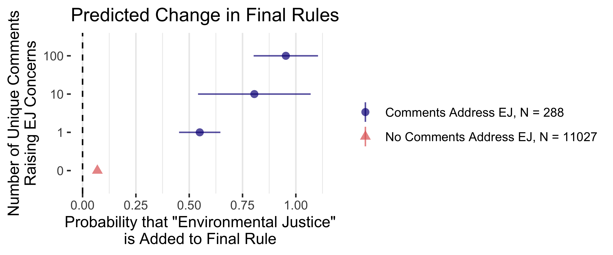

```{r setup, include = FALSE}
# cache everything 
knitr::opts_chunk$set(warning = FALSE, 
                      message = FALSE,
                      echo = FALSE, 
                      #fig.path = "Figs/",
                      fig.topcaption=TRUE,
                      cache = TRUE, 
                      fig.align = 'center',
                      fig.retina = 2,
                      dpi = 100)


# Xaringan: https://slides.yihui.name/xaringan/
library("xaringan")
library("xaringanthemer")
library("here")
library("tidyverse")
library("magrittr")
library("knitr")
library("kableExtra")


style_mono_light(base_color = "#3b444b",
          inverse_link_color	
 = "#B7E4CF",
          #background_image = "Figs/ej-superfund-light.jpeg",
          background_color = "white", #FAF0E6", # linen
          header_font_google = google_font("PT Sans"), 
          text_font_google = google_font("Old Standard"), 
          text_font_size = "29px",
          padding = "10px",
          code_font_google = google_font("Inconsolata"), 
          code_inline_background_color    = "#F5F5F5", 
          table_row_even_background_color = "#ddede5"#, extra_css = list(".remark-slide-number" = list("display" = "none"))
 )
```

```{r, eval = FALSE, include= FALSE}

# setup
devtools::install_github("yihui/xaringan")
devtools::install_github("gadenbuie/xaringanthemer")
install.packages("webshot")
# webshot::install_phantomjs()

library(webshot)

# export to pdf
pagedown::chrome_print("docs/present/methods-pres.Rmd")

file <- here("present/methods-pres.html")
webshot(file, "methods-pres.pdf")
```

<style type="text/css">

.figure {
   margin-top: 0px;
   margin-bottom: 0px;
}

table {
    margin-top: 0px;
    margin-bottom: 0px !important;
}
}
</style>

 
Human coding and computational text analysis are more powerful when combined in an iterative workflow. 
<!--I show how search and text-reuse tools can aid common hand-coding tasks. 
Human coding can both inform and be informed by rule-based information extraction---iteratively structuring queries on unstructured text.-->

1. Text analysis tools can strategically **select texts for human coders**---texts representing larger samples and outlier texts of high inferential value.
2. Preprocessing can **speed up hand-coding** by extracting features like names and key sentences. 
3. Humans and computers can iteratively **tag entities** using regex tables 
<!--(e.g., identify organizations)--> and **group texts by key features** (e.g., identify lobbying coalitions by common policy demands)


Applying simple search and text-reuse methods to public comments on U.S. federal agency rules, a **sample of 10,894 hand-coded comments** yields **41 million as-good-as-hand-coded comments** regarding both the organizations that mobilized them and the extent to which policy changed in the direction they sought. <!--This large sample enables new analyses of lobbying coalitions, social movements, and policy change.-->

<!--
# The Broader Project: Public Pressure

Mobilization


(grassroots, astroturf, elected officials)

↓

Getting policymakers' attention and framing policy debates

↓

Substantive policy influence

↓

Surviving judicial review


# 50 million public comments on proposed agency rules

---->


<!--
# Challenges and Opportunities in Studying Political Texts
--

--->

# Hand-coding dynamic data

<!--
- 15 coders 

```{r greyhound, fig.cap= "Incorrectly Labeled Coaltion Identified by Automated Check"}
knitr::include_graphics(here("figs", "greyhound.png"))
```

--->

Workflow: `googlesheets4` allows analysis and improving data in real-time. For example, in Fig. 1: 

- The "org_name" column is populated with a guess from automated methods. As humans identify new organizations and aliases, other documents with the same entity strings are auto-coded to match human coding.   
- As humans identify each organization's policy "ask," other texts with the same ask are put in their coalition.   
- If the organization and coalition become known, it no longer needs hand coding.

**Fig. 1:** Coded Public Comments in a Google Sheet

```{r datasheet, fig.show = "hold", out.width = "100%"}
 
knitr::include_graphics(here("figs", "datasheet.png"))
```


# Regex tables to tag entities


- **Deductive:** Start with databases of known entities.


<!--### Consolidating entity name variants with regex tables-->


```{r regex-crp}
#CRP data
here("data", "Lobbbying_Summary.csv") |>
read_csv() |>
  filter(parentName %in% c("Teamsters Union", "3M Co") ) |>
  filter(!orgName %in% "3M Cogent") |>
  mutate(orgName = orgName %>% str_replace(".*Teamsters.*", "Teamsters")) |> 
  distinct(orgName, parentName) |> 
  group_by(parentName) |>
  summarize(pattern = str_c(orgName, collapse = "|") ) |>
  mutate(pattern = pattern %>% str_replace("Teamsters & ", "Teamsters|Teamsters.{1:4}") |>
           str_replace("Maint ", "Maint[a-z]* ") |>
           str_replace("Trucking Pension", "(Trucking|Pension)") |>
           str_replace_all("&|and", "(and|&)") |>
           str_remove_all(" Div")) |>
  rename(Entity = parentName, Pattern = pattern) |>
  knitr::kable(caption = "Lookup Table Deduced from Center for Responsive Politics Lobbying Data, Collapsed into an Initial Regular Expression Table", full_width = T) |>
  kableExtra::kable_paper()
```

- **Inductive:** Add entity strings that frequently appear in the data to regex tables. 
- **Iterative:** Add to regex tables as humans identify new entities or new aliases for known entities. Update data (Google Sheets) to speed hand coding.

<!--### Add to regex tables as hand coders identify new aliases-->

**Fig 2:** Iteratively Building Regex Tables

```{r, out.width = "100%", fig.show='hold'}
#knitr::include_graphics("https://docs.google.com/drawings/d/e/2PACX-1vRSJJgSbMdFtkpJjB94Tw5cmFElhDKrHEkOLaUb5-qFdIY-sQp4qGyC-FZoZ7UmWSLfoMZDueAkemhU/pub?w=752&h=238") 

knitr::include_graphics(here::here("figs", "methods-regex.png"))

#knitr::include_graphics(here::here("legislators" , "man", "figures", "logo.png") %>% str_remove("dissertation"))
```

<!--
The `legislators` package adds name variants (e.g., "Liz Warren") to standard legislator names.

```{r legislators, eval = FALSE}
library(legislators)

members |>
  filter(first_name == "Elizabeth", congress == 117) |>
  select(Entity = bioname, Pattern = pattern) |>
  mutate(Pattern = Pattern |> 
           str_replace_all("\\\\b" , "\\\\\\\\b") %>% 
           str_remove_all("na |\\|herring, e\\\b|\\|herring, elizabeth|\\|liz herring|\\|warren, l\\\\b") %>% 
           str_replace("representative fletcher\\\\b.\\{1,4\\}tx", "\\|representative fletcher") %>% 
           #str_replace("fletcher\\|fletcher", "fletcher") %>% 
           str_replace("senator warren\\\\b.\\{1,4\\}ma", "\\|senator warren") |>
  str_replace_all("\\\\b", "\\\\\\b") )%>% 
  kable( caption = 'Regex Table for Legislators Named Elizabeth in the 117th Congress', full_width = T)|>
  kableExtra::kable_paper()
```

-->

For example, the `legislators` package adds variants (e.g., "AOC") to standard legislator names to detect them in messy text.


---


### Results: Who mobilizes public comments?

```{r}
# code in the top_orgs.R
load(here("data", "org_counts_summary.Rdata"))

top5 <- org_counts_summary[1:5,] %>% tally(comments)
top10 <- org_counts_summary[1:10,] %>% tally(comments)
top100 <- org_counts_summary[1:100,]  %>% tally(comments)
```

<!--Iteratively linking comments to the organizations that wrote or mobilized them (and thus strings to identify similar documents), I find that a few advocacy organizations mobilize the vast majority of comments. 
-->
Of 58 million public comments on proposed agency rules, the top 100 organizations mobilized `r top100 |> prettyNum(big.mark = ",")`. The top ten organizations mobilized `r top10 |> prettyNum(big.mark = ",")`.


```{r}
# code in the top_orgs.R
load(here("data", "org_counts_summary.Rdata"))

top10 <- org_counts_summary[1:10,]
top100 <- org_counts_summary[1:100,]

# Pretty up for presentation
org_counts_summary %>%
  dplyr::select(org_name, rules, campaigns, percent, comments, average) %>% 
  mutate(comments = comments %>% prettyNum(big.mark = ","),
         average = average %>% prettyNum(big.mark = ",")) %>% 
  rename(Organization = org_name,
         Comments = comments,
         `Rules Lobbied On` = rules, 
         `Pressure Campaigns` = campaigns,
         `Percent (Campaigns /Rules)` = percent, 
         `Average per Campaign` = average) %>% 
  head() %>% 
  #mutate(Organization = Organization %>% 
           #str_rpl("Natural Resources Defense Council", "NRDC") %>% 
           #str_rpl("World Wildlife Fund", "WWF") %>% 
           #str_rpl("Pew Charitable Trusts", "Pew")) %>% 
  kable(caption = "The Top 5 Organizations Mobilized 20 Million Public Comments",
         full_width = T, font_size = 55, align= c('l', rep('c', 5))) |>
  kableExtra::kable_paper()
```


# Grouping with text reuse {.mybreak}

**Fig. 3:** Iteratively Group Documents

```{r, out.width = "100%", fig.show='hold'}
#knitr::include_graphics("https://docs.google.com/drawings/d/e/2PACX-1vSy9MpvnXV0nbZj4kUPnWC38bwk5xiBXjRiGC3fyrddwoZVT19SmfT4WRr_AvOH5lxeKyrTenqLlKmm/pub?w=953&h=603")

knitr::include_graphics(here::here("figs", "methods-ngrams.png"))

```


<!--## Collapsing form letters with text reuse-->


**Fig 4:** Identifying Groups of Linked Documents with Text Reuse (a 10-gram Window Function)

```{r percent-match, fig.show = "hold", out.width = "55%"}

knitr::include_graphics(here::here("figs", "comment_percent_match_plot-2.png")  )
```

- Document A shares no 10-word phrases with the others 
- B, C, and D share some text (they are part of an organized mass comment campaign) 
- E and F are the same text that was submitted twice

---

### Results: Most public comments result from organized pressure campaigns

**Fig. 5:** Public Comments on Regulations.gov, 2005-2020

```{r comments-mass, out.width = "100%", fig.show = "hold"}
knitr::include_graphics(here::here("figs", "comments-mass-1.png"))
```

Comments that share a 10-gram with 99 or more others are part of a mass comment campaign.

---

# Grouping with key phrases

1. Humans identify groups of selected documents (e.g., lobbying coalitions)
2. Humans copy and paste key phrases
3. Computer puts other documents containing those phrases in the same group (coalition)

*Preprocessing tip:* 
<!--**Digitized text** allows humans to paste text exactly matching machine-read strings.  -->
**Summaries** speed hand-coding (e.g., use `textrank` to select representative sentences).


<!--
## Hand-coded coalitions and key demands

---

## Iteratively adding texts to groups with text reuse

---

## Selecting Texts of High-inferential Value {#select}

---

## Inferring Lobbying Success From the Success of Others in a Coalition {#success}

### Coding commenter demands

<!--
## Coding policy positions {#spatial}


```{r spatial-coding, fig.cap= "Coding the Spatial Position of Comments on Proposed Policy Changes", fig.height=4, fig.width=5.5}
include_graphics(here("figs", "spatial-coding-1.png"))
```


---

### Comments from Legislators Correlate with Public Pressure

---

### The Dependent Variable: Lobbying Success

---
--->

---

### Results: Larger coalitions → more likely to win

<!--get desired policy changes-->

**Fig. 6:** Lobbying Success by Campaign Size

```{r coded-coalition-success, out.width = "100%"}
knitr::include_graphics(here::here("figs", "coded-coalition-success-1.png"))
```


Public pressure on climate and environmental justice greatly affected policy documents (Fig. 7), but a few organizations dominate lobbying coalitions (Table 2). When tribal governments or local groups lobby without the support of national advocacy organizations, policymakers typically ignore them.

**Fig. 7:** Policy Text Change by Coalition Size

```{r ej-m-PR-ejcomments-agencyFE,  out.width = "100%", small.mar = TRUE}

```


```{r ej-winrates, eval=FALSE}
load(here::here("data", "winrate.Rdata"))
winrates %>% 
  mutate(`EJ Success Rate` = `EJ Success Rate` %>%
           percent(accuracy = 1) %>% replace_na("-"),
         `Overall Success Rate` = `Overall Success Rate` %>%
           percent(accuracy = 1)) %>% 
  dplyr::select(-`N raising EJ`) %>% #mutate(across(where(is.numeric), pretty_num)  ) %>%
      knitr::kable(caption = "Lobbying Success by Type of Organization, 2005-2020") %>% 
  kable_paper() |>
      kableExtra::kable_styling(position = "center")  #kable3(caption = )
```


# Next steps

- Compare exact entity linking (regex tables) to probabilistic methods (`linkit`, `fastlink`, ML with hand-coded training set)
- Compare exact grouping (e.g., by policy demands) to supervised probabilistic classifiers/clustering

<!--
An example dashboard is available here: <https://judgelord.github.io/correspondence/FERC/DOE_FERC-letter-coding.html

<!--
```{r check-company, fig.cap= "Checking for Disparities Among Coders in Real Time", out.width="100%"}
include_graphics(here("figs", "check-company.png"))
```


```{r check-backslashes, fig.cap= "Checking for Incorrect Coding in Real Time", fig.height=4, fig.width=5.5}
include_graphics(here("figs", "check-backslashes.png"))
```

# References 

```{r, include=FALSE}
knitr::write_bib(c('knitr','rmarkdown','posterdown','pagedown'), 'packages.bib')
```


<!--
TODO 
Bloomington

The textrank algorithm creates a bipartite network of sentence pairs that share words and then applies Google Pagerank on the sentence network to rank sentences [@textrank]. This is the summary method I use, in part because many federal agencies used the texrank algorithm to summarize public comments. This means that the sentences chosen by textrank may be especially likely to be seen and quoted by agency officials responding to comments.  

Topic models also provide helpfuls summary information. Frequent and exclusive words associated with with the topic(s) occuring in the highest proportions in the document may be helpful summary information. 

Similarly, the results of superivised machine classification can also simplify human codeing [@Sebok2021]. For example @Chou2019 use k-means clustering to classify sentences in audit reports and select sentences closted to cluster centroids as summaries for human auditors. Hummans with basic domain knowledge are well suited to check and correct the results of machine coding. Human coders might dig deeper in to cases where the machine coding looks off (given other available metadata, like associated entities, summaries, or topics). As humans do such a task, they likely learn how the classifier(s) tend to error. Future human and computational attention can then be paid to those cases. 


Nothing is langauge dependent. Whereas statistical models of word frequnecies require langague-deendent preprocessing for dimension-reduction [@Lucas2015], regex tables and text reuse are not.


# Classification 
"The tasks of estimating category percentages (quantification) or classifying individ- ual documents (classification) both begin by analyzing a small subset of documents with (usually hand-coded) category labels." [@Jerzak2019]

The brand of linguistics that focuses on the combinations of words we use emphasises the reoccoring nature of phrases. 
"utterances are formed by repetition, modification, and concatenation of previously-known phrases consisting of more than one word...we speak mostly by stitching together swatches of text that we have heard before"
[@Becker1975]

nu- merical representation of text documents can have an outsized impact on the results (see Denny and Spirling, 2016; Levy, Goldberg, and Dagan, 2015). 

A corpus may lack textual discrimination regarding word frequencies [@Jerzak2019], but still be classified by phrases long enough that they are highly unlikely to appear by chance. 

Another advangage of key phrases is that it cleanly allows texts to appear in multiple groups. 
--> 