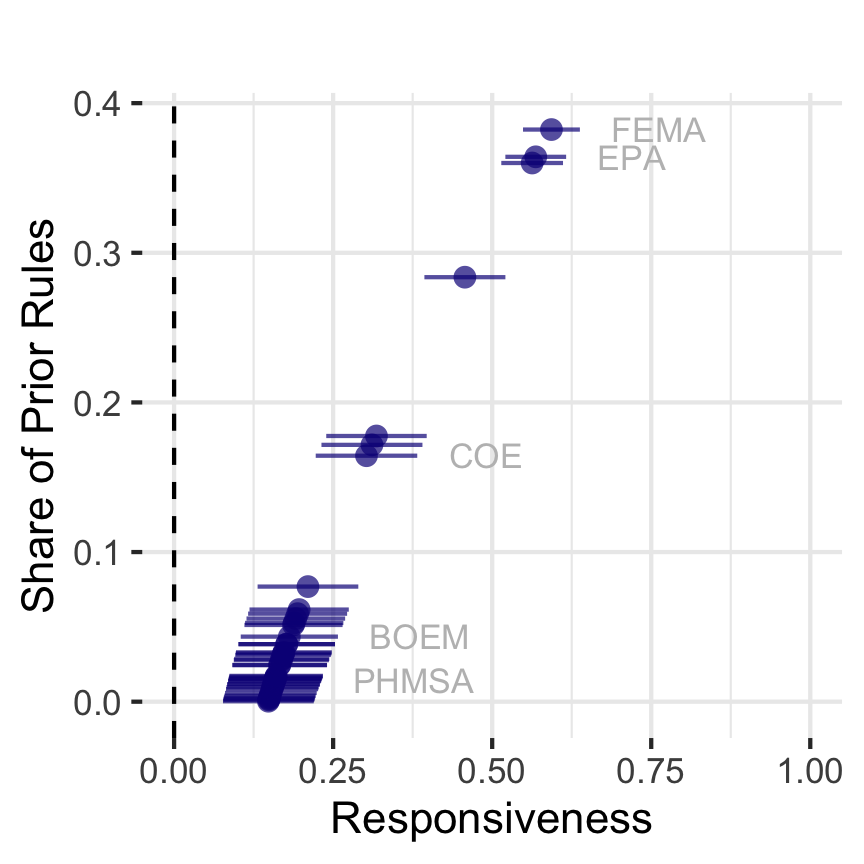
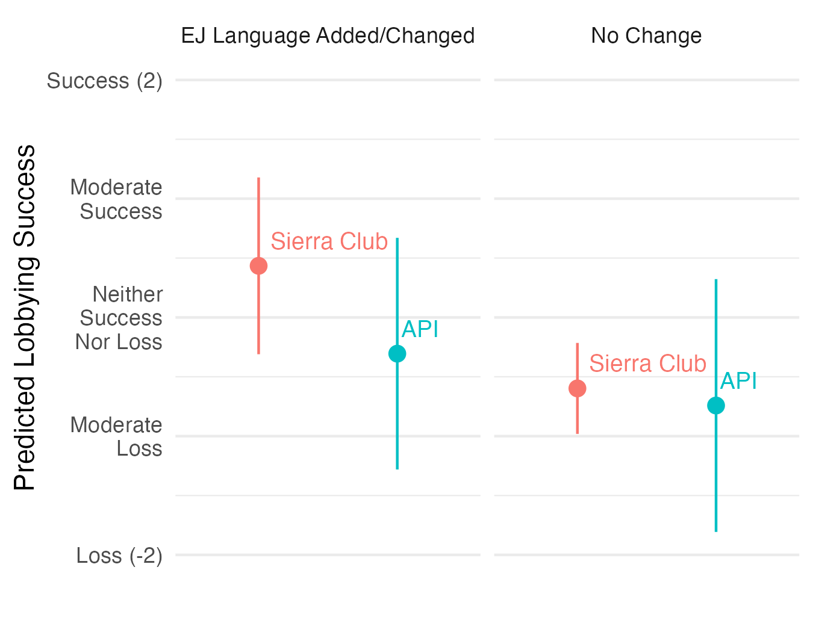

---
# TODO add name and email to all slides
# knit: ( function(input, ...){rmarkdown::render(input) } )
# rmarkdown::render("docs/present/methods-pres.Rmd")
knit: ( function(input, ...){xaringan::infinite_moon_reader(input) } )
title: Rulemaking
subtitle: "Money, Expertise, Public Pressure, and Democratic Capacity in Federal Agencies"
author: "Devin Judge-Lord"
bibliography: '`r here::here("assets/dissertation.bib")`'
biblio-style: '`r here::here("assets/apsr.bst")`'
link_col: cyan
date: "Guest lecture for PP320"
titletext_fontfamily: "Roboto:wght@100"
middle_fontfamily: "Roboto"
font_family: "Roboto:wght@100"
urlcolor: cyan
output:
  xaringan::moon_reader:
    self_contained: true
    footer: These slides available at http://bit.ly/myslides
    lib_dir: libs
    mathjax: "default" # "https://cdn.bootcss.com/mathjax/2.7.1/MathJax.js?config=TeX-AMS_HTML"
    css: ["footer-header.css", "xaringan-themer.css"]
    nature:
      ratio: '16:9'
      highlightStyle: github
      highlightLines: true
      countIncrementalSlides: false
      slideNumberFormat: "%current%"           # 12/42 
editor_options: 
  chunk_output_type: console
---


```{r setup, include = FALSE}
short = "false"
exclude_stepwise = "false"
exclude_extra = "false"

# cache everything 
knitr::opts_chunk$set(warning = FALSE, 
                      message = FALSE,
                      echo = FALSE, 
                      #fig.path = "Figs/",
                      fig.topcaption=TRUE,
                      cache = TRUE, 
                      fig.align = 'center',
                      fig.retina = 2,
                      fig.show="hold",
                      fig.pos= "htbp",
                      fig.path = "Figs/",
                      fig.cap = '   ',
                      out.width = "100%",
                      out.extra = "")
```


layout: true

<div class="my-footer"><span>Devin Judge-Lord&emsp;&emsp;</span></div> 

---

## Types of policy

**statutes**: Laws made by the legislature and signed by the executive, generally codified into *The U.S. Code (e.g., Title 5 U.S. Code § 706)* or state codes. 

--

[**executive orders**](https://theconversation.com/what-is-an-executive-order-and-why-dont-presidents-use-them-all-the-time-150896): Presidential directives to agencies.

--

**administrative rules**: Often called regulations, but also include funding criteria, deregulatory policy, and many other kinds of policy. They usually have the force of law, are published in the *Federal Register (FR)*, and are codified in the *Code of Federal Regulations (CFR)*  (unlike informal *agency guidance*).

--

**case law**: Policy made as a result of judicial decisions. "Judgements" in cases stating an "*interpretation*" of a constitution, law, or rule that influences future decisions, called *legal precedent.*

---

## Inputs to executive-branch policymaking

Congressional oversight

- Statutory deadlines, reporting requirements, or budget restrictions, the threat of repeal under the Congressional Review Act 
- CRS, CBO, GAO, Inspectors General, etc. 
- [Hearings](Clinton Lewis Selin 2014) and [direct correspondence with legislators](https://judgelord.github.io/correspondence)  

  
Whitehouse oversight over the *career civil service*

- Executive orders
- Appoint and remove agency heads. 
- Executive Office of the President OMB/OIRA Review  

---

## More inputs to executive-branch policymaking

Public comments on proposed agency rules 

  - Experts  
  - [Public pressure campaigns](https://judgelord.github.io/dissertation/present/whyMail-APW.html#1) 
  - [other interest group lobbying coalitions](https://www.niskanencenter.org/how-bureaucrats-make-good-policy/) 


Judicial oversight

- Judicial review
   - May be sparked by citizen suits
   - May result in court-imposed deadlines

---

background-image: url(Figs/mercury.jpeg)
background-size: cover
name: example

--

.pull-left[
# `1990 Clean Air Act: EPA shall regulate as “appropriate and necessary” for public health`
]

???


Section 112(n)(1)(A)


---

background-image: url(Figs/brianadams.png)
background-size: cover

# Safe Levels of Mercury 
--
(For Whom?)

???
Before the politics of who gets what, there is the politics of who the whos *are*. What are the groups or communities deserving consideration? 

--

.pull-left[
2004 Draft Rule: `“the U.S. population”`

&emsp;&emsp;&emsp;&emsp; ↓ 

170,000 public comments

&emsp;&emsp;&emsp;&emsp; ↓

2005 Final Rule: `Environmental justice for “minority populations”`
]

--

.pull-right[

```{r, fig.show = "hold", out.width = c("35%","50%","30%","40%")}
#, fig.cap="Example: Identifying Coalitions by the Percent of Matching Text in a Sample of Public Comments"
knitr::include_graphics("Figs/acat.png") 
 
 
knitr::include_graphics("Figs/Tom_Allen.jpeg") 


```

]


???

TOM ALLEN 

 Mercury standards that protected the average person in the US did not protect certain minority communities, in this case, many native communities who traditionally ate a lot more fish. 

I grew up in Wisconsin, in the center of the great lakes, and despite Friday fish fries, these regulations probably protected people in my family, BUT 

And there is a large Hmong population that came over after the Vietnam war, and other commenters raised produced studies that certain southeast Asian immigrant populations like the Hmong also ate a lot of freshwater fish and thus had higher rates of Mercury poisoning. Similarly,  Ojibwe people in the great lakes region had higher rates of mercury poising. 

---


background-image: url(Figs/brianadams.png)
background-size: cover
name: ej-mercury-long


- 2000 Notice: "the U.S. population."

--

- 2004 Draft: Regulated entities + "Other types of entities not listed could also be
affected."

--

- 2011 Draft: disparate impacts on "vulnerable populations" including "African Americans," "Hispanic,"
"Native American," and "Other and Multi-racial" groups.

--

- 2012 Final Rule: EJ analysis adds "minority, low income, and indigenous"
--

- 2020 Rollback: "These communities may experience foregone benefits" 

--

- 2021 Draft: 2012 Final Rule categories + "differentiated subsistence fisher
populations" + "children exposed prenatally"


???
2011 Draft: Five pages of EJ analysis of the disparate impacts
on

- 2020 Rollback: "While these communities may experience foregone benefits as a result of this action, the potential foregone [health benefits] are small." 

⁉️

30/51 pages in Biden

---


background-image: url(Figs/brianadams.png)
background-size: cover


### Public comments on proposed agency rules

> `"The amount of methyl-mercury and other bioaccumulative chemicals consumed by Alaskans (especially Alaskan Natives) could potentially be much higher than is assumed" - Heather McCausland of the Alaska Community Action on Toxics (ACAT)`

---


background-image: url(Figs/earthjustice.png)
background-size: cover
background-position: bottom
background-color: white


> `"Such an approach ignores the cumulative pollution burdens experienced by environmental justice communities." - Amanda Goodin, Staff Attorney, Earthjustice on behalf of Communities for a Better Environment et al.`

---

background-image: url(https://www.sierraclub.org/sites/www.sierraclub.org/files/styles/sierra_full_page_width/public/sierra/articles/big/SIERRA%20March%20Big%20Javier%20WB.jpg.webp?itok=F4EVr755
background-size: cover
background-position: bottom
background-color: white


> `"Attached are files containing the names of 11,478 individuals who have submitted public comments urging the Bureau of Land Management (BLM) to strengthen the proposed regulations on methane waste and pollution on federal and tribal lands"` 

---


## Motivation for my research

- Large majorities want stronger environmental policy

- Massive youth and activist energy behind climate and environmental justice

- Policy fights don't end with legislation

- But agency policymaking is technocratic  
$\rightarrow$ hostile terrain for mass politics and activism  
$\rightarrow$ good for incumbent industries


???

Legal theorists debate the normative value of public participation in agency rulemaking.
The role of agency policymaking in a large democracy unsettled

Big push from this administration increase participation and democratize agency decision-making, but the aim is unclear

Moreover, Bureaucratic inertia frustrates any "all of government" initiatives

As a political scientist, I take a more empirical large-scale quantitative approach to figure out the potential and limits of activism targeting agencies


---

## For example, the Inflation Reduction Act fight isn't over 

"energy community".  
$\rightarrow$ already [300+ pages of guidance from Treasury](https://arcgis.netl.doe.gov/portal/apps/experiencebuilder/experience/?id=a2ce47d4721a477a8701bd0e08495e1d) &  [maps from DOE](https://energycommunities.gov/energy-community-tax-credit-bonus/)

"disadvantaged community"   
$\rightarrow$ "a community that the Secretary determines [is] disadvantaged"

"life cycle emissions" <!--$\rightarrow$ "additional"/"new" generation -->    
$\rightarrow$ $0 – ∞ billion for hydrogen

"facility"   
$\rightarrow$  0 – massive reductions in methane 


---

layout: true

<div class="my-footer"><span>Devin Judge-Lord&emsp;&emsp;(Results from Powell, Judge-Lord, & Grimmer 2023)</span></div> 

---

## Money buys allies in Congress who pressure agencies

```{r, out.width= c("60%", "40%")}
knitr::include_graphics("Figs/pac_amounts-2.png")
knitr::include_graphics("Figs/full-logit-pro-1.png")
```

---

layout: true

<div class="my-footer"><span>Devin Judge-Lord&emsp;&emsp;(Results from Carpenter et al. "Inequality in Administrative Democracy")</span></div> 


---


## Agency rulemaking tilts toward the rich


```{r, commenters-noncommenters, out.width= c("55%", "45%")}
knitr::include_graphics("Figs/compustat-density-1.png")
knitr::include_graphics("Figs/assets-efficacy-6.png")
```

???

The other day I mentioned work I'm doing with my mentor Dan Carpenter here on how the banks successfully pushed back on financial regulation after the financial crisis and Dodd-Frank Act by lobbying the regulatory agencies. 

There may be lessons here for how powerful incumbent interests responding to the IRA and especially if we get more regulatory legislation.

---

## Why? 

### $\rightarrow$ Big companies hire experts and lawyers

```{r, out.width= "100%"}
knitr::include_graphics("Figs/mediation-4way-acme-1.png")
```


---

layout: true

<div class="my-footer"><span>Devin Judge-Lord&emsp;&emsp;</span></div> 

---

## When does public pressure affect agency rulemaking? 


Campaigns succeed when

1. They have broad **public support** & **showing support is easy**

???

Public support can be a resource. Presidents "go public" to get their agenda through Congress. Similarly, activists mobilize public attention when it shifts politics in their favor. 

--
1. They have **experts and lawyers**

--
2. They **shift the terms of debate** or **mobilize elected officials**

--
2. The agency has **capacity** (e.g. to address climate or environmental justice issues)


???

Pushing back against some of the skepticism about pressure.
It can help, but only in certain conditions
 involved, ideally both


The work that Carrie and Arie do at ELP is really important 

???
Framing values-based decisions as scientific may hurt more than it helps.


---

name: orgs


Pressure results from **organized campaigns**. Of 58 million public comments on proposed agency rules, 2005-2020    
- The top 100 organizations mobilized 43,938,811
- The top 10 organizations mobilized 25,947,612

Organization | Rules Lobbied On | Comments
:---- | ---- | ----:
NRDC | 530 | 5,939,264 
Sierra Club | 591 | 5,111,922 
CREDO  | 90  | 3,019,150 
Environmental Defense Fund  | 111 | 2,849,517 
Center For Biological Diversity | 572 | 2,815,509 
Earthjustice  | 235  | 2,080,583 


---


### Getting policymakers talking about climate & EJ

```{r, out.width="90%"}
knitr::include_graphics("Figs/cj-data-agencies100-2.png")
```

---

```{r, out.width="89%"}
knitr::include_graphics("Figs/cj-data-agencies-2.png")
```

---

### Getting policymakers talking about climate & EJ

From 2005 to 2020

- 8% of relevant agency rules addressed climate change, 15% mentioned EJ 

- 20% of all public comments mentioned climate change, 12% mentioned EJ 

- 1000 supporters = ~ 65 percentage point increase in the probability that the agency addresses climate change, 46 percentage point increase that the agency addresses EJ 

- Responsiveness is surprisingly stable across administrations but varies wildly across agencies

---

include: short 

.right-column[
```{r,  out.width = "75%"}
knitr::include_graphics("Figs/ej-m-PR-ejcomments-agencyFE-pres-1.png")
```

]

 .left-column[  
### Agencies respond to larger coalitions demanding attention to EJ

Logit (N = 11,315 rules)
 ]


---


 .left-column[  
### Agencies that more often address EJ are more responsive to comments demanding attention to EJ


Logit (N = 11,315 rules)

 ]
 
 .right-column[
```{r, fig.cap = "", out.width = "65%", fig.show = "hold", fig.subcap=""}



```
]


---

.left-column[
### When agencies adopt EJ language, environmental coalitions do better 

Cross-sectional OLS model of coalition-level lobbying success (N = 284)

]

.right-column[
```{r, out.width = "90%"}
knitr::include_graphics("Figs/mc1ej-obama.png")
```
]

---

name: ej-org-success

.left-column[

### When agencies adopt EJ language, environmental groups do better

Within-organization (DiD) OLS model (N = 3,932 organizations)

]

.right-column[

```{r, out.width = "90%"}

```
]

---


name: substantive

.left-column[

### Who gets their substantive policy demands met?


- Business Associations
- Law Firms & National Advocacy Organizations


]

.right-column[

```{r substantive, out.width = "85%", fig.show = "hold"}

knitr::include_graphics("Figs/ej-success-table.png")

```
]

???

In line with previous scholarship 

Beyond previous scholarship 


---

class: inverse

## What do we do? 

- Make it someone's job inside the agency
- Consider group representation
- Make it easy to show support
- Hire lawyers
- Mobilize elected allies and issue frames
