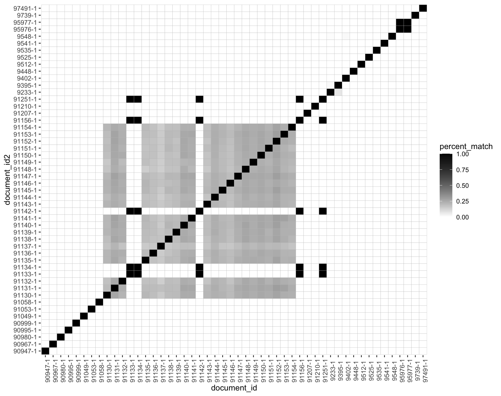
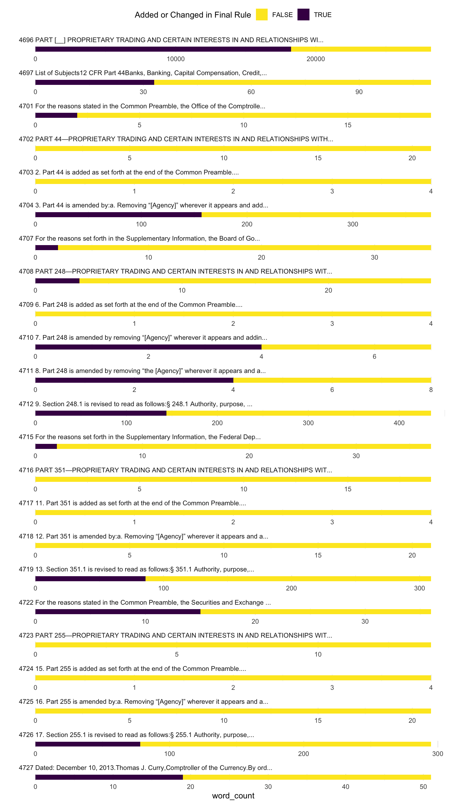

## The broader project: Data & Methods

80,000,000 public comments on 300,000 policy documents

```{r mass, fig.show = "hold", out.width = "85%"}

knitr::include_graphics("Figs/comments-mass-1.png")  
```

???

To assess the role of public pressure in bureaucratic policymaking, I collect a massive new dataset of policy documents and public comments on those policy documents. If you have ever gotten an email from a group like the Sierra Club with a link to send an outraged (or perhaps encouraging) note to a federal agency. This is what I am talking about. And if you have ever done that, your note is public record and in these data. 

Using text-reuse methods similar to plagiarism detection, I assess how much text is copied and find that the overwhelming majority is form letters. As you can see, the vast majority are mass comments are those with over 100 identical texts, excluding signatures. Medium batch is identical copies less than 100. Partially unique, have some unique text. 

---

## The broader project: Data & Methods

Automated methods to identify coalitions and lobbying success validated against a hand-coded sample of 7000 comments, 160 coalitions.


```{r percent, fig.show = "hold", out.width = "60%"}

  
```

???

This figure shows the percent of textual overlap between a small number of comments. The grey block in the middle is a bunch of partially unique comments that still share a good amount of text. And they are, in fact, a coalition, all mobilized by the same group. The black on the diagonal shows that each text overlaps perfectly with itself, and the other black squares show texts that are perfectly identical. 

With a team of RAs, I am hand-coding a fairly large sample to validate both the methods of identifying coalitions with similar text and my methods of identifying lobbying success. [SLIDE]

---

## The broader project: Data & Methods

The DV: Change between draft and final policy documents

```{r fr, fig.show = "hold", out.width = "100%"}

  
```

???

So, in addition to hand-coded lobbying success where we read the comment and compared it to the change between draft and final policy, I also measure change across all policy documents, again with percent of text that is the same verses that which changed. 

In this figure, words that did not change from the draft are in yellow, and words that did change are in purple, so That long first section of this policy changed quite a bit while the much shorter 4th and 5th sections did not change at all. 


I've very happy to talk more about text analysis methods in the Q&A, but I really just want to give you a flavor of the data and methods.

And quickly sum up the findings from the previous chapters and then dive into this final chapter that I want to focus on.

---


## The broader project: Findings

Who runs campaigns targeting federal agencies?    
- Public interest groups (It's rarely astroturf, but it's also not spontaneous). 80% is mobilized by just 100 organizations

--

Are members of Congress mobilized?   
- Yes, on both sides. The side with more legislators is more likely to win.

--

Do campaigns affect policy?   
- Sometimes. On average, larger coalitions are more likely to win.

--

Do campaigns affect judicial review?   
- Not at the Supreme Court. 

???

Other findings   
- Procedural claims are almost always related to policy demands (also see Potter 2019)

---