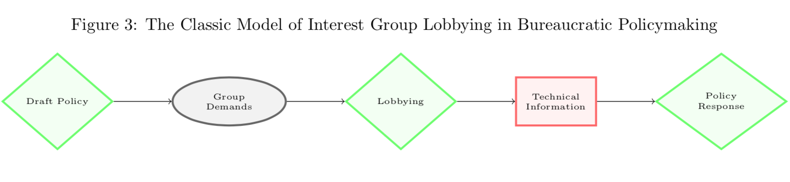
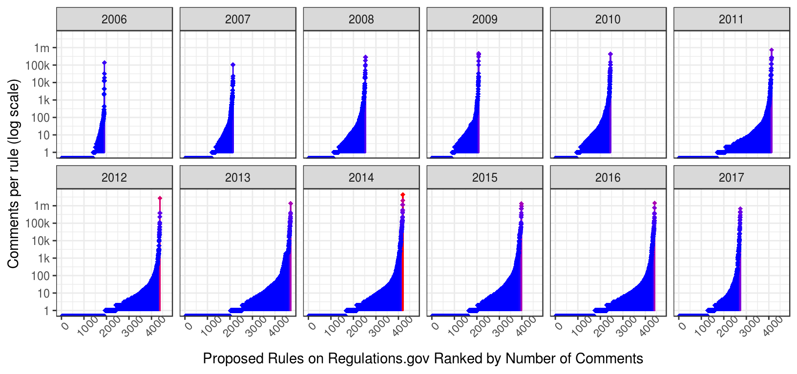
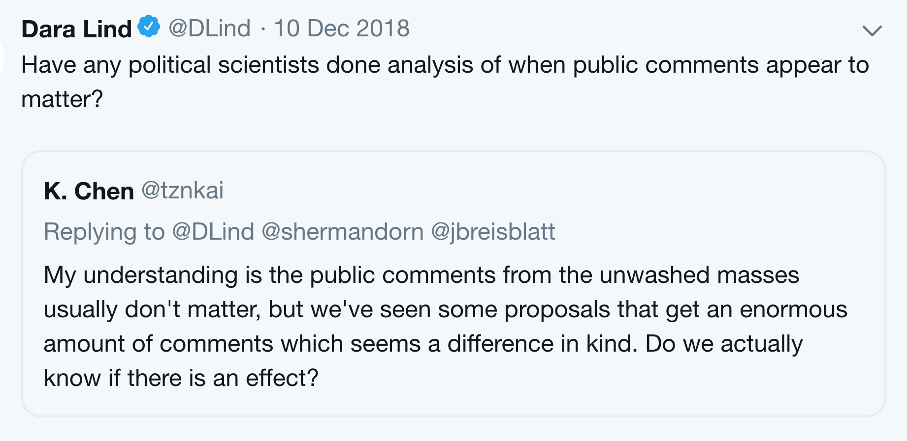
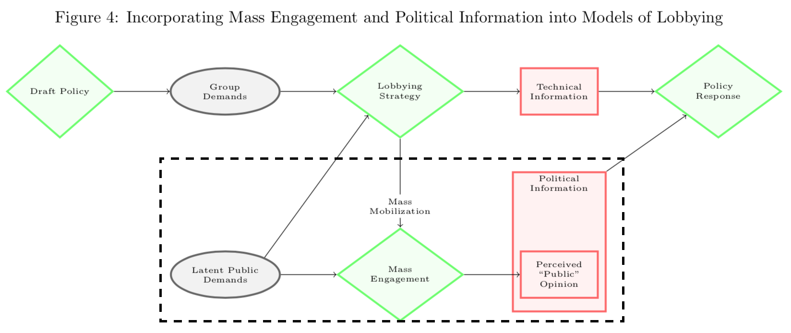
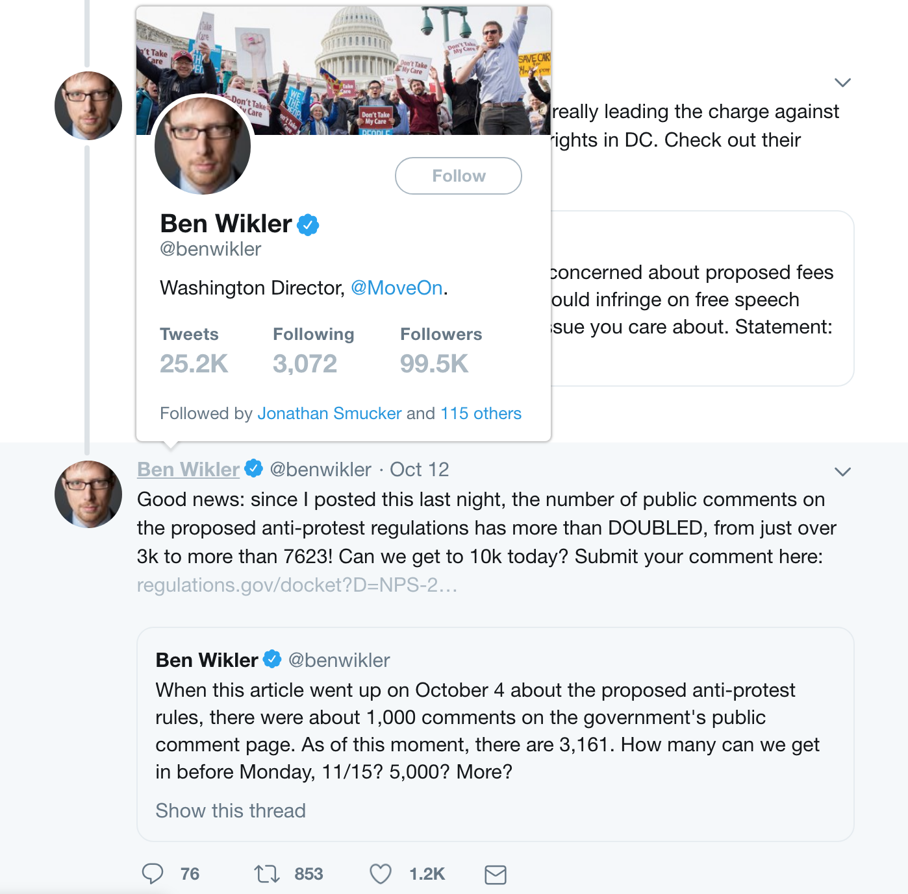
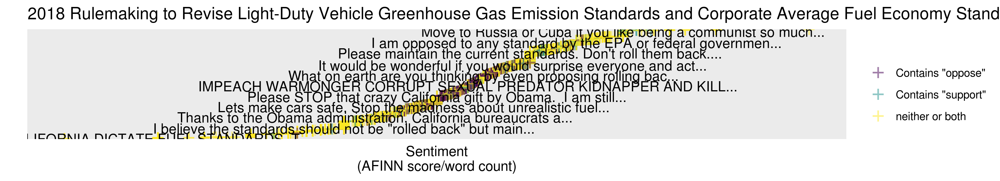
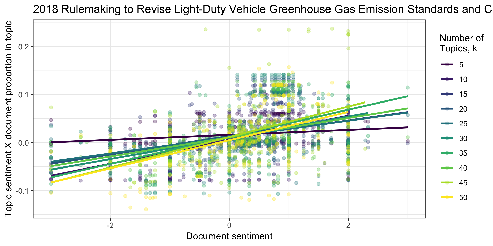

```{r setup, include = FALSE, cache = TRUE, echo = FALSE}
# chunks options:
# hide code and messages by default (warning, message)
# cache everything 
knitr::opts_chunk$set(eval = TRUE, 
                      warning = FALSE, message = FALSE,
                      cache = TRUE,
                      fig.retina = 2,
                      fig.align = "center", dpi = 100)
# Xaringan: https://slides.yihui.name/xaringan/
library("xaringan")
library("xaringanthemer")
library("here")


mono_light(base_color = "#003333",
          link_color = "#000080",
          #background_color = "#FAF0E6", # linen
          header_font_google = google_font("PT Sans"), 
          text_font_google = google_font("Old Standard"), 
          text_font_size = "30px",
          padding = "1px",
          code_font_google = google_font("Inconsolata"), 
          code_inline_background_color    = "#F5F5F5", 
          table_row_even_background_color = "#E6F0FA",
          extra_css = 
            list(".remark-slide-number" = list("display" = "none")))

```

```{r, eval = FALSE, include= FALSE}
# setup
devtools::install_github("yihui/xaringan")
devtools::install_github("gadenbuie/xaringanthemer")
install.packages("webshot")
# webshot::install_phantomjs()

library(webshot)

# export to pdf
file <- here("present/whyMail-APW.html")
webshot(file, "whyMail-APW.pdf")
```


<!-- 
Hi, my name is Devin Judge-Lord, I'm a Ph.D. candidate at Wisconsin
This paper is the first bit of writing I've done for my dissertation on mass engagement in bureaucratic policymaking, for example, mass comment campaigns.

It sets out concepts and measures for these occasional bursts of civic participation,
which I will then use to assess whether it matters. 

I am still workshopping these concepts and measures, so your comments will be decisive for where I take this in the next few years. 

SLIDE

My dissertation is at the intersection of two kinds of literature that have not had much contact. 

On the one hand, civic engagement has long been a core interest of political scientists. We are highly uncertain about the size of effects from actions like letter writing, signing petitions, protests, but there is little doubt that, at a large enough scale, these things matter.  
--> 

## Civic engagement

### Writing to government officials, signing petitions, attending hearings, attending protests, or donating to a political campaign (Verba and Nie 1987).


---

## Bureaucratic policymaking

### ~90% of U.S. law

--

### Discretion (Institutional design, information asymmetry, multiple principals, coalitions)

--

### Interest group lobbying



---


--




---


## 1946 Administrative Procedures Act

### "opportunity to participate in the rulemaking through submission of written data, views, or arguments" - U.S.C.§553(c)

### "a bill of rights for the hundreds of thousands of Americans whose affairs are controlled or regulated" - Senator Pat McCarran

---

<!--

In Susan's recent Annual Review on the politics of rulemaking, she found that the literature has next to nothing in the literature about mass engagement, besides some filp skepticism.

SLIDE 

For many reasons, Rulemaking is usually an insiders' game--people here and others have shown that to the extent, anyone can influence bureaucratic policymaking; it is the usual suspects, mostly businesses. 
--> 

## Public comment periods
### Usually an insiders' game, but occasionally not. 

--
Does it matter? 
 

<!-- but SOMETIMES it is very different, or at least it looks different because lots of ordinary people are voicing their opinions, but we don't know if it matters. 
-->


---

## Mass engagement in bureaucratic policymaking

### "The ‘mass comments’ occasionally submitted in great volume in highly salient rulemakings are one of the more vexing challenges facing agencies in recent years."  (Sant’Ambrogio and Staszewski 2018)

---

##  The debate in administrative law 

- **Optimists:** Notice and comment is the "purest example of participatory democracy in actual American governance."
- **"Regulatory democracy" reformers** (Cuéllar 2014, Johnson 2013) argue that it could be more discursive. Agencies often discard non-technical comments, but they shouldn't (Mendelson 2011).
- **Pluralists:** "The goal of e-rulemaking is to more fully capture such credible, specific, and relevant information, not to solicit the views of random, self-nominating members of the public." (Herz 2016)
- **Pluralist reformers** suggest that lobbying groups disclose there membership, funding, and decisionmaking processes(Seifter 2016)
- **Skeptics:** Public comment distracts from good policy. Abolish it.

--


---

<!-- The normative interest in expertise on and deliberation--in the quality of information--have kept distracted from empirical reality. These are not attempts at information or deliberation; they are attempts to gain power with quantity rather than quality.  -->

## Political information 
### (e.g., signals of the scale and intensity of public support)

--




<!-- Before we can assess effects, however, we need to know what exactly we are assessing the effects OF and WHEN we expect to see these effects. This is my present task.
-->

---

class: inverse middle 
## But first:
### 1. What is it? 
### 2. How do we measure it? 
### 3. Why does it occur? (selection problems)

---

## Selection process 

### Which rules? 
- Significant policy changes at less-expert agencies (Moore n.d.)
- Ones people dislike? (negativity bias)
- Controversial, salient? (both endogenous) <!-- indeed, we often measure salience this way --> 

--

### -> Opportunities for mobilization

---

background-image: url("present/tweetBenWilkerMoveon.png")



---

<!-- First, I want to assert that what we care about here is MOBILIZED commenting. Sure, a few of us in this room may peruse open dockets on regulations.gov, but this is just not what ordinary people do. By ordinary, I mean not professional policy influencers.-->

#*Mobilized* civic engagement

--

### Who mobilizes?
<!-- Tricky concepts! -->
<!-- In the paper, I suggest that many conflicts that mobilize thousands are best seen as over public and private goods rather than cultural issues -->

- Public interest groups / "advocacy" groups (Shapiro 2008; Potter 2017) / "societal constituencies" (Balla et al. n.d.)
- Sometimes others 

<!--sometimes people that don't fit that concept-->

--


--

-> Coalitions


---

# Why mobilize people?

### Outside lobbying
#### 1. Expand the scope of conflict (Schattschneider 1975)

vs.

#### 2. Leverage resources into an impression of public support

### Not lobbying

#### 3. Meet member expectations or recruit new members

---

## Comments evoke public support

"Along with 80% of the American people, I strongly support ending commercial trade in elephant ivory in the US." 

"petition signed by 67,275 self-proclaimed United States residents" and “more than 110 East Coast municipalities, 100 Members of Congress, 750 state and local elected officials, and 1,100 business interests, all of whom oppose offshore drilling."

---

class: inverse middle

# Tasks

## 1. Identify coalitions

## 2. Measure mass engagement

## 3. Which campaigns ought to matter

---

## Identifying Coalitions

### Text reuse
1. Remove text copied from proposed rule or request for comments 

2. Exact match = duplicate (cosigned) comments

3. 10-word moving "window" = part copy vs. entirely unique

### Cluster comments by word frequency and sentiment

### Inspect and hand-code clusters (i.e. coalitions)

<!-- EPA has contractors do this by hand! --> 

---
<!-- Second, we need to measures what campings are doing that might be influential. I call this political information, following Nelson and Yackee  --> 

## Political Information 

### "Coalition lobbying can generate new information and new actors—beyond simply the ‘usual suspects’—relevant to policy decision makers. Thus, we theorize _**consensus**_, coalition _**size**_, and _**composition**_ matter to policy change" (Nelson and Yackee 2012)
---


## Measuring Political Information*

### 1. Number of comments per coalition

### 2. Average effort per comment

Lower <--------------------------------------------> Higher 

Co-sign an org's comment <-> Partially unique <-> Unique 

### 3. Potential contagion (share of unique comments)

--
*Agencies may not process comments in ways that deliver this information to decisionmakers

---

## Selection issues
### Which campaigns ought to matter? 
### How to tell them apart?
--

| | Inside lobbying | Outside lobbying |
|:---|:---:|:---:|:---:|
| "Normal" lobbying | High | None | 
| "Going public" | High | High |
| "Disrupting consensus" | High | Low | 
| "Going down fighting" | Low | High |

---

class: inverse center middle 

# First cut

---

class: center

## Most comments are mass comments


---

## Who mobilizes?
A few public interest groups (more "conflict expansion" than groups with the most resources "buying" the impression of public support)


100 organizations mobilized 39m of 48m regulations.gov comments on proposed rules, ~87/100 lobby in the same public interest coalitions.


---
class: center

## When does mass engagement occur?

### Asymmetric mobilization > negativity bias


---

## Asymmetric sentiment 



---

## Sentiment-LDA correlation




400 of 610,927 comments


---
class: center
 

# Thanks!

<!--
#### Unified Agenda, ORIA reports, Regulations.gov (in progress):

### GitHub.com/JudgeLord/Rulemaking

or

### JudgeLord@Wisc.edu
-->


---

Draft rules not mentioning "Environmental Justice"


<!--
questions that Congress scholars have asked 


EPA - profitability inseparable from democracy 

Wilson - bureaucrats want to be sued.

Janna - complexity is essential - working on policy development monopolies- expert groups claim rents as providing info.

Brian - how important are these rules 
- 25% of CRS overturned 
- 
- payday vs. net neutrality - are they all the same thing? 
- - no some are going down fighting 
- - net neutrality is ideology vs. ideology - organized IN THE SAME WAY 
- - payday loan was not only mobilizer - true vs. false grassroots
- - disrupting consensus = Payday 
- - why do agencies care? 

- how do they process and extract 
- - EPA consultant bins - more binned 


- a better fit between theory and measures 

- Maarmam - cosigning 

- coalition - movement - interest - 
- What evidence would you need to know if this is 


Gunnar Trumbull - coalitions need to create legitimacy.


- Companies buying off nonprofits, hiring consultants, supporting coal miners union, grassroots 

-->

