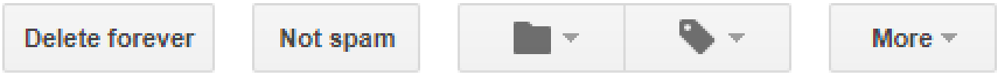

```{r setup, include = FALSE, cache = TRUE, echo = FALSE}
# chunks options:
# hide code and messages by default (warning, message)
# cache everything 
knitr::opts_chunk$set(eval = TRUE, 
                      warning = FALSE, message = FALSE,
                      cache = TRUE,
                      fig.retina = 2,
                      fig.align = "center", dpi = 100)
# Xaringan settings
library("xaringan")
library("xaringanthemer")
library("here")


```

```{r, eval = FALSE, include= FALSE}
# extra 
mono_light(base_color = "#002b36",
          link_color = "#2aa198",
          header_font_google = google_font("Vollkorn"), 
          text_font_google = google_font("PT Sans"), 
          code_font_google = google_font("Inconsolata"), 
          code_inline_background_color    = "#F5F5F5", 
          table_row_even_background_color = "white", 
          extra_css = 
            list(".remark-slide-number" = list("display" = "none"), 
                 ".remark-inline-code" = list("background" = "#F5F5F5", 
                                                #e7e8e2; /* darker */
                                              "border-radius" = "3px", 
                                              "padding" = "4px")))
# setup
devtools::install_github("yihui/xaringan")
devtools::install_github("gadenbuie/xaringanthemer")
install.packages("webshot")
library(webshot)
install_phantomjs()

# export to pdf
file <- here("present/whyMail-SPSA.html")
webshot(file, "whyMail-SPSA.pdf")

### Read the documentation

<https://slides.yihui.name/xaringan/>
```

## Public comment periods:
### Usually an insiders' game, but occassionally not. 

--

## Does it matter? 
 
### But first: who, when, why?
1. Selection effects? 
2. How do we measures it? 

---

### Who mobilizes?
- Public interest groups / "advocacy" groups (Shapiro 2008; Potter 2017) / "societal constituencies" (Balla n.d.)
<!-- Tricky concepts! -->

### Who is mobilized? 
- Earnist, not so nieve (Yackee 2015)
- "Like-minded" 
<!-- Discusts some law professors, but collective action among like minded is the bread and butter of polticis  -->

### Who's interests do they represent? 
- "Second-order"" participation/representation (Seifter 2016)

---
### Which rules? 
- Ones people dislike? (negativity bias)
- Controversial, salient? (both endogenous) <!-- indeed, we often measure salience this way --> 


### Which agencies? 
- Less expert, more controversial (Moore 2017)
---
# Why mobilize people?

### Outside lobbying
#### 1. Expand the scope of conflict (Schattschneider 1975)
vs.
#### 2. Leverage resources into an impression of public support

### 3. Not lobbying
#### Recruitment
#### Member expectations
---
## Political Information 

###“Coalition lobbying can generate new information and new actors—beyond simply the ‘usual suspects’—relevant to policy decision makers. Thus, we theorize **consensus**, coalition **size**, and **composition** matter to policy change." (Nelson and Yackee 2012)
---
## Measuring Political Information 

### 1. Text reuse 

### 2. Classifiers


---
class: inverse center middle 

# First cut

---
class: center

## When does mass engagment occur?


---
class: center

## When does mass engagment occur?


### Asymetric mobilization swamps negativity bias


---
## Who is engaged?

### Sample of 300 people who signed their names:

---

class: center
# Thanks!
 

Regulations.gov, Unified Agenda, ORIA reports:

GitHub.com/JudgeLord/Rulemaking

or

JudgeWord@Wisc.edu


---


